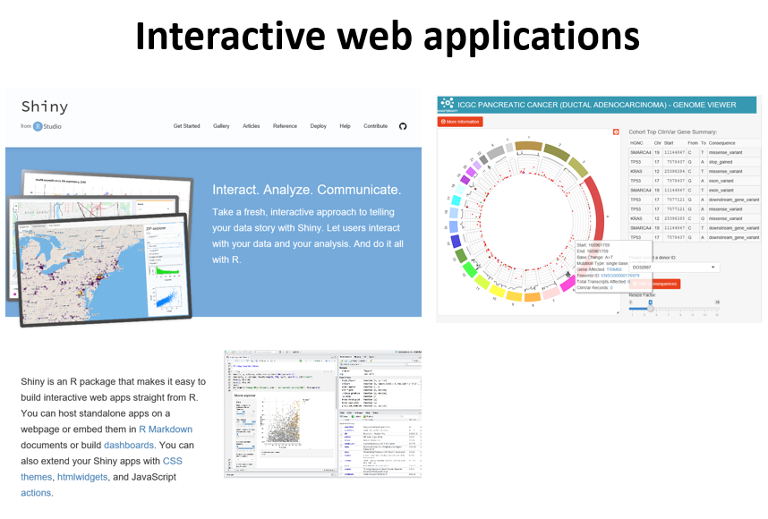
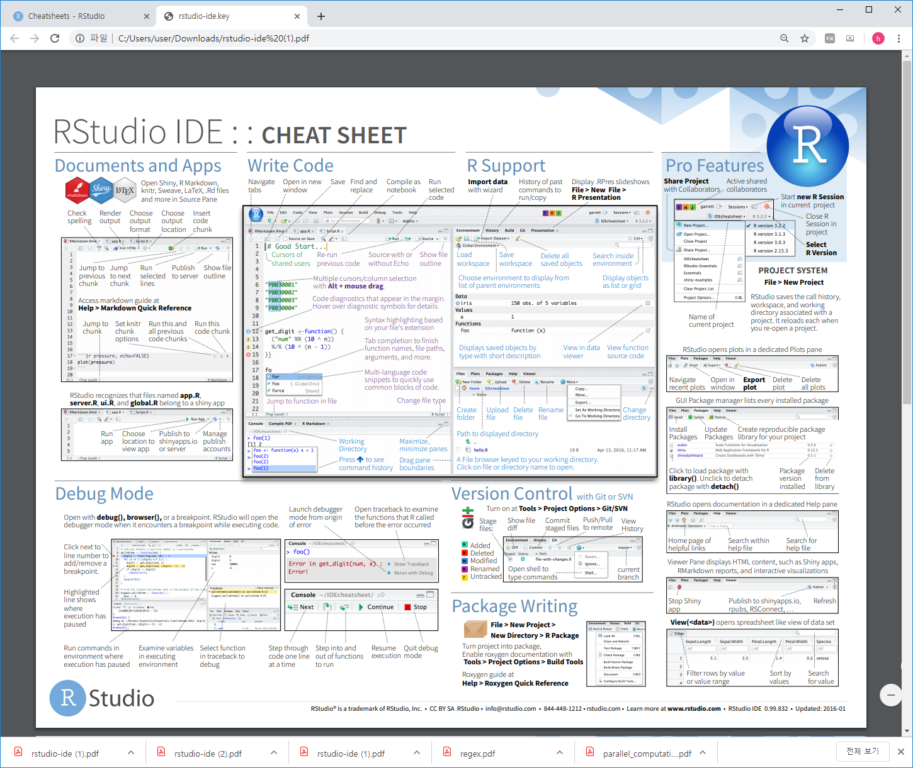

# R basics  

## What is R / Rstudio 


R은 통계나 생물통계, 유전학을 연구하는 사람들 사이에서 널리 사용되는 오픈소스 프로그래밍 언어 입니다. Bell Lab에서 개발한 S 언어에서 유래했으며 엄청나게 많은 라이브러리 (다른 사람들이 만들어 놓은 코드)가 있어서 쉽게 가져다 사용할 수 있습니다. R은 복잡한 수식이나 통계 알고리즘을 간단히 구현하고 사용할 수 있으며 C, C++, Python 등 다른 언어들과의 병행 사용도 가능합니다. 2019년 top five language에 랭크 되었으며 이는 빅데이터 증가에 따라 인기가 높아진 것으로 볼 수 있습니다 (참고로 2018년에는 7위).

{width=450px}

Despite being a much more specialized language than the others, it’s maintained its popularity in recent years due to the world being awash in an ever-growing pile of big data.
https://spectrum.ieee.org/computing/software/the-top-programming-languages-2019


R은 통계분석에 널리 사용되는데 이는 데이터 가시화를 위한 그래픽 기능이나 벡터 연산 등의 편리함 때문에 점점 더 많은 사람들이 사용하고 있습니다. 기존에는 느린 속도나 부족한 확장성이 다른 언어들에 비해 단점으로 지적되었으나 R 언어의 계속적인 개발과 업데이트로 이러한 단점들이 빠르게 극복되고 있습니다. R 사용을 위해서는 R 언어의 코어 프로그램을 먼저 설치하고 그 다음 R 언어용 IDE인 RStudio 설치가 필요합니다.  

  

  

## R / Rstudio installation

### R 설치
- R 사이트에 접속 후 (https://www.r-project.org/) 좌측 메뉴 상단에 위치한 CRAN 클릭. 
- 미러 사이트 목록에서 Korea의 아무 사이트나 들어감
- Download R for Windows를 클릭 후 base 링크 들어가서 
- Download R x.x.x for Windows 링크 클릭으로 실행 프로그램 다운로드 - 로컬 컴퓨터에 Download 된 R-x.x.x-win.exe 를 실행
- 설치 가이드에 따라 R 언어 소프트웨어 설치 완료

 
### Rstudio 설치
Rstudio는 R 언어를 위한 오픈소스 기반 통합개발환경(IDE)으로 R 프로그래밍을 위한 편리한 기능들을 제공해 줍니다. 

- 사이트에 접속 (https://www.rstudio.com/), 상단의 Products > RStudio 클릭
- RStudio Desktop 선택
- Download RStudio Desktop 클릭
- RStudio Desktop Free 버전의 Download를 선택하고
- Download RStudio for Windows 클릭, 다운로드
- 로컬 컴퓨터에 다운로드된 RStudio-x.x.x.exe 실행
- 설치 가이드에 따라 설치 완료


## Rstudio interface
- 좌측 상단의 공간은 코드편집창, 좌측 하단은 콘솔창 이며 각 위치를 기호에 따라서 바꿀 수 있습니다. 


## Keyboard shortcuts

- 참고사이트 
  - https://support.rstudio.com/hc/en-us/articles/200711853-Keyboard-Shortcuts
  - Tools --> Keyboard shortcut Quick Reference (```Alt + Shift + K```)
- 코드편집창 이동 (```Ctrl+1```) 콘솔창 이동(```Ctrl+2```)
- 한 줄 실행 (```Ctrl+Enter```)
- 주석처리 (```Ctrl + Shift + C```) 
  - 또는 ```#```으로 시작하는 라인 

- 실습
  - 코드편집창에서 다음 입력 
  -   
  - 단축키 ```Ctrl + enter```로 코드 실행 
  - 단축키 ```Ctrl + 2```로 커서 콘솔창으로 이동
  - ```x```값 ```x+y```값 확인 
  - 단축키 ```Ctrl + 1```로 코드편집창 이동 
  - 단축키 ```Ctrl + Shift + C``` 사용

```{r, eval=F}
# x <- 10
# y <- 20

```


## R programming basics and terminology

- Console: 명령어 입력하는 창 
- Code: R 프로그래밍 변수/제어문 모음   
- Objects (개체, variable): 값이 (데이터) 저장되는 장소
- Data types: Integers, doubles/numerics, logicals, and characters.
- Object (Variable) types:
  - Vectors: 값들의 모임 combine function c() EX: c(6, 11, 13, 31, 90, 92)
  - Factors: 범주형 데이터 저장 장소
  - Data frames: 2D matrix 형태 데이터 저장 장소 
- Conditionals (조건, 제어):
  - if: ==, & (AND), | (OR) Ex: (2 + 1 == 3) & (2 + 1 == 4) 
  - for, while: 반복 수
- Functions (함수, commands): 특정 일 수행, 함수이름 - 입력값 (arguments) - 출력값 (output) 으로 구성 

## Set a working directory  

- 시작 전 항상 작업 디렉토리 설정 
- 예를 들어 c:\ 아래 새로운 디렉토리 rstat01 을 만들고 작업공간으로 설정  

```{r, eval=FALSE}
getwd()
dir()
setwd("C:\\rstat01")
getwd()
dir()
```

- RStudio > Session > Set Working Directory > Choose Directory


## R coding practice 

- 콘솔 계산기 
```{r, eval=FALSE}
2 + 2
((2 – 1)^2 + (1 – 3)^2 )^(1/2)
2 + 2; 2 - 2
```
- 이전 명령: 콘솔에서 위 아래 화살표  


## Variables and values 

- 프로그래밍 언에어서 변수, 값 개념 
- Assignment operator ( `<-` OR `=` )
  - Valid object name `<-` value 
  - 단축키: `Alt + -` (the minus sign)
- 내장 변수 Built-in variables

```{r, eval=FALSE}
x <- 2
y <- x^2 – 2*x + 1
y
x <- "two"  
some_data <- 9.8
pi
```

- 변수이름 작명법 
  - 문자, 숫자, “_”,  “.” 등으로 구성
  - 대소문자 구분
  - 가독성, 의미있는 변수 이름 
  - 길이 제한 없음

```{r, eval=F}
i_use_snake_case <- 1
otherPeopleUseCamelCase <- 2
some.people.use.periods <- 3
And_aFew.People_RENOUNCEconvention <- 4
```

- 자동 완성 기능 (Tab completion) in RStudio


## Variable type of (storage) mode


## Variable - Vectors 

- Combine function `c()`: Concatenating elements end to end

```{r, eval=FALSE}
x <- c(10.4, 5.6, 3.1, 6.4, 21.7) 
y <- c("X1", "Y2",  "X3",  "Y4")
```

- 인덱싱: Subsets of the elements of a vector 

```{r, eval=F}
x[1]
x[1:3]
x[c(1,2,4)]
y[3]
```


## Functions

- Function define

```{r, eval=FALSE}
my_sine <- function(x){
	y <- sin(x)
	return(y)
}
```

- Usage

```{r, eval=F}
my_sine(pi)
```

- Terminology 
  - function name: `my_sine`
  - parameter: `x`
  - argument: `pi`
  - return value: `y`


- Built-in functions
  - Arguments separated by commas
  - Tab completion


```{r, eval=F}
x <- pi
sin(x)
sqrt(x)
log(x)
log(x, 10)
x <- c(10, 20, 30)
x + x
mean(x)
sum(x)/length(x)
```


## Vectorized functions

```{r, eval=F}
x <- c(10, 20, 30)
x + x
sqrt(x)
sin(x)
log(x)
x-mean(x)
```


## Help

- R의 장점 중 하나 (예제 포함)

```{r, eval=F}
?
?mean
help("mean")
example("mean")
help.search("mean")
help(package="MASS")
```


## RStudio workspace





## R packages

- R comes ready loaded with various libraries of functions called packages
 + ex) sum() is in the “base” package and sd() in the “stats” package
- The packages can be found in numerous server locations on the web called repositories
 + The Comprehensive R Archive Network (CRAN) http://cran.r-project.org/web/views/
 + Bioconductor specialised in genomics http://www.bioconductor.org/packages/release/bioc/
 


- UsingR package installation


- UsingR package loading

```{r, eval=F}
library(UsingR)
```

- R 설치 디렉토리
- R 패키지 설치 디렉토리

```{r, eval=F}
.libPaths()
path.package()
```


## Data sets

- Packages include accompanying data sets
- R has a datasets package that is loaded automatically
- The data function  produces a copy of dataset in user’s workspace

```{r, eval=F}
head(rivers)
length(rivers)
class(rivers)
data(rivers)
data(package="UsingR")
library(HistData)
head(Cavendish)
str(Cavendish)
head(Cavendish$density2)
```


## Cheatsheet


