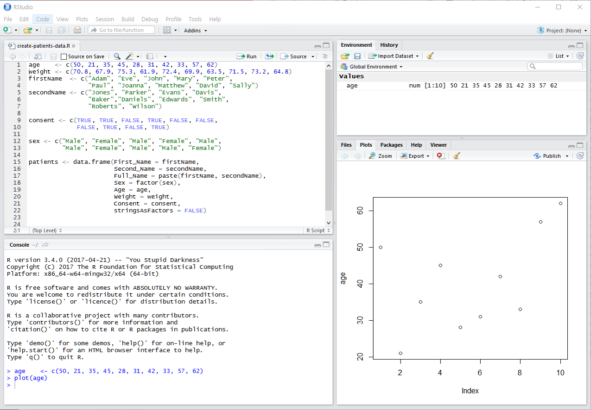
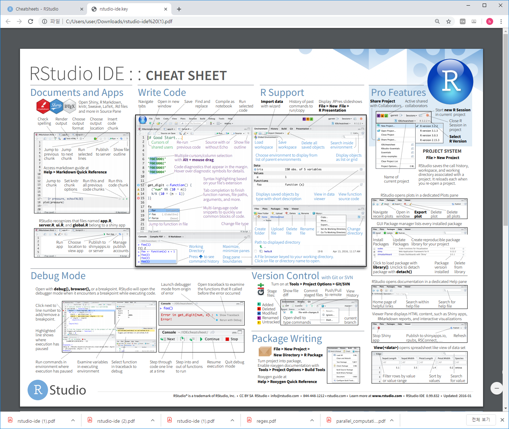
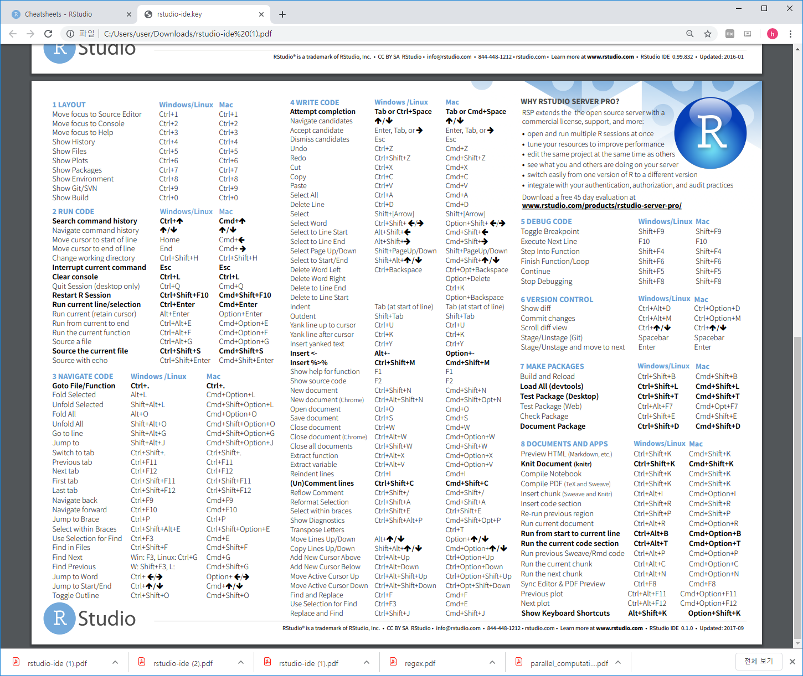

# R basics  

## What is R / Rstudio 


R은 통계나 생물통계, 유전학을 연구하는 사람들 사이에서 널리 사용되는 오픈소스 프로그래밍 언어 입니다. Bell Lab에서 개발한 S 언어에서 유래했으며 엄청나게 많은 라이브러리 (다른 사람들이 만들어 놓은 코드)가 있어서 쉽게 가져다 사용할 수 있습니다. R은 복잡한 수식이나 통계 알고리즘을 간단히 구현하고 사용할 수 있으며 C, C++, Python 등 다른 언어들과의 병행 사용도 가능합니다. 2019년 top five language에 랭크 되었으며 이는 빅데이터 증가에 따라 인기가 높아진 것으로 볼 수 있습니다 (참고로 2018년에는 7위).

{width=450px}

Despite being a much more specialized language than the others, it’s maintained its popularity in recent years due to the world being awash in an ever-growing pile of big data.
https://spectrum.ieee.org/computing/software/the-top-programming-languages-2019


R은 데이터를 통계분석에 널리 사용되는데 이는 데이터를 눈으로 확인하기 위한 visualization 이나 벡터 연산 등의 강력한 기능 때문에 점점 더 많은 사람들이 사용하고 있습니다. 기존에는 속도나 확장성이 다른 언어들에 비해 단점으로 지적되었으나 R 언어의 계속적인 개발과 업데이트로 이러한 단점들이 빠르게 보완되고 있습니다. R 사용을 위해서는 R 언어의 코어 프로그램을 먼저 설치하고 그 다음 R 언어용 IDE인 RStudio 설치가 필요합니다.  

  

  

## R / Rstudio installation

- R 사이트에 접속 후 (https://www.r-project.org/) 좌측 메뉴 상단에 위치한 CRAN 클릭. 
  

- 미러 사이트 목록에서 Korea의 아무 사이트나 들어감
  

- Download R for Windows를 클릭 후 base 링크 들어가서 
  
  

- Download R 3.6.3 for Windows 링크로 실행 프로그램 다운로드 (2020.3 현재 R 버전은 3.6.3). 로컬 컴퓨터에 Download 된 R-3.6.3-win.exe 를 실행하고 설치 프로그램의 지시에 따라 R 언어 소프트웨어 설치를 완료합니다. 

  


 
- Rstudio는 R 언어를 위한 오픈소스 기반 통합개발환경(IDE)으로 R 프로그래밍을 위한 편리한 기능들을 제공해 줍니다. 다음 사이트에 접속 (https://www.rstudio.com/), 상단의 Products > RStudio 클릭
  

- RStudio Desktop 선택
  

- Download RStudio Desktop 클릭
  

- RStudio Desktop Free 버전의 Download를 선택하고
  

- Download RStudio for Windows (2020.03현재 version 1.2.5033) 클릭, 다운로드. 로컬 컴퓨터에 다운로드된 RStudio-1.2.5033.exe를 실행하고 설치 가이드에 따라 설치 완료합니다. 
  


## Rstudio interface
- 아래 그림의 좌측 상단의 공간은 코드편집창, 좌측 하단은 콘솔창 입니다. 



## Keyboard shortcuts

- 참고사이트 
  - https://support.rstudio.com/hc/en-us/articles/200711853-Keyboard-Shortcuts
  - Tools --> Keyboard shortcut Quick Reference (```Alt + Shift + K```)
- 코드편집창 이동 (```Ctrl+1```) 콘솔창 이동(```Ctrl+2```)
- 한 줄 실행 (```Ctrl+Enter```)
- 주석처리 (```Ctrl + Shift + C```) 
  - 또는 ```#```으로 시작하는 라인 

- 실습
  - 코드편집창에서 다음 입력 
  -   
  - 단축키 ```Ctrl + enter```로 코드 실행 
  - 단축키 ```Ctrl + 2```로 커서 콘솔창으로 이동
  - ```x```값 ```x+y```값 확인 
  - 단축키 ```Ctrl + 1```로 코드편집창 이동 
  - 단축키 ```Ctrl + Shift + C``` 사용

```{r, eval=F}
# x <- 10
# y <- 20

```


## Set working directory  

시작 전 항상 작업 디렉토리 설정. 예를 들어 c:\ 아래 새로운 디렉토리 rprog2020 을 만들고 작업공간으로 설정  

```{r, eval=FALSE}
getwd()
dir()
setwd("C:\\rprog2020")
getwd()
dir()
```

또는 아래와 같이 RStudio 메뉴 에서 설정 

  


## Hello world

```{r, eval=FALSE}
mystring <- "Hello \n world!"
cat(mystring)
print(mystring)
```


## Help

R의 장점 중 하나로 방대한 양의 도움말 페이지가 제공됩니다. ```?``` 명령을 사용하면 되며 구글이나 웹에서도 도움을 얻을 수 있습니다. 

```{r, eval=F}
?cat
?print
?mean
help("mean")
example("mean")
help.search("mean")
help(package="MASS")
```


## RStudio workspace






## R packages

R은 "package"라 불리우는 다양한 함수 라이브러리를 사용할 수 있습니다. 예를 들어 ```sum()``` 이나 ```sd()```와 같은 함수는 ```stats```이라는 패키지에서 구현된 함수 입니다. 이러한 패키지는 인터넷의 ```repository```에서 구할 수 있으며 대표적으로 The Comprehensive R Archive Network (CRAN) http://cran.r-project.org/web/views/ 와 생물학자를 위한 Bioconductor specialised in genomics http://www.bioconductor.org/packages/release/BiocViews.html#___Software 가 있습니다. 이러한 패키지의 설치는 아래와 같이 RStudio를 이용하거나 콘솔창에서 ```install.packages()``` 함수를 이용할 수 있습니다. 
 


- UsingR package installation


패키지를 설치하고 사용하기 위해서는 ```library()``` 함수를 사용해서 미리 loading 해 두어야 합니다. 한 번 로딩으로 작업 세션이 끝날때까지 관련된 함수를 사용할 수 있으나 R 세션이나 RStudio를 재시작 할 경우 다시 로딩해야 사용할 수 있습니다. 


```{r, eval=F}
library(UsingR)
```

- R 설치 디렉토리
- R 패키지 설치 디렉토리

```{r, eval=F}
.libPaths()
path.package()
```


## Data sets

대부분의 패키지는 함수와 함께 관련된 도움말, 예제, 그리고 데이터셋을 같이 제공해 줍니다. ```library()``` 함수를 사용할 때 자동으로 같이 로딩이 되며 ```data()``` 함수를 사용해서 사용자 작업공간에 복사본을 만들어서 사용할 수 있습니다. 

```{r, eval=F}
head(rivers)
length(rivers)
class(rivers)
data(rivers)
data(package="UsingR")
library(HistData)
head(Cavendish)
str(Cavendish)
head(Cavendish$density2)
data(package="HistData")
```


## Cheatsheet


---


<a rel="license" href="http://creativecommons.org/licenses/by-nc-nd/4.0/"></a><br />이 저작물은 <a rel="license" href="http://creativecommons.org/licenses/by-nc-nd/4.0/">크리에이티브 커먼즈 저작자표시-비영리-변경금지 4.0 국제 라이선스</a>에 따라 이용할 수 있습니다.

