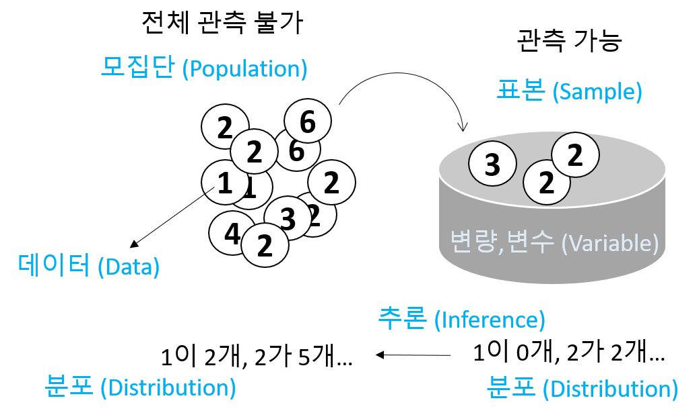
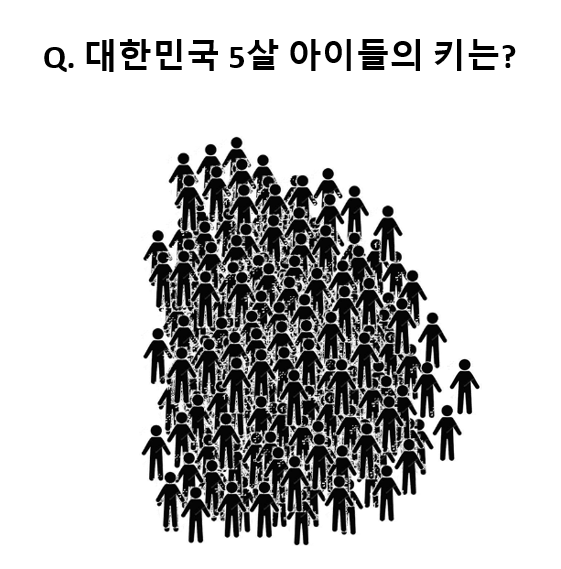

# Univariat data

## Introduction 2
- Statistics: 데이터 분석을 통한 예측. 즉, 데이터를 수집, 정리하여 이로부터 미지의 사실에 대한 신빙성 있는 추론을 수행하는 과정



- Data - 사실을 나타내는 수치 
- 맥도너 정보경제학 (1963)
  + 지혜 (wisdom) : 패턴화된 지식
  + 지식 (knowledge) : 가치있는 정보
  + 정보 (information) : 의미있는 데이터
  + 데이터 (data) : 단순한 사실의 나열

- Univariate (단변량): Single variable 


$$ x_1, x_2, ..., x_n $$
```{r, eval=F}
library(UsingR)
exec.pay
?exec.pay
```


- 데이터의 속성에 따른 구분 
- 범주형 - 질적 데이터, 숫자로 나타낼 수 있으나 의미 없음
  + 명목형 (Nominal) - 사람 이름
  + 순서형 (Ordinal) – 달리기 도착 순서
- 수치형 - 숫자로 나타내며 데이터 속성을 그대로 지님님
  + 구간형 (Interval) – 선수1, 선수2 종점통과 시간
  + 비율형 (Ratio) – 출발시간 기준 종점 통과 시간


- Data type in R
  + Numeric data types (수치형)
    + Discrete (이산형) data - 카운트, 횟수 
    + Continuous (연속형) data - 키, 몸무게, Cannot be shared
  + Factors data - Categories to group the data (범주형)
  + Character data - Identifiers (범주형)
  + Date and time (수치형)

## Data vectors

- Using combine function 

```{r, eval=F}
#The number of whale beachings in Texas during the 1990s
whale <- c(74, 122, 235, 111, 292, 111, 211, 133, 156, 79)
#Object `whale` is a data vector == (univariate) data set

# The size 
length(whale)
sum(whale)
sum(whale)/length(whale)
mean(whale)
```


- Vectorization

```{r, eval=F}
whale - mean(whale)
whale^2 - mean(whale)
sqrt(whale)
```


- Adding values to a vector variable

```{r, eval=F}
x <- 1
x <- c(x, 2)
x
x <- c(x, 3, 3, 3, 4)
x
```


- Missing/NULL values
  + NA: Not available, The value is missing 
  + NULL: a reserved value
  + NaN: Not a number (0/0)
  + Inf: (1/0)

```{r, eval=F}
hip_cost <- c(10500, 45000, 74100, NA, 83500)
sum(hip_cost)
sum(hip_cost, na.rm=TRUE)
?sum
```

- Attributes: names in data vectors

```{r, eval=F}
head(precip)
class(precip)
length(precip)
names(precip)
order(names(precip))

test_scores <- c(100, 90, 80)
names(test_scores) <- c("Alice", "Bob", "Shirley")
```

- Indexing 

```{r, eval=F}
head(precip)
precip[1]
precip[2:10]
precip[c(1,3,5)]
precip[-1]
precip["Seattle Tacoma"]
precip[c("Seattle Tacoma", "Portland")]
precip[2] <- 10
```


- Functions for generating structured data

```{r, eval=F}
1:5
seq(1,5, by=1)
seq(0, 100, by=10)
seq(0, 100, length.out=11)
?seq
rep(5, times10)
rep(1:3, times=4)
```


## Data type 
 - Numeric data
```{r, eval=F}
class(1)
class(pi)
class(seq(1,5,by=1))
```
 
 - Character data
```{r, eval=F}
ch <- c("Lincoln", "said", "and")
class(ch)
```
 - Combining strings - paste function
```{r, eval=F}
paste("X", 1:10)
paste("X", 1:10, sep="")
paste("The", "quick", "brown", "fox")
paste(c("The", "quick", "brown", "fox"))
paste(c("The", "quick", "brown", "fox"), collapse=" ")
x <- 1:10
paste(x)
paste(x, collapse=":")
```

 - Factors 
```{r, eval=F}
x <- c("Red", "Blue", "Yellow", "Green", "Blue", "Green")
y <- factor(x)
y
```
 
- Adding a level 
```{r, eval=F}
levels(y)
y[1] <- "Gold"
y
```
```{r, eval=F}
levels(y) <- c(levels(y), "Gold")
levels(y)
y
y[1] <- "Gold"
y
```

 - Logical data
   + TRUE and FALSE
   + "is" functions
   + Comparison by `<`, `<=`, `==`, `!=`, `>=`, `>`
   + Combination by `!`, `&`, `|`

```{r, eval=F}
is.na(1)
is.numeric(1)
is.logical(TRUE)

pi < 3
precip < 30
which(precip < 30)
any(precip < 30)
all(precip < 30)
any(39 == precip)
which(39 == precip)
sum(precip < 30)
sum(c(TRUE, TRUE))

x <- 1:100
x < 10
x > 90
x < 10 | x >90
which(x < 10 | x >90)
i <- which(x < 10 | x >90)
x[i]
x[x < 10 | x >90]
```


- Date and time
  + Unixtime, POSIX time
  + 1970년 1월 1일 00:00:00 협정 세계시(UTC) 부터의 경과 시간을 초로 환산 
  + 32비트로 표현된 유닉스 시간은 1970년 1월 1일 00:00 (UTC)에서 2,147,483,647 (231 - 1) 지난 후인 2038년 1월 19일 03:14:08 UTC에 2038년 문제를 발생시킨다. 이는 산술 오버플로와 관련 있는 문제이다. –wiki- 


```{r, eval=F}
library(lubridate)
current_time <- now() # record since 1970
as.numeric(current_time)
as.numeric(now())
month(current_time)
```


## Functions 2

- Define a function

```{r, eval=F}

my_mean <- function(x){
	total <- sum(x)
	n <- length(x)
	return(total/n)
}

```

- Write a function named `get_dist` and use it for the `rivers` data

```{r, eval=F}

get_dist <- function(x){
	return()
}

```

## Miscellaneous 1

랜덤 문자열 만들기 

```{r, eval=F}
LETTERS
x <- sample(LETTERS, 10)
x_paste <- paste(x, collapse="")

random_string_generator <- function(n){
  x <- sample(LETTERS, n)
  x_paste <- paste(x, collapse="")
  return(x_paste)
}

random_string_generator(20)
random_strings <- replicate(10, random_string_generator(5))


```


특정 문자로 시작하는 데이터 뽑기

```{r, eval=F}

i <- grep("^D", random_strings)
random_strings[i]

i <- grep("D$", random_strings)
random_strings[i]
```


## Numeric summaries
<center>


<br>
<br>

</center>

- 대푯값 (요약값)
- Center – commonly known as “average” or “mean” but not the only one. 
  + median, mode, etc
  
- Spread – Variability of a data set. 
  + No variability – mean is everything 
  + Large variability – mean informs much less
  + confidence of interpretation from knowing center
  + Distance from center
  
- Shape – Degree of interpretation from knowing center and spread. 
  + eg. bell shape – two sides are equally likely, large values are rather unlikely and values tend to cluster near the center.


## Center for a univariat variable

<center>

</center>

### Sample mean
$$ \bar{x} = \frac{1}{n} (x_1 + x_2 + ... + x_n) = \frac{1}{n}\sum_i{x_i} $$ 

```{r, eval=F}
head(kid.weights)
str(kid.weights)
wts <- kid.weights$weight
length(wts)
plot(wts)
mean(wts)
devs <- wts – mean(wts) # deviation, centering
plot(wts)
mean(wts)
```
- Trimmed mean

```{r, eval=F}
mean(wts)
wts[wts<120]
mean(wts[wts<=120])
mean(wts, trim=0.8)
```

### Measure of Position

- _p_th Quantile - 특정 값으로 이 값보다 작은 데이터의 비율이 100∙p 퍼센트, 큰 데이터의 비율은 100∙(1- p) 퍼센트 
- Median - Splits the data in half _p_=0.5
- Percentiles - The same as quantile but its scale is 0 to 100

```{r, eval=F}
x <- 0:5
length(x)
quantile(x, 0.25)
median(x)
quantile(x, seq(0, 1, by=0.2))
quantile(x)
```

- Robustness 

```{r, eval=F}
mean(wts)
median(wts)
plot(wts)
abline(h=mean(wts), col="red")
abline(h=median(wts), col="blue")
wts2 <- wts[wts<120]
abline(h=mean(wts2), col="red", lty=2)
abline(h=median(wts2), col="blue", lty=2)
```

- Boxplot

```{r, eval=F}
x <- 0:5
quantile(x)
boxplot(x)
text(x=1.3, y=quantile(x, 0.25), labels = "1사분위수")
text(x=1.3, y=quantile(x, 0.5), labels = "2사분위수")
text(x=1.3, y=quantile(x, 0.75), labels = "3사분위수")
```


## Spread for a univariat variable

<center>

</center>

- Range - the distance between the smallest and largest values 
- Sample variance 
  + Distance - $$ d_i = x_i - \bar{x} $$

\begin{equation}
 s^2 = \frac{1}{n-1}\sum_i(x_i - \bar{x})^2
\end{equation}

- Sample standard deviation
  + 측정값들이 평균에서 떨어진 정도 
\begin{equation}
 \sqrt{s^2} = \sqrt{ \frac{1}{n-1}\sum_i(x_i - \bar{x})^2 }
\end{equation}

  
```{r, eval=F}
wts <- kid.weights$weight
var(wts)
sd(wts)

plot(wts)
boxplot(wts)
hist(wts)
hist(wts, breaks = 50)
hist(wts, 50)
abline(v=mean(wts), col="red")
```

- z-score 
  + How big (small) is the value relative to the others
  + $z=3$ 이 값은 평균에 비해 3 표준편차만큼 크다 

\begin{equation}
 z_i = \frac{x_i - \bar{x}}{s}
\end{equation}


- Example - z score
wts의 z 값을 구하는 함수를 만들고 histogram을 그리시오 

```{r, eval=F}
wts <- kid.weights$weight
```


- Interquartile range (IQR) 
  + Middle 50% of the data
  + Difference between Q3 and Q1

<center>

</center>


## Problems 02

1) `seq` 또는 `rep` 함수를 사용해서 다음 서열들을 만들고 `x` 변수에 저장하시오 

1-1) "a", "a", "a", "a", "a" 

1-2) 1, 3, 5, 7, ..., 99

1-3) 1, 1, 1, 2, 2, 2, 3, 3, 3

1-4) 1, 2, 3, 4, 5, 4, 3, 2, 1

<br>
<br>

2) Recording values  

다음은 신생아들의 키를 나타내는 data set 이다. 오류 값을 찾아내고 이들 값을 `NA`로 바꾼 후 평균 값을 구하시오 (`babies` 데이터셋은 `UsingR` 패키지에 있으며 오류값은 999 입니다)
```{r, eval=F}
x <- babies$dwt
x
```


<br>
<br>

3) `precip` 데이터는 미국 도시들의 연간 평균 강수량을 저장한 데이터이다. `precip`에서 "J"로 시작하는 도시이름을 찾고 해당 도시들의 평균 강수량을 구하시오 

<br>
<br>

4) 위 강수량 데이터 `precip`에서 연평균 강수량이 50 이상인 도시를 뽑고 해당 도시들의 강수량에 따라서 순서대로 나열하시오 

<br>
<br>

5) 특정 숫자가 짝수인지를 검사하는 방법은 해당 숫자를 2로 나누어 나머지가 0인지 확인하는 방법이다. `2 %% 2 == 0` 위와 같은 코드로 이를 구현할 수 있다. 다음 변수의 값들 중 짝수의 개수를 구하는 코드를 작성하시오 (1줄 코드임). 

```{r, eval=F}
x <- c(12, 3, 4, 2, 28, 11, 8, 9, 51, 89)
```

<br>
<br>

6) `bumpers` 데이터셋은 (`UsingR` 패키지) 자동차 범퍼를 교환하는데 필요한 비용을 나타낸다. 평균과 중간값, 표준편차를 구하고 교체 비용이 가장 비싼 차와 가장 싼 차가 어떤 차들인지 찾으시오. 


7) 다음 `wts` 변수 값들의 center를 나타내는 평균, 중간값과 spread를 나타내는 분산, 표준편차, IQR 을 구하시오 

```{r, eval=F}
wts <- kid.weights$weight
```


## Shape for a univariat variable

<center>

</center>
 
- Symmetry and skew

\begin{equation}
 \text{sample skewness} = \sqrt{n} \frac{\sum{(x_i - \bar{x})^2}}{(\sum{(x_i - \bar{x})^2)^{3/2}}} = \frac{1}{n}\sum{z_i^3}
\end{equation}


```{r, eval=F}
myskew <- function(x){
  n <- length(x)
  z <- (x-mean(x))/sd(x)
  return(sum(z^3)/n)
}

wts <- kid.weights$weight
hist(wts, 50)
myskew(wts)

z <- rnorm(length(wts))
hist(z, br=50)
myskew(z)
```

- Sample excess kurtosis 
  + Measure of tails
  
\begin{equation}
  \text{sample excess kurtosis} = n \frac{\sum{(x_i - \bar{x})^4}}{(\sum{(x_i - \bar{x})^2)^2}} -3 = \frac{1}{n}\sum{z_i^4} - 3
\end{equation}

```{r, eval=F}
mykurtosis <- function(x){
  n <- length(x)
  z <- (x-mean(x))/sd(x)
  return(sum(z^4)/n - 3)
}

wts <- kid.weights$weight
hist(wts, 50)
mykurtosis(wts)

z <- rnorm(length(wts))
hist(z, br=50)
mykurtosis(z)
```

## Viewing the shape

### Histogram 

도수분포표를 나타낸 그림으로 데이터를 특정 범위의 그룹으로 짝짓고 해당 범위와 그룹의 크기에 해당하는 막대를 그린 그래프입니다. 

```{r, eval=F}
x <- faithful$waiting
hist(x)
hist(x, breaks = 20)
hist(x, breaks = 20, freq=FALSE)
hist(x, breaks = 20, freq=FALSE, main="Histogram")
hist(x, breaks = 20, freq=FALSE, main="Histogram", xlim=c(0, 100))
hist(x, breaks = 20, freq=FALSE, main="Histogram", xlim=c(0, 100), ylim=c(0, 0.1))
```

히스토그램은 center (mean, median), spread (Variance, IQR), shape (tail)을 모두 볼 수 있는 그래프입니다. 그리는 방법은 전체 범위의 데이터가 포함되도록 범위를 정하고 동일 같격으로 구분되는 계급의 개수를 정한 후 해당 계급에 속하는 데이터의 개수를 세어 도수를 구합니다. 다음은 도수 분포표를 만드는 코드 입니다.

```{r, eval=F}
x <- faithful$waiting
bins <- seq(40, 100, by=5)
out <- cut(x, breaks=bins)
table(out)
plot(table(out))
```


### Density plots 

히스토그램을 갖는 하나의 단변량 변수가 있을 때 특정 값이 선택될 확률은 히스토그램의 해당 계급의 도수값을 전체로 나눈 값이라고 할 수 있습니다. 그런나 연속적인 구간이나 시간의 경우에는 히스토그램보다는 density plot이 요약값을 보기에 더 적합합니다. 


```{r, eval=F}
wts <- kid.weights$weight
xrange <- range(wts)
den <- density(wts)
plot(den, xlim=xrange, xlab="densities", main="")
```


### Boxplots 
상자그림 또는 상자 수염 그림으로 불리는 boxplot은 다섯개의 주요 요약값을 (min, max, Q1, Q3, and median) 보여주며 대규모 데이터를 한 눈에 비교할 수 있는 좋은 방법 입니다. 

```{r, eval=F}
boxplot(kid.weights)
boxplot(kid.weights$weight)

#install.packages("vioplot")
library(vioplot)
vioplot(kid.weights)
vioplot(kid.weights, col=c("#3CAEA3", "#F6D55C", "#ED553B"), rectCol=c("gray"), main="Kids")
?vioplot

#console
par(mfrow=c(1,2))
plot(density(kid.weights$weight))
vioplot(kid.weights$weight)

```


## Quantile graph

quantile plot은 일반적으로 두 개의 변수의 분포를 비교하는데 사용됩니다. 본 단원의 단일 변수의 경우 해당 변수의 분포가 정규분포인지를 검사하는데 사용될 수 있습니다.  
```{r, eval=F}
x <- rep(Macdonell$finger, Macdonell$frequency)
qqnorm(x)
hist(x, br=50)

hist(Galton$child, br=50)
x <- jitter(Galton$child, factor=5)
hist(x, br=50)
qqnorm(x)

y <- rnorm(10000, mean(x), sd(x))
hist(y, br=50)
qqnorm(y)

## overlay
plot(density(x))
lines(density(y), col="red")
```


## Categorical data

단일 변수에서 범주형 데이터는 테이블 형태로 요약값 정보를 볼 수 있습니다. 

```{r, eval=F}

x <- babies$smoke
x <- factor(x, labels=c("never", "now", "until current", "once, quit", "unknown"))
table(x)
out <- table(x)
prop <- 100*out/sum(out)
round(prop, digits=2)
barplot(out)
barplot(prop)
dotplot(out)
dotplot(prop)
pie(out)

```


