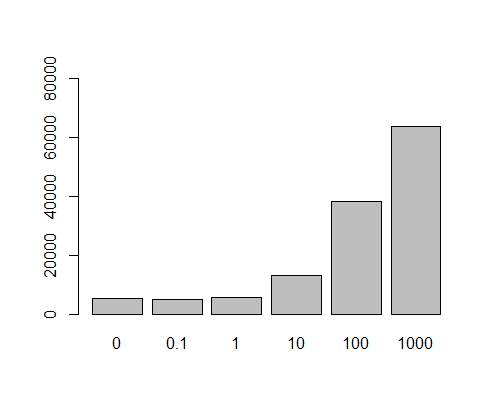
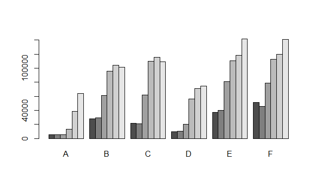

# Multivariate data

## Introduction

앞서 장에서는 기본적인 변수에 대한 대표값들과 두 개 이상의 변수가 주어졌을 경우 그 관계를 정량화 하는 과정을 학습했습니다. 그러나 일반적인 데이터 분석은 두 개 이상의 변수와 샘플들에 대해서 정제, 변환, 가시화, 대표값 비교 및 모델링으로 이어지는 단계로 이루어질 수 있습니다. 본 장에서는 R을 사용해서 위 데이터 분석 과정을 수행하기 위해 필요한 프로그래밍 기술을 습득하기 위해 최근 대표적으로 사용되는 apply 함수들과 dplyr 패키지 사용에 대한 학습을 목표로 합니다. 


## Data structures in R

### Vectors 

같은 타입의 데이터를 (Numeric, character, factor, ...) 모아 놓은 컨테이너로서 인덱스는 ```[```, ```]```를 사용합니다. 


```{r, eval=F}
x <- c(10.4, 5.6, 3.1, 6.4, 21.7) 
class(x)
is.numeric(x)
y <- c("X1", "Y2",  "X3",  "Y4")
class(y)
is.numeric(y)
z <- c(T, F, F, T)
class(z)
is.logical(z)
```


### Lists 

`list` 변수 타입은 `vector` 형태의 여러개의 element를 가질 수 있으며 각 element의 데이터는 문자나 숫자 어떤 데이터 타입도 가능하며 각 element vector의 길이가 모두 달라도 됩니다. list의 인덱싱에서 `[` `]`는 리스트를 반환하고 `[[` `]]`는 vector element들을 반환합니다. 


```{r, eval=F}
## list
parent_names <- c("Fred", "Mary")
number_of_children <- 2
child_ages <- c(4, 7, 9)
data.frame(parent_names, number_of_children, child_ages)
lst <- list(parent_names, number_of_children, child_ages)
lst[1]
lst[[1]]
class(lst[1])
class(lst[[1]])
lst[[1]][1]
lst[[1]][c(1,2)]
```


### Matrices

메트릭스는 같은 타입의 데이터로 채워진 사각형 모양을 갖는 컨테이너로 볼 수 있습니다. 인덱스는 ```[i, j]``` 형태로 ```i```는 row, ```j```는 column 을 가리킵니다. 메트릭스의 생성은 ```matrix``` 명령어를 사용하며 다음과 같이 각 column 별로 값을 채워 나가는 것이 기본 설정이며 ```byrow=T``` 를 통해 row를 다 채우고 그 다음 row를 채워 나가게 할 수도 있습니다. 


```{r eval=F}
mymat <- matrix(0, nrow=100, ncol=3) # 1
mymat[,1] <- 1:100 # 2
mymat[,2] <- seq(1,200,2) # 3
mymat[,3] <- seq(2,200,2) # 4

m <- matrix(c(1,2,3,4), nrow=2)
m
m <- matrix(c(1,2,3,4), nrow=2, byrow = T)
m

```

row와 column 이름은 ```rownames```와 ```colnames```로 설정이 가능하며 ```rbind```와 ```cbind```는 벡터를 연결하고 붙이는 역할을 할 수 있으나 데이터가 많거나 반복해서 수행할 경우 컴퓨터의 리소스를 많이 사용하는 문제로 느려질 수 있습니다. 

```{r, eval=F}
m <- cbind(1:3, c(1.1, 1.2, 1.3), c(1, 1, 2)) # a 3 by 3 matrix
colnames(m) <- c("x", "y", "z") # or cbind(x=..., ...)
m
dim(m)
```

### data.frame

data frame은 변수들의 집합으로 ```list```형과 비슷하지만 각 변수 element들이 똑같은 길이를 가지고 matrix 형태로 표현되는 것이 다릅니다. 즉, 각 row는 샘플을 나타내고 각 column은 변수를 나타내며 각 변수들이 갖는 샘플의 개수 (row의 길이, vector 의 길이)는 같아야 합니다. 컬럼 한 줄이 하나의 변수 이므로 새로운 변수도 컬럼 형태로 붙여 넣을 수 있습니다. 변수들의 이름을 이용하여 ```$``` 기호로 각 변수들의 데이터에 접근 할 수 있고 matrix와 같이 ```[i,j]``` 형태의 인덱싱도 가능합니다. R 기반의 데이터 분석에서는 가장 선호되는 데이터 타입이라고 볼 수 있습니다.


```{r, eval=F}
ids <- 1:10
ids
idnames <- paste("Name", ids, sep="")
idnames
students <- data.frame(ids, idnames)
students
class(students$ids)
class(students$idnames)
students$idnames
str(students)

students <- data.frame(ids, idnames, stringsAsFactors = F)
class(students$idnames)
students$idnames
students[1,]
str(students)
```


## Working with data frame I

일반적인 데이터 분석은 데이터 클리닝, 변환, 가시화, 대표값비교, 모델링의 반복적인 수행으로 진행될 수 있습니다. 특히 R에서는 data frame 타입의 데이터로 대부분의 분석이 진행되므로 data frame 기반의 다양한 기법을 익혀야 합니다. 


```{r, eval=F}
# `state.x77` 데이터셋에서 `population`과 `Life Exp`, 그리고 `Murder` 변수만을 이용한 새로운 matrix

str(state.x77)
newstate <- state.x77[,c(1,4,5)]
class(newstate)
str(newstate)
```


```{r, eval=F}
# 새로운 변수 추가
rownames(state.x77)
head(state.x77)
state_names <- rownames(state.x77)
newstate <- data.frame(state_names, state.x77[,c(1,4,5)])
head(newstate)
str(newstate)
newstate <- data.frame(state_names, state.x77[,c(1,4,5)], stringsAsFactors = F)
str(newstate)
```


### subset and filter

R에서 데이터 저장은 `data.frame`이나 `matrix` 타입을 일반적으로 사용합니다. 이 데이터의 일부 열 또는 행의 데이터만을 가져와서 별도로 저장하거나 분석이 필요할 경우가 있습니다. 이 때 인덱싱을 사용해서 일부 데이터를 선택하고 사용할 수 있으며 `subset`과 `filter` 함수도 이러한 선별 기능을 제공합니다. `subset`은 행과 열 모두를 선별할 수 있는 함수이고 `filter`는 열 (샘플)을 선택하는 함수입니다. 다음 `airquality` 데이터는 1973년 날짜별로 뉴욕의 공기질을 측정한 데이터 입니다. `NA`를 제외한 나머지 데이터만으로 새로운 데이터셋을 만들어 봅시다. `is.na`함수를 사용하면 해당 데이터가 `NA`일 경우 `TRUE`, `NA`가 아닐 경우 `FALSE` 를 반환해 줍니다. 


```{r, eval=F}
is.na(airquality$Ozone)
ozone_complete1 <- airquality[!is.na(airquality$Ozone),]
ozone_complete2 <- filter(airquality, !is.na(airquality$Ozone))
ozone_complete3 <- subset(airquality, !is.na(Ozone))
```

위 ozone_complete1와 ozone_complete2, ozone_complete3는 같은 결과를 보입니다. 그러나 ozone_complete1, 2보다는 ozone_complete3 코드가 훨씬 직관적이고 가독성이 높습니다. 특히 `airquality$ozone` 로 `$`를 사용하여 변수에 접근한 반면 subset 함수는 `Ozone`이라는 변수 이름을 사용해서 접근함으로써 코드의 간결성과 가독성을 유지할 수 있습니다. 또한 `subset`의 `select` 옵션을 이용해서 변수를 선택할 수도 있으며 `&`(AND)와 `|`(OR) 연산자를 사용해서 조건을 두 개 이상 설정할 수 있습니다. 아래 `select` 옵션에서 `-`는 해당 변수를 제외한다는 의미 입니다. 

```{r, eval=F}
ozone_complete4 <- subset(airquality, !is.na(ozone), select=c(ozone, temp, month, day))
ozone_complete5 <- subset(airquality, !is.na(ozone) & !is.na(solar.r), select=c(-month, -day))
```


### merging and split

`merge` 함수는 두 개 이상의 데이터셋을 통합하는 기능을 수행하는 함수입니다. 특히 `rbind`나 `cbind`와는 다르게,  결합하는 두 데이터에 공통적이거나 한 쪽의 데이터를 기준으로 결합을 수행 합니다. `?merge`를 참고하면 `by`, `by.x`, `by.y`, `all`, `all.x`, `all.y` 등의 옵션으로 이러한 설정을 수행할 수 있습니다. 간단한 예제를 통해서 이해해 보겠습니다.  

10명의 사람이 있고 이 사람들의 나이와 성별을 각각 나타낸 두 데이터셋이 있습니다. 그런데 df1은 나이만을 df2는 성별 정보만을 가지고 있으며 두 정보 모두 제공된 사람은 3명 (인덱스 4,5,6) 뿐입니다. 이제 merge를 이용해서 두 데이터셋을 결합해 보겠습니다. 


```{r, eval=F}
## merge
df1 <- data.frame(id=c(1,2,3,4,5,6), age=c(30, 41, 33, 56, 20, 17))
df2 <- data.frame(id=c(4,5,6,7,8,9), gender=c("f", "f", "m", "m", "f", "m"))

df_inner <- merge(df1, df2, by="id", all=F)
df_outer <- merge(df1, df2, by="id", all=T)
df_left_outer <- merge(df1, df2, by="id", all.x=T)
df_right_outer <- merge(df1, df2, by="id", all.y=T)
```

만약 두 데이터셋의 id가 다를 경우나 각각 다른 기준으로 결합해야 하는 경우는 `by`대신 `by.x`, `by.y` 옵션을 사용할 수 있습니다. 

`split` 함수는 데이터를 특정 기준으로 나누는 역할을 하며 해당 기준은 factor 형 벡터 형태로 주어질 수 있습니다.  예를 들어 `airquality` 데이터의 `month` 변수를 기준으로 데이터를 분리해 보겠습니다. 


```{r, eval=F}
str(airquality)
g <- factor(airquality$Month)
airq_split <- split(airquality, g)
class(airq_split)
str(airq_split)
```

위와 같이 `airq_split`은 길이가 5인 (5, 6, 7, 8, 9월) `list`타입이 되었고 각 요소는 서로 다른 size의 `data.frame`형으로 구성 된 것을 확인할 수 있습니다. 


### transforming data

R에서 기존 가지고 있는 데이터의 변경은 새로운 변수의 추가, 삭제, 변형과 샘플의 추가, 삭제, 변형을 생각해 볼 수 있습니다. 이러한 기능은 앞에서 배운 `merge`, `split`이나 `rbind`, `cbind`, 그리고 인덱싱을 활용한 값 변경 등의 방법을 이용할 수 있습니다. 또한 가장 직관적으로 필요한 변수들을 기존 데이터셋에서 추출한 후 `data.frame` 명령어를 사용해서 새로운 데이터셋으로 만들어주면 될 것 입니다. 

이러한 방법들 외에 `within`을 사용할 경우 특정 변수의 변형과 이를 반영한 새로운 데이터셋을 어렵지 않게 만들수 있습니다. `with` 함수의 사용 예와 함께 `within` 함수를 사용하여 데이터를 변형하는 예를 살펴봅니다. `with`나 `within` 함수는 R을 활용하는데 많이 사용되는 함수들은 아닙니다. 또한 이러한 기능들은 `dplyr` 등의 패키지에서 제공하는 경우가 많아서 필수적으로 익힐 부분은 아닙니다. 그러나 개념적인 이해를 돕기위한 좋은 도구들이며 여전히 고수준의 R 사용자들이 코드에 사용하고 있는 함수들이므로 알아두는 것이 좋습니다. 

```{r, eval=F}
## without with
ozone_complete <- airquality[!is.na(airquality$Ozone),"Ozone"]
temp_complete <- airquality[!is.na(airquality$Temp),"Temp"]
print(mean(ozone_complete))
print(mean(temp_complete))

## with
with(airquality, {
  print(mean(Ozone[!is.na(Ozone)]))
  print(mean(Temp[!is.na(Temp)]))
})

```

위 `with` 함수에서 보는바와 같이 `$`를 이용한 변수 접근 대신 `with`함수 내에서는 (`{`, `}` 안에서) 해당 `data.frame`에 있는 변수 이름을 직접 접근할 수 있으며 따라서 코드의 간결함과 가독성이 향상됩니다. 

`within` 함수는 `with`함수와 같이 `{`, `}` 안에서 변수의 이름만으로 해당 변수에 접근이 가능하나 입력된 데이터와 변경된 변수(들)을 반환한다는 점이 다릅니다. 아래 예는 `airquality` 데이터의 화씨 (Fahrenheit) 온도를 섭씨 (Celsius) 온도로 변환해서 새로운 데이터셋을 만드는 코드입니다. `data.frame`을 이용한 코드와 비교해 보시기 바랍니다. 데이터셋 내에서 참조할 변수들이 많아질 경우 `airquality$xxx` 식의 코드를 줄이는 것 만으로도 코드의 가독성과 간결성을 유지할 수 있습니다.  


```{r, eval=F}
newairquality <- within(airquality, {
  celsius = round((5*(Temp-32))/9, 2)
})
head(newairquality)

## data.frame
celsius <- round((5*(airquality$Temp-32))/9, 2)
newairquality <- data.frame(airquality, celsius)
head(newairquality)
```


**EXERCISE** airquality 데이터의 Month에 따른 Ozone 의 분포를 boxplot을 이용해서 비교하시오. (subset??)을 이용하여 Month에 따른 각각의 Ozone의 값들로 새로운 변수들 v5, v6, v7, v8, v9을 만들고 이들을 하나의 data frame으로 만드시오 

```{r}
head(airquality)

boxplot(formula=Ozone~Month, data=airquality)
boxplot(airquality$Ozone~airquality$Month)
```

**EXERCISE** 가장 직관적으로 먼저 필요한 기능을 하나의 데이터 엘리먼트에 대해서 수행하는 스크립트를 먼저 작성해 보고 필요한 index를 붙이거나 for 문을 활용해서 원하는 형태의 데이터 변환을 완료하시오 

```{r, eval=F}
oz <- data.frame(airquality$Ozone[airquality$Month==5],
airquality$Ozone[airquality$Month==6],
airquality$Ozone[airquality$Month==7],
airquality$Ozone[airquality$Month==8],
airquality$Ozone[airquality$Month==9])

oz <- list(airquality$Ozone[airquality$Month==5],
airquality$Ozone[airquality$Month==6],
airquality$Ozone[airquality$Month==7],
airquality$Ozone[airquality$Month==8],
airquality$Ozone[airquality$Month==9])

boxplot(oz)

##
soz <- list()
soz[[1]] <- (oz[[1]]-mean(oz[[1]], na.rm=T))/sd(oz[[1]], na.rm=T)
soz[[2]] <- (oz[[2]]-mean(oz[[2]], na.rm=T))/sd(oz[[2]], na.rm=T)
soz[[3]] <- (oz[[3]]-mean(oz[[3]], na.rm=T))/sd(oz[[3]], na.rm=T)
soz[[4]] <- (oz[[4]]-mean(oz[[4]], na.rm=T))/sd(oz[[4]], na.rm=T)
soz[[5]] <- (oz[[5]]-mean(oz[[5]], na.rm=T))/sd(oz[[5]], na.rm=T)
soz

boxplot(soz)
soz <- list()
for(i in 1:5){
  soz[[i]] <- (oz[[i]]-mean(oz[[i]], na.rm=T))/sd(oz[[i]], na.rm=T)
}
boxplot(soz)


```

반복적으로 수행하는 일들은 apply 계열 함수를 사용하면 쉽게 기능을 수행할 수 있습니다. 


```{r, eval=F}
l1 <- transform(l[[1]], ozz=scale(Ozone))
l1
l2 <- transform(l[[2]], ozz=scale(Ozone))
l2

soz2 <- lapply(l, function(x){scale(x$Ozone)})
boxplot(soz2)
```


## working with data frame II

앞서 배운 일련의 작업들은 R에서 기본적으로 제공되는 함수를 사용한 경우입니다. 이 외에 R이 갖는 장점인 행렬, 벡터연산 기능을 최대한 활용할 수 있는 기능들에 대한 내용을 배워봅니다. dplyr, reshape2 등의 별도 패키지에대한 설치가 필요합니다.   

### apply 

데이터를 다룰 때 각 원소별, 그룹별, row, column 별로 다뤄야 할 경우가 많으며 apply 계열의 합수는 이러한 기능을 제공하는 함수로써 적절히 사용하면 효율성이나 편리성 뿐만 아니라 코드의 간결성 등 장점이 많은 기능입니다. colMean 과 같은 함수는 column 또는 row 단위로 해당하는 모든 값들에 대해 연산을 수행해주는 함수로 colMean은 평균을 계산하는 함수이고 일반적으로는 다음과 같이 apply 함수와 mean 함수를 이용해서 같은 기능을 수행할 수 있습니다. 아래는 앞서 ```babies``` 데이터셋 clearning 된 ```b2``` 데이터에 이어서 수행되는 내용입니다. 


```{r, eval=F}
library(UsingR)

b <- within(babies, {
  gestation[gestation==999] <- NA
  wt[wt == 999] <- NA
})

b2 <- within(b, {
  smoke = factor(smoke)
  levels(smoke) = list(
    "never" = 0, 
    "smoke now" = 1, 
    "until current pregnancy" = 2,
    "once did, not now" = 3)
  })


b3 <- b2[,c("gestation", "wt", "dwt")]
colMeans(b3)
colMeans(b3, na.rm=T)

b4 <- within(b3, dwt[dwt==999]<-NA)
```

apply는 다음과 같이 작동을 합니다. 


```{r, eval=F}
apply(b4, 1, mean)
apply(b4, 2, mean)
apply(b4, 2, mean, na.rm=T)

apply(b4, 2, sd)
apply(b4, 2, sd, na.rm=T)

apply(b4, 2, function(x){ 
  xmean <- mean(x, na.rm=T) 
  return(xmean)
  })

```

임의의 함수를 만들어서 사용할 수도 있습니다. apply 함수를 사용할 경우 행렬이 커질수록 계산 시간도 빨라질 수 있습니다. 

```{r, eval=F}
n <- 40
m <- matrix(sample(1:100, n, replace=T), ncol=4)
m
mysd <- function(x){
  xmean <- sum(x)/length(x)
  tmpdif <- x-xmean
  xvar <- sum(tmpdif^2)/(length(x)-1)
  xsd <- sqrt(xvar)
  return(xsd)
}
mysd(m[1,])
apply(m, 1, mysd)
apply(m, 1, sd)
```


**[EXERCISE]** ```for``` 문과 mysd를 이용하여 위 행렬 ```m```의 4개 컬럼에 대한 stadard deviation을 구하시오 

```{r, eval=F}

mysd(m[,1])
mysd(m[,2])
mysd(m[,3])
mysd(m[,4])

sd_result <- rep(NA, 4)
for(i in 1:4){
  sd_result[i] <- mysd(m[,i])
}
sd_result
apply(m, 2, mysd)
```


### map and apply function family 

```apply``` 함수 외에도 ```sapply```, ```lapply```, ```mapply``` 등의 다양한 apply계열 함수가 쓰입니다. 

```{r, eval=F}
# map
collection <- c(4, 9, 16)
Map(sqrt, collection)
sqrt(collection)
sapply(collection, sqrt)

#
lst <- with(ToothGrowth, split(len, supp))
sapply(lst, mean)
sapply(lst, median)
Map(median, lst)

median(lst)
mean(lst)

# mapply
Map(min, c(1,4), c(2,3))
#simplification of output
mapply(min, c(1,4), c(2,3)) 

```

sapply는 lapply와 유사하며 벡터, 리스트, 데이터프레임 등에 함수를 적용하고 그 결과를 벡터 또는 행렬로 반환합니다. 
```{r, eval=F}
x <- c(1:10)
sapply(x, function(x){2*x})
x*2

x <- list(a=1:10, b=exp(-3:3), logic=c(T,T,F,T))
sapply(x, quantile)
quantile(x$a)

x <- data.frame(a=1:7, b=exp(-3:3), logic=c(T,T,F,T,T,T,F))
sapply(x, class)

x
```


### dplyr - pipe operator

dplyr은 테이블형 데이터를 다루기 위한 도구를 제공하는 매우 편리한 패키지 입니다. ```%>%``` 파이프 오퍼레이터를 사용하여 여러 함수를 연속적으로 사용할 수 있으며 R의 장점 중 하나인 apply와 같은 행렬 연산 기능을 subset, split, group 와 같은 행렬 편집 기능과 더하여 만들어낸 도구라고 할 수 있습니다 (홈페이지: https://dplyr.tidyverse.org/)

파이프 오퍼레이터 ```%>%``` 의 단축키는 ```Ctrl``` + ```Shift``` + ```m``` 입니다. 이 오퍼레이터는 ```%>%```의 왼쪽 코드의 결과를 출력으로 받아 오른쪽 코드의 입력 (첫번째 파라미터의 값)으로 받아들이는 작동을 합니다. 다음 예에서 보면 ```sin(pi)``` 와 같은 함수의 일반적인 사용법 대신  ```pi %>% sin``` 처럼 사용해도 똑같은 결과를 보여줍니다. ```cos(sin(pi))```와 같이 여러 합수를 중첩하여 사용할 경우에도 코드 디자인의 가독성이나 효율 측면에서 크게 향상된 방법을 제공해 줍니다. 


```{r, eval=F}
library(dplyr)

pi %>% sin
sin(pi)
pi %>% sin %>% cos
cos(sin(pi))
```


특히 ``` %>% ```는 이후 설명할 dplyr의 group_by, split, filter, summary 등의 행렬 편집/연산 함수를 빈번히 다양한 조합으로 쓰게되는 상황에서 더 큰 효과를 발휘할 수 있습니다. 그에 앞서 pipe 오퍼레이터의 예제를 좀 더 살펴보겠습니다. 

pipe operator의 왼쪽 구문의 결과가 오른쪽 구문의 입력으로 처리된다고 설명드렸지만 엄밀히 따지면 오른쪽 구문의 첫 번째 파라미터의 입력 값으로 처리되는 것 입니다. 즉, 함수에서 사용되는 파라미터가 여러개일 경우가 있으므로 기본적으로 ``` %>% ``` 의 왼쪽 구문의 출력 값은 오른쪽 구문 (함수)의 첫 번째 인자의 입력값으로 들어가는 것 입니다. 


이는 다음 예들을 통해서 명확히 알 수 있습니다. 먼저  ```paste```함수는 그 파라미터로 ```,```로 구분되는 여러개의 입력 값을 가질 수 있습니다. 따라서 다음 코드는 ```x```가 paste의 첫 번째 파라미터로 들어가게 되어 ```"1a", "2a", "3a", "4a", "5a"``` 로 a 앞에 x 값들이 붙어서 출력된 것을 알 수 있습니다. 


```{r, eval=F}
x <- 1:5
x %>% paste("a", sep="")
```

특정 데이터셋의 컬럼별 평균을 구하고 각 평균의 합을 구할 경우를 생각해 봅시다. R에서는 ```colMeans```라는 특별한 함수를 제공하여 컬럼별로 평균을 계산해 줍니다. 그 후 sum 함수를 사용하여 최종 원하는 값을 얻을 수 있습니다. 이러한 코드를 ```%>%``` 오퍼레이터를 사용한 경우의 코드와 비교해 볼 수 있습니다.

```{r, eval=F}
x <- data.frame(x=c(1:100), y=c(201:300))
sum(colMeans(x))

x <- data.frame(x=c(1:100), y=c(201:300))
x %>% colMeans %>% sum
```


만약 두 번째 또는 다른 위치의 파라미터에 입력으로 왼쪽 구문의 출력을 받아들이고 싶을 경우는 place holer라는 ```.``` 을 사용하면 되겠습니다. round 함수는 두 개의 파라미터를 가지고 digits 값을 pipe operator로 넘겨주고 싶을 경우 아래와 같이 표현할 수 있습니다. 

```{r, eval=F}
6 %>% round(pi, digits=.)
round(pi, digits=6)
```


**[EXERCISE]** 다음 행렬 ```m```의 컬럼별 표준편차를 앞서 만든 ```mysd``` 함수와 ```apply``` 함수를 사용하여 구하되 ```%>%``` 를 사용하시오


### dplyr - Important functions

dplyr을 구성하는 중요한 함수는 다음 5가지가 있습니다.  

* mutate() -	기존 데이터셋에 새로운 변수 추가  
* select() -	주어진 데이터에서 변수 선택 
* filter() -	특정 값을 기준으로 샘플 (case) 선택 
* summarise() -	대표값 계산 
* arrange() -	샘플들의 배열 변환 

그리고 위 다섯개의 함수들과 결합해서 자주 사용되는 group_by() 함수가 있습니다. 특히 summarise 함수와 같이 사용될 때 강력한 성능을 발휘합니다. 여러개 함수를 동시에 적용할 때는 ``` %>% ```를 이용할 수 있으며 summarise 외 5개 함수들은 행렬 편집을 위한 함수들로 보시면 되겠습니다. 


예제를 수행하면서 각각의 기능을 살펴보고 그 장점이 무엇인지 파악해 보도록 하겠습니다. 예제에 사용할 데이터는 iris 데이터로 R을 설치하면 기본으로 들어있는 데이터 입니다. 세 종류의 iris 품종에 대한 꽃잎과 꽃받침의 length와 with를 측정해 놓은 데이터 입니다. ```head```와 ```str``` 명령어를 이용해서 데이터를 살펴 봅니다. ```%>%```를 배웠으니 써보겠습니다.   

```{r, eval=F}
iris %>% head(10)
iris %>% str
```


filter의 ```,```로 구분되는 매개변수는 and 로직으로 묶인 조건입니다. R에서 and는 ```&```,  or는 ```|```, 그리고 not은 ```!``` 으로 사용하면 되겠습니다. 




Image from (https://r4ds.had.co.nz/)


```{r, eval=F}
head(iris)
filter(iris, Species=="setosa", Species=="versicolor")
filter(iris, Species=="setosa" & Species=="versicolor")
filter(iris, Species=="setosa" | Species=="versicolor") %>% dim

```

```arrange()```는 샘플들의 배열 순서 즉, row의 순서를 바꾸는 기능을 수행합니다. 

```{r, eval=F}
arrange(iris, Sepal.Length)
arrange(iris, Sepal.Length, Sepal.Width)
```


```select()``` 는 주어진 데이터셋으로부터 관심있는 변수를 선택하여 보여줍니다. 다음 helper 함수들은 select 함수와 같이 유용하게 쓰일 수 있습니다. 


* starts_with("abc") -	"abc" 로 시작하는 문자열을 갖는 변수 이름 
* ends_with("xyz") -	"xyz"으로 끝나는 문자열을 갖는 변수 이름 
* contains("ijk") -	"ijk" 문자열을 포함하는 변수 이름 
* matches("(.)\\1") - 정규식, 반복되는 문자 


```{r, eval=F}
head(iris)
select(iris, Species, everything())
select(iris, starts_with('S'))
select(iris, obs = starts_with('S'))
iris2 <- rename(iris, aavar = Petal.Length)
select(iris2, matches("(.)\\1"))


tmp <-iris[,3:5]
colnames(iris)[grep("^S", colnames(iris))]
iris[,grep("^S", colnames(iris))]
tmp
```


```mutate()``` 함수는 새로운 변수를 추가할 수 있는 기능을 제공합니다. ```within()```과 비슷하다고 볼 수 있습니다. 


```{r, eval=F}
iris2 <- mutate(iris, sepal_ratio = Sepal.Length/Sepal.Width)
head(iris2)
```

```summarise()```는 ```data.frame```내 특정 변수의 값들로 하나의 요약값/대푯값을 만들어 줍니다. summarise 함수는 단독으로 쓰이기 보다는 ```group_by()``` 기능과 병행해서 쓰이는 경우에 유용하게 쓰입니다. ```summarise_all()``` 함수를 사용하면 모든 변수에 대해서 지정된 함수를 실행합니다. 


```{r, eval=F}
summarise(iris, mean(Sepal.Length), m=mean(Sepal.Width))
by_species <- group_by(iris, Species)
summarise(by_species, mean(Sepal.Width))
summarise_all(by_species, mean)
summarise_all(by_species, sd)
```


위와 같은 ```dplyr``` 함수들은 ```%>%```와 같이 사용되어 다중 오퍼레이션을 구현하면 더욱 강력한 효과를 발휘할 수 있습니다. 위에서 구한 품종별 꽃잎과 꽃받침의 평균 길이는 다음과 같이 구현할 수 있습니다. 

```{r, eval=F}
iris %>% group_by(Species) %>% summarise_all(mean)
```


여러 합수를 중접하여 한 줄로 코딩할 수 있지만 가독성이 떨어지므로 중첩해서 함수를 사용하는 습관은 어떤 프로그래밍 언어에서도 권장하지 않습니다.

```{r, eval=F}
iris %>% head(10)
iris$Species
iris_split <- split(iris, iris$Species)
iris_split %>% lapply(dim)
iris_split %>% lapply(class) 

colMeans(iris_split[[1]][,-5])
x <- iris_split[[1]]
class(x)
head(x)
colMeans(x)
colMeans(x[,-5])
apply(x[,-5], 2, mean)

iris_means <- lapply(iris_split, function(x){colMeans(x[,1:4])})
iris_means

irisdat <- rbind(iris_means[[1]], iris_means[[2]], iris_means[[3]])
rownames(irisdat) <-names(iris_means)
irisdat 

irisdat <- do.call(rbind, iris_means)

iris_means_df <- data.frame(iris_means)
iris_means_df

barplot(irisdat, beside = T, legend.text = rownames(irisdat))

```


dplyr의 전신이라 할 수 있는 plyr 패키지는 다음과 같이 설명이 되어 있습니다. *A set of tools for a common set of problems: you need to split up a big data structure into homogeneous pieces, apply a function to each piece and then combine all the results back together.* 즉 split-apply-combine 세 가지 동작을 쉽게 할 수 있도록 만들어 놓은 툴 입니다. R이 다른 언어에 비해 데이터 분석에서 주목을 받는 이유로 split, apply 등의 행렬 연산 함수가 발달한 것을 내세우는데 dplyr은 이들보다 더 편리하게 데이터 조작을 할 수 있도록 만들어 놓은 것 입니다. 


**[EXERCISE]**  babies 데이터셋에서 산모의 흡연 여부를 기준으로 아이와, 아이의 엄마, 아빠의 몸무게 데이터에 대한 평균을 구하고 barplot으로 비교하는 분석 실습을 진행하겠습니다. 이 과정에서 split, apply, combine을 활용하여 평균을 구하는 코드와 dplyr 패키지를 사용하여 만든 코드를 비교해 보도록 하겠습니다. 대략적인 분석 프로세스는 다음과 같습니다. 

* 필요 데이터셋 준비 - subset
* 데이터 클리닝, 변환 - within  
* 그룹별 데이터 분리 - split
* 대표값 계산 - lapply, apply
* 계산값 통합 - rbind
* 그래프 비교 - barplot 


```{r, eval=F}
head(babies)
mydat <- subset(babies, select = c(wt, wt1, dwt, smoke))
mydat <- within(mydat, {
  wt[wt == 999] <- NA
  wt1[wt1 == 999] <- NA
  dwt[dwt == 999] <- NA
})

mydat <- within(mydat, {
  smoke = factor(smoke)
  levels(smoke) = list(
    "never" = 0, 
    "smoke now" = 1, 
    "until current pregnancy" = 2,
    "once did, not now" = 3)
  })

mydat %>% str
by_smoke <- split(mydat, mydat$smoke)

by_smoke %>% lapply(dim)


apply(by_smoke[[1]][,-4], 2, mean, na.rm=T)

mysummary <- function(x){
  apply(x[,-4], 2, mean, na.rm=T)
}
mysummary(by_smoke[[1]])
by_smoke_mean <- lapply(by_smoke, mysummary)

## for
wt_mean <- do.call(rbind, by_smoke_mean)
wt_mean
barplot(wt_mean, beside=T, legend.text = rownames(wt_mean), ylim=c(0,200))
#legend(x=1, y=150, legend = rownames(wt_mean))
```


split은 factor형 변수를 기준으로 데이터를 나누어 주는 역할을 하며 lapply는 list 형 데이터를 각 리스트의 각각의 원소들에 대해서 function(x) 를 수행하는 역할을 합니다. 마지막 rbind를 이용해서 list를 data.frame으로 통합하며 이 때 ```do.call``` 함수를 사용할 수도 있습니다. 이제 ```dplyr``` 패키지를 이용하여 동일한 기능을 수행해 봅니다. 


```{r, eval=F}
babies %>% str
tmp <- babies %>% 
  select(c(wt, wt1, dwt, smoke)) %>% 
  filter(wt!=999, wt1!=999, dwt!=999) %>% 
  mutate(smoke=factor(smoke)) %>% 
  group_by(smoke) %>% 
  summarise_all(mean)

tmp

```


위에서 보듯 dplyr 패키지를 사용할 경우 그 결과는 같으나 코드의 가독성과 효율성면에서 장점을 보여줍니다. 여기서 group_by, summarise_all 함수 등의 자세한 사용법은 help 페이지를 참고해 주세요. 참고로 barplot은 numeric matrix 형태의 입력만을 받으므로 이에 맞도록 데이터를 다시 변형해야 합니다. 후에 배울 ggplot 을 이용하면 이러한 불편함이 없이 data.frame 형 데이터셋도 쉽게 가시화 할 수 있습니다. 


## Multivariate graphics - ggplot2 package


데이터 분석에서 데이터를 눈으로 확인하는 것은 중요합니다. 가능하면 raw 데이터를 보면서 크기 비교나 분포를 대략적으로 예측한다면 tool을 사용해서 나오는 결과를 가늠하는 척도가 될 수도 있습니다. 그러나 비교적 큰 데이터의 경우 눈으로 확인하는 것은 한계가 있으므로 그래프나 도표를 그려서 데이터의 분포를 확인하게 됩니다.


### Bar graph with basic graph functions

Bar graph를 그리기 위한 데이터는 연속형과 범주형으로 나눌 수 있습니다. 아래 예제들은 후에 배울 ggplot의 stat 옵션을 설명하기 위한 예제들로 특정 변수에 대한 그래프를 그릴 때 변수의 값들을 count를 해야할지 아니면 그 값 그대로를 그릴지에 대한 설명을 이해하는데 도움을 줄 있습니다. 


첫 번째는 x 변수가 연속형 (continuous)인 경우로 대부분의 경우 bar 그래프는 histogram 을 표현하는데 사용 됩니다. 즉, 특정 구간 내에 포함되는 x의 값의 갯수 (count)를 bar로 표현하는 것 입니다. 

```{r eval=F}
x <- rnorm(100)
hist(x, br=10)
head(x)
class(x)

```

두 번째는 하나의 변수 x의 값이 이산형 (discrete) 일 경우에는 x가 갖는 각 값이 몇 개인지를 (count) 나타내기 위해서 bar 그래프를 그릴 수 있을 것 입니다. 아래 코드에서는 x 값 범주의 counting을 위해 table 함수를 사용하였습니다. 

```{r eval=F}
x <- sample(1:3, 100, replace = T)
count_x <- table(x)
barplot(count_x)
head(x)
class(x)
count_x
barplot(x)
```


앞서 두 경우가 하나의 x 변수에 대한 값들을 bar graph로 표현한 경우라면 세 번째와 네 번째 경우는 변수가 두 개인 경우라고 볼 수 있습니다. 그 중 세번째 경우로 두 변수 x, y 가 있을 경우 x가 연속형 값을 갖고 y는 각 x 값의 빈도수를 나타내는 상황을 생각할 수 있습니다. 예를 들어 1.212값을 갖는 데이터가 20개이다 라는 상황을 가정할 경우 x=1.212 가 되고 y=20이 됩니다. 이 경우는 앞에서와 같은 카운팅은 필요 없이 x, y 값 그대로를 화면에 그려주면 됩니다. 


```{r eval=F}
x <- rnorm(10)
y <- rnorm(10)
plot(x, y, type="h")
plot(x, y)
data.frame(x,y)
```

마지막으로 앞서와 같이 두 개의 변수로 이루어져 있으나 x가 연속형이 아닌 이산형 변수라는 점이 다릅니다. y는 각 x 값들의 빈도수를 나타내며 이 경우도 x의 빈도수가 y값에 저장되어 있으니 y 값 그대로를 화면에 그려주면 됩니다. 


```{r eval=F}
x <- 1:3
y <- table(sample(x, 100, replace = T))
y
x
barplot(y)
plot(x=x, y=y, type="h")
```


### Bar graph ggplot


ggplot의 문법은 간단히 다음과 같습니다. 각 요소들은 레이어 개념으로 생각하면 되며 각 레이어는 ```+``` 기호로 줄을 바꿔가며 사용할 수 있습니다. 

* 데이터 지정 (ggplot)
* 색상, 크기, x축의 값, y축의 값 등 심미적 요소 지정 (aes)
* 점, 선, 면 등 기하학적 요소 지정 (geoms)
* 그릴 통계량 지정  (stats)
* 테마, 스케일 지정


이제 앞서와 같은 4가지 데이터들을 ggplot을 이용하여 차례로 bar graph를 그려 보겠습니다. 간단히 ggplot 함수로 먼저 데이터와 aes로 (미학요소 또는 미적요소) x축 y축 등을 명시하고 ```+``` 오퍼레이터를 사용하여 필요한 레이어를 차례로 추가하면서 그래프를 그릴 수 있습니다. 


아래 ggplot2를 로딩후 ggplot을 실행할 경우 데이터와 x, y 축만 지정한 상태로 어떤 그래프 (히스토그램인지, 산포도인지 등)를 그릴지 명시되어 있지 않아서 아무것도 그리지 않은 상태의 빈 켄버스만 그려지게 됩니다. 

```{r, eval=F}
library(ggplot2)
x <- rnorm(10)
y <- rnorm(10)
dat <- data.frame(x, y)
ggplot(data=dat)
ggplot(data=dat, aes(x=x, y=y))
dat
```


```+``` 로 레이어를 추가하면서 geom_bar() 함수로 막대그래프를 그린다고 명시를 하면 되지만 geom_bar의 기본 stat은 count로 data의 y 값은 count 데이터가 아니므로 여전히 빈 화면을 보여줍니다. 

```{r eval=F}
ggplot(data=dat, aes(x=x, y=y)) +
  geom_bar()
```


따라서 stat을 "identity"로 명시하고 그릴 경우 정상적으로 barplot이 그려지게 됩니다.  


```{r eval=F}
ggplot(data=dat, aes(x=x, y=y)) +
  geom_bar(stat="identity")
```


x가 연속형일 경우 아래와 같이 histogram을 그려 줍니다. continuous 일 경우 stat은 bin으로 하면 특정 범위 안에 있는 값들의 빈도수를 계산하여 히스토그램을 그려줍니다. 

```{r eval=F}
dat <- data.frame(x1=rnorm(100))
barplot(dat$x1)
plot(x=1:length(dat$x1), y=dat$x1, type="h")
ggplot(dat, aes(x=x1)) +
  geom_bar(stat="bin", bins=30)
dat
```


x가 이산형인 경우는 stat을 count로 설정하여 해당 값들의 빈도수를 그려줄 수 있으며 

```{r eval=F}
x <- sample(1:3, 100, replace = T)
x
dat <- data.frame(x=factor(x))
ggplot(dat, aes(x=x)) +
  geom_bar(stat="count")

```


세 번째, 네 번째 경우 x, y 두 변수에서 y가 x의 빈도수를 저장하고 있을 경우 x가 연속형, 이산형에 상관 없이 stat을 identity로 설정하여 bar graph를 그릴 수 있습니다. 


```{r eval=F}
x <- rnorm(10)
y <- rnorm(10)
dat <- data.frame(x, y)
ggplot(dat, aes(x=x, y=y)) +
  geom_bar(stat="identity")


x1 <- as.factor(1:3)
y1 <- tabulate(sample(x1, 100, replace=T))
dat <- data.frame(x1, y1)
ggplot(dat, aes(x=x1, y=y1)) +
  geom_bar(stat="identity") 
```

ggplot은 다음과 같이 다양한 레이어를 추가하여 필요한 기능을 사용할 수 있습니다. 

```{r eval=F}
x1 <- as.factor(1:3)
y1 <- tabulate(sample(x1, 100, replace=T))
dat <- data.frame(x1, y1)
ggplot(dat, aes(x=x1, y=y1, fill=x1)) +
  geom_bar(stat="identity") +
  guides(fill=FALSE) +
  xlab("Discrete cases") + 
  ylab("Value") +
  ylim(c(0,50))+
  ggtitle("Bar graph for x:discrete and y:value")
```


### Line graph with ggplot

다음으로 ggplot을 이용한 line graph를 그리는 방법을 알아 봅니다. 앞서 bar graph와의 관계를 보면 line graph는 bar graph의 각 bar에 해당하는 값들을 서로 선으로 이어주는 graph라고 볼 수 있겠습니다. 


Line graph는 geom_line이라는 함수를 사용해서 그릴 수 있으며 stat의 사용법은 앞서 bar graph와 같습니다. Line graph에서 중요한 점은 아래 group 파라미터 입니다. 선이라는 것은 두 점 이상의 값들을 알 경우에만 연결할 수 있고 ggplot에서는 같은 그룹에 (```group```) 속해있는 두 개 이상의 값들을 선으로 연결한다는 의미 입니다. 그런데 우리가 가진 데이터 ```dat``` 에는 group을 나타내는 변수가 없습니다. 따라서 ```group=1```이라고 할 경우 모든 값들이 같은 ```1``` 그룹에 있는 것으로 간주되고 모든 값들을 선으로 연결하는 line 그래프가 그려집니다.  bar그래프와 다른 점은 ```group=1```과 ```geom_bar``` 대신 ```geom_line```을 사용한 점입니다. 그리고 bar graph의 fill 옵션은 bar의 색을 결정하는 부분으로 line 그래프에서는 bar가 없으므로 사용하지 않습니다.  

```{r eval=F}
ggplot(dat, aes(x=x1, y=y1, group=1)) +
  geom_line(stat="identity") +
  guides(fill=FALSE) +
  xlab("Discrete cases") + ylab("Value") +
  ylim(c(0,50))+
  ggtitle("Barplot for x:discrete and y:value")

```


추가로 아래와 같이 그려지는 선의 두께를 조절하고 점을 추가로 그려볼 수 있습니다. 점을 그리는 명령어는 geom_point로서 line 과 함께 그리는 것 이므로 ```+``` 오퍼레이터를 사용하여 geom_line 과 함께 사용하면 됩니다. 

```{r eval=F}
ggplot(dat, aes(x=x1, y=y1, group=1)) +
  geom_line(size=2) +
  geom_point(size=4, pch=21, fill="white") +
  guides(fill=FALSE) +
  xlab("Discrete cases") + ylab("Value") +
  ylim(c(0,50))+
  ggtitle("Barplot for x:discrete and y:value")
```


같은 방법으로 bar 또한 같이 그려줄 수 있습니다.  여기서는 fill 옵션이 geom_bar에 하나 geom_point에 하나씩 쓰였는데 이는 각 geometry에 따라서 필요한 옵션이 다르므로 각각의 geom_xxx 를 사용할 때 상황에 맞게 (help 나 예제를 통해서) 사용하시면 되겠습니다. 


```{r eval=F}
ggplot(dat, aes(x=x1, y=y1, group=1)) +
  geom_bar(stat="identity", fill=x1) +
  geom_line(size=2) +
  geom_point(size=4, pch=21, fill="white") +
  guides(fill=FALSE) +
  xlab("Discrete cases") + ylab("Value") +
  ylim(c(0,50))+
  ggtitle("Barplot for x:discrete and y:value")
```


### Color, facet, heatmap

다음은 R의 기본 그래픽 함수와 ggplot을 이용한 비교 예제 입니다. 

```{r eval=F}
library(UsingR)
library(dplyr)

mycol <- c("black", "red", "blue", "red", "yellow", "brown")
mydat <- data.frame(Cars93$Price, Cars93$Horsepower, Cars93$Type)
head(mydat)
mycol2 <- Cars93$Type
levels(mycol2) <- mycol
mycol3 <- as.character(mycol2)
plot(Cars93$Price, Cars93$Horsepower, col=mycol3); legend(x=10, y=300, pch=19, col=levels(mycol2), legend = levels(Cars93$Type))

```


ggplot 사용, 컬러 지정 

```{r, eval=F}
ggplot(Cars93, aes(x=Price, y=Horsepower, color=Type)) +
  geom_point() +
  scale_color_manual(values=mycol)

```

R에서는 컬러를 지정할 수 있는 다음과 같은 다양한 함수들을 제공합니다. 
scale_colour_brewer, scale_alpha, scale_colour_gradient, scale_colour_grey, scale_colour_hue, scale_colour_viridis_d 각 함수는 ggplot 명령어와 함께 사용할 수 있으며 자세한 사용법은 도움말을 참고하시기 바랍니다. 


```{r, eval=F}
ggplot(Cars93, aes(x=Price, y=Horsepower, color=Type)) +
  geom_point() +
  scale_color_brewer(palette="Spectral")
```

color는 태두리의 색을 지정하는 경우이며 fill은 내부의 색을 지정함을 참고하세요.  

```{r, eval=F}
ggplot(Cars93, aes(x=Price, y=Horsepower, fill=Type)) +
  geom_boxplot() +
  scale_fill_brewer(palette="Spectral")
```

facet_wrap 또는 facet_grid 등의 명령어로 여러 그래프를 그릴 수 있으며 x, y 배치는 formular 형태의 표현식을 사용해서 지정해 줍니다. 

```{r eval=F}
ggplot(Cars93, aes(x=Price, y=Horsepower, color=Type)) +
  geom_point() +
  geom_smooth() +
  facet_wrap(.~Type, nrow=2) 

ggplot(Cars93, aes(x=Price, y=Horsepower, color=Type)) +
  geom_boxplot()
```

다음과 같이 plot을 특정 변수에 저장하고 ```+``` 기호로 추가 레이어를 구성할 수 있으며 facet 그래프에서 scale="free" 옵션으로 각 판넬의 x 또는 y축에 scale이 다르게 보여지게 할 수 있습니다. 

```{r, eval=F}
p <- Cars93 %>% ggplot(aes(x=Weight, y=MPG.highway)) + geom_point()
p <- p + geom_smooth()
p
p + facet_wrap(~Type, nrow=2)
p2 <- p + facet_wrap(~Type, nrow=2, scale="free")
p2
```

Heatmap은 geom_tile 함수를 사용하시면 됩니다. 
```{r, eval=F}
library(UsingR)
str(Cars93)
Cars93 %>% mutate(rescale_price = scale(Horsepower)) %>% 
  ggplot(aes(x=Model, y=Manufacturer)) + 
    geom_tile(aes(fill = rescale_price), colour = "white") + 
    scale_fill_gradient(low = "white", high = "steelblue")
```


### reshape, scaling, tibble row and column names

앞서 5.3.4절에서는 ```reshape``` 함수를 이용해서 long 형이나 wide 형의 데이터들을 서로 형태를 전환하는 방법을 배웠습니다. 그러나 reshape 함수보다는 ```reshape2``` 패키지의 ```melt```함수를 사용하는 것이 좀 더 직관적이어서 많이 사용되고 있습니다. long 형 데이터의 경우 id, variable, value 세가지 변수만 기억하면 되겠습니다. wide형 데이터를 잘 생각해 보면 id, variable, 그리고 value 이 세가지 요인이 주요 구성 요소임을 알 수 있습니다. data.frame 에 대한 ```melt``` 함수의 경우 (help 참고) ```id.vars``` 와 ```measure.vars``` 파라메터들을 제어해서 사용될 ID나 변수를 선택할 수 있고 value.name을 이용해서 value가 들어갈 변수 이름을 설정할 수 있습니다. 따로 설정하지 않으면 "value"라는 이름으로 저장 됩니다. 




**[EXERCISE]** Cars93 데이터에서 numeric 인 변수들만을 뽑아서 별도의 데이터셋을 만들고 NA 제거, Price 기준으로 내림차순 정렬을 수행한 후 상위 30개 데이터만을 가지고 heatmap을 그리시오 


```{r, eval=F}
library(UsingR)
library(dplyr)
library(reshape2)
str(Cars93)
#mydata <- Cars93 %>% select(Price, EngineSize, Horsepower, Length, Wheelbase, Width, Luggage.room, Weight) 
mydata <- Cars93 %>% select_if(is.numeric) %>% 
  filter(complete.cases(.)) %>% 
  arrange(desc(Price)) %>% 
  mutate(id=factor(1:length(Price))) %>%  
  head(30)

mydata_mlt <- melt(mydata, id.vars="id")
ggplot(mydata_mlt, aes(x=id, y=variable, fill=value)) + 
  geom_tile(colour = "white") + 
  scale_fill_gradient(low = "white", high = "steelblue")

head(mydata_mlt)
## boxplot
ggplot(mydata_mlt, aes(x=variable, y=value)) + 
  geom_boxplot()
```

위 그래프는 우리가 원하는대로 그래프가 출력되지 않았습니다. 원인은 스케일이 다르기 때문인데 이는 boxplot을 그려보면 알 수 있습니다. 이에 우선 scaling 을 수행해 보도록 하고 결과를 다시 heatmap을 이용해 표현해 보겠습니다. 


```{r, eval=F}
library(viridis)
library(dplyr)
library(reshape2)
library(UsingR)

mydata2 <- Cars93 %>% select_if(is.numeric) %>% 
  filter(complete.cases(.)) %>% 
  apply(2, scale) %>% 
  as.data.frame() %>% 
  arrange(desc(Price)) %>% 
  mutate(id=factor(1:length(Price))) %>% 
  head(30)
  
mydata_mlt2 <- melt(mydata2, id.vars="id")
p <- ggplot(mydata_mlt2, aes(x=variable, y=id, fill=value)) + 
  geom_tile(colour = "white") 
p

p +  scale_fill_gradient(low = "white", high = "steelblue")
p + scale_fill_viridis() 

p <- p + scale_fill_viridis() +
  theme(axis.text.x = element_text(angle = 90, hjust = 1))
p
Cars93 %>% head
```

**[EXERCISE]** 위 예제에서 id 대신 Cars93 의 Make 변수 값을 사용해서 다시 plot을 그리시오. 

```{r, eval=F}
library(viridis)
library(tibble)

mydata2 <- Cars93 %>% 
  select(which(sapply(., class)=="numeric" | sapply(., class)=="integer"), Make) %>% 
  filter_all(function(x){!is.na(x)}) %>% 
  mutate_if(is.numeric, function(x){x/sum(x)})  %>% 
  as.data.frame() %>% 
  arrange(desc(Price)) %>% 
  column_to_rownames("Make") %>%  
  rownames_to_column() %>% 
  mutate(rowname=factor(rowname, levels=rowname[order(Price)])) %>% 
  head(30)

mydata_mlt2 <- melt(mydata2, id.vars="rowname")
p <- ggplot(mydata_mlt2, aes(x=variable, y=rowname, fill=value)) + 
  geom_tile(colour = "white") +
  scale_fill_viridis(name="Scaled value") +
  theme(axis.text.x = element_text(angle = 90, hjust = 1)) +
  xlab("Variables") +
  ylab("Make") +
  ggtitle("") 

p
```


## Problems 05

### Exercise 7.1 
1) airquality 데이터에서 `Temp`와 `Ozone` 변수로 이루어진 df라는 이름의 `data.frame`을 만드시오 (단 `NA`가 있는 샘플(열)은 모두 제외) 

```{r, eval=F, echo=F}
subset(airquality, !is.na(Temp) & !is.na(Ozone), select=c("Temp", "Ozone"))
```

2) `ggplot`을 이용하여 `Temp`와 `Ozone`의 산포도와 추세선을 그리시오


newstate data frame의 population과 Life Exp, Murder 변수들의 분포를 boxplot을 이용하여 비교하고 표준화 후 분포가 어떻게 변하는지 설명하시오 

```{r, eval=F}
newstate <- state.x77
boxplot(newstate[,-1])

newstate$popstd <- (newstate$Population - mean(newstate$Population))/sd(newstate$Population)
newstate$lifexpstd <- (newstate$Life.Exp - mean(newstate$Life.Exp))/sd(newstate$Life.Exp)
newstate$murderstd <- (newstate$Murder - mean(newstate$Murder))/sd(newstate$Murder)

boxplot(newstate$popstd, newstate$lifexpstd, newstate$murderstd)
boxplot(data.frame(newstate$popstd, newstate$lifexpstd, newstate$murderstd))

## one vector, No use "c"
boxplot(c(newstate$popstd, newstate$lifexpstd, newstate$murderstd)) 
```


세 변수간 상관계수를 구하고 관계를 그래프로 나타내시오. 

```{r, eval=F}
cor(newstate$Population, newstate$Life.Exp)
cor(newstate$Population, newstate$Murder)
cor(newstate$Life.Exp, newstate$Murder)

plot(newstate$Population, newstate$Life.Exp)
plot(newstate$Population, newstate$Murder)
plot(newstate$Life.Exp, newstate$Murder)

```

