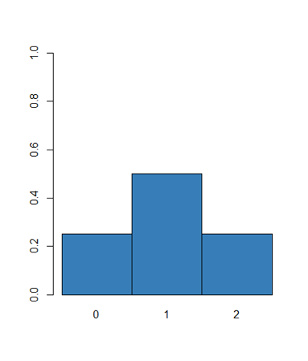

# Populations

* https://youtu.be/QIUM-diWzso

2장 통계의 개념을 설명하면서 다음과 같은 그림을 설명했습니다. 모집단은 우리가 관측할 수 없는 전체집합이고 그 중 샘플링을 통해 표본과 표본의 대표값을 구하고 이 대표값으로 모집단의 대표값이나 분포를 추정하는 것이 통계 입니다. 본 장에서 새로 등장하는 개념은 확률변수 (Random variable)  입니다. 이번 강의에서는 확률변수의 개념을 확실히 이해하고 이에 따른 확률과 분포의 개념도 정립하는 시간을 갖도록 합니다.  


## Random variable

확률변수는 변수와 같지만 데이터가 들어있지 않은 빈 공간으로 보면 되며 population의 데이터가 들어올 가능성만을 갖는 변수로 이해하면 되겠습니다. 즉, population의 어떤 데이터도 샘플링되어 들어갈 수 있지만 아직 들어가 있지 않은 상태이며 따라서 특정 값이 들어갈 수 있는 경우의 수, 즉 확률만이 존재하므로 확률 변수라고 합니다.

경우의 수는 임의 시행에서 어떤 사건이 일어날 수 있는 가짓수를 말하며 사건 E가 일어날 경우의 수는 $n(E)$ 로 나타냅니다. N을 모든 경우의 수가 일어날 수 있는 가짓수라 할 때 확률의 정의는 아래와 같습니다.

$$ P(E) = \frac{n(E)}{N} $$  
가짓수를 구할 때 두 사건 A, B가 동시에 일어나지 않는 경우, 즉 사건 A 또는 사건 B가 일어나는 경우의 수는 합의 법칙에 의해 두 경우의 수를 더해주고 두 사건이 동시에 일어날 때, 즉, 사건 A에 연이어 (동시에) 사건 B가 일어나는 경우의 수는 곱의 법칙에 의해 두 경우의 수를 곱해줍니다 .

만약 모든 사건이 동일 확률로 일어나고 총 사건이 한정적이라고 가정하면 다음과 같은 규칙이 적용 됩니다. 

$$ 
\begin{split}
P(E) & > 0 \\
\sum_{All} P(E) & = 1 \\
P(A \cup B) & = P(A) + P(B) - P(A ~ \cap ~ B) 
\end{split}
$$  

여기서 만약 사건 A와 B가 배반사건 일 경우 A 또는 B가 일어날 확률은 $P(A) + P(B)$ 이며 만약 두 사건이 독립일 경우 A와 B가 동시에 일어날 확률은 $P(A)P(B)$ 입니다. 독립이라는 것은 하나의 사건이 일어날 확률이 다른 사건이 일어날 확률에 영향을 주지 않는 경우를 말합니다. 


다음 예에서 한 사람을 선택할 경우 그 사람이 남자일 확률, 그 사람이 heavy smoker일 확률, 그리고 남자이거나 heavy smoker 일 확률을 각각 구하시오 

```{r, eval=F}
library(UsingR)
tbl <- xtabs(~Sex + Smoke, data=survey)
tbl
#
sum(tbl)
#P(Male)
margin.table(tbl, 1)/sum(tbl)
#P(Heavy)
margin.table(tbl, 2)/sum(tbl)

```


위 survey 데이터에서 Univariate 경우만을 생각해 보고 이 때 Random variable 의 개념을 알아봅니다. 


```{r, eval=F}
smoke <- survey$Smoke
smoke
```

survey의 smoke를 pupulation 데이터라고 가정하고 $X$를 해당 population에서 랜덤하게 sampling 한 변수라 하면 (확률 변수) $X$ 가 가질 수 있는 값은 4가지 입니다. 그러나 확률변수는 실제 값을 가지고 있지 않고 확률만을 가질 수 있으므로 $P()$를 사용하여 $P(X)$ 라고 표현합니다. R 코드를 이용하여 다음 확률들을 구해봅시다. 

$$ 
P(X=\text{"Never"}) =  \\
P(X=\text{"Heavy"}) = \\
P(X=\text{"Occas"}) = \\
P(X=\text{"Regul"}) = 
$$

```{r, eval=F}
smoke <- survey$Smoke
smoke
table(smoke)/length(smoke)
```


## Discrete random variable

$X$ 를 이산형 확률변수라 하면 $X$가 가질 수 있는 값은 ${0, 1, ..}$ 또는 ${"yes", "no"}$ 등의 이산형 값을 가질 수 있으며 이 값들을 $x$라 하면 $P(X=x)>0$ 이며 $X$의 분포는 이러한 확률들을 나열한 것으로 생각하면 됩니다. 즉, 이산형 확률변수 $X$의 분포는 먼저 가능한 $x$의 값들을 구한 후 $P(X=x)>0$이고 $\sum_x{P(X=x)}=1$인 확률 $P(X=x)$의 값들을 명시하면 됩니다. 

동전 한 번 던지기, 가능한 경우의 수는? 확률 변수는? 분포는?

$$
P(X=0) = 1/2 \\
P(X=1) = 1/2
$$

주머니에서 공 꺼내기 (G+R=N), 반복 허용해서 두 번 뽑을 때, $X$를 빨간 공의 갯수라 하면, 가능한 경우의 수는? 분포는?

$$
\begin{split}
P(X=0) & = G/N \times G/N \\
P(X=1) & = R/N \times G/N + G/N \times R/N\\
P(X=2) & = R/N \times R/N \\
\end{split}
$$




### Probability mass function

그러나 확률 변수의 분포를 언급할 때마다 일일이 확률을 명시할 수 없으므로 이러한 확률을 나타내는 함수를 정의하여 사용할 수 있고 이를 확률 질량 함수 (probability mass function, PMF)라 합니다. 


앞서 동전 던지는 예제에서 PMF는? 

$$
f_X(x) =  \begin{cases} 
\frac{1}{2} ~~~~~ \text{where} ~ x \in \{0, 1\} \\
0   ~~~~~~ \text{where} ~ x \notin \{0, 1\}
\end{cases}
$$


### Mean and standard deviation of discrete R.V.

Dataset에서는 평균과 분산이 각각 center와 spread를 나타내는 대표값이였으나 확률 변수에서는 그 정의가 달라집니다. 모평균 (population mean)은 $\mu$로 나타내며 확률 변수 $X$에 기댓값 (expected value)과 같습니다. 기댓값은 평균과 같은 개념으로 사용되며 기호로는 다음과 같이 $E(X)$로 나타낼 수 있습니다. 

$$
\mu = E(X) = \sum x P(X=x) \\
$$
이는 가중평균으로 모든 $x$ 값들에 대해서 $P(X=x)$의 가중치를 비율로 곱한 후 더하면 됩니다. 참고로 기댓값은 다음과 같은 선형적 성질을 가지고 있습니다. 

* 가산성 $E(X+Y) = E(X) + E(Y)$
* 동차성 $E(cX) = cE(X)$

주사위를 한 번 던질 때 나올 수 있는 주사위의 수의 기댓값? (확률변수 $X$?, 확률변수의 분포?, 확률변수의 기댓값?)

* 확률변수: 주사위를 한 번 던질 때 나올 수 있는 주사위의 수
* 가능한 경우의 수: {1, 2, 3, 4, 5, 6}
* 확률 변수의 분포: 

$$
\begin{split}
P(X=1) & = 1/6 \\
P(X=2) & = 1/6 \\
P(X=3) & = 1/6 \\
P(X=4) & = 1/6 \\
P(X=5) & = 1/6 \\
P(X=6) & = 1/6 \\
\end{split}
$$

* PMF: 

$$
f_X(x) = 
\begin{cases}
1/6 ~~ \text{where} ~~ x \in \{1,2,3,4,5,6\} \\
0 ~~ \text{where} ~~ x \notin \{1,2,3,4,5,6\}
\end{cases}
$$

* 기댓값:

모평균은 $\mu$로 표현하며 다음과 같이 정의할 수 있습니다.  
$$ 
\begin{split} 
\mu  & = E(X) \\
& = \sum_x{xP(X=x)} \\
\end{split}
$$


모표준편차는 $\sigma$로 표현하며 다음과 같이 정의할 수 있습니다 
$$ 
\begin{split} 
\sigma^2  & = VAR(X) \\
& = E[(X-\mu)^2] \\
& = E(X^2 - 2\mu X + \mu^2) \\
& = E(X^2) - 2\mu E(X) + \mu^2 \\
& = E(X^2) - E(X)^2 \\
& = \sum_x{x^2 P(X=x^2)} - (\sum_x{xP(X=x)})^2
\end{split}
$$
즉, 이 값은 $(X-\mu)^2$의 기댓값과 같습니다. 


주머니에서 공 꺼내기 (G+R=N), R을 빨강공의 갯수, G를 녹색 공의 갯수라 하고 N을 총 공의 갯수라 하자. 반복을 허용해서 두 번의 공을 뽑을 때 빨간 공의 갯수를 확률변수 $X$라 하자. $X$의 분포는? 
$$
\begin{split}
P(X=0) &= \frac{G}{N} \times \frac{G}{N} \\
P(X=1) &= \frac{G}{N} \frac{R}{N} + \frac{R}{N} \frac{G}{N} = 2 \frac{GR}{N^2} \\
P(X=2) &= \frac{R}{N} \frac{R}{N} = \frac{R^2}{N^2}
\end{split}
$$

기댓값과 분산을 구하시오
$$
\begin{split}
E(X) &= 0 \times P(X=0) + 1 \times P(X=1) + 2 \times P(X=2) \\
& = 2 \frac{G}{N}\frac{R}{N} + 2(\frac{R}{N})^2 \\
& = 2 \frac{(N-R)R}{N^2} + 2 \frac{R^2}{N^2} \\
& = 2 \frac{NR}{N^2} - 2 \frac{R^2}{N^2} + 2 \frac{R^2}{N^2} \\
& = 2 \frac{R}{N} \\
\end{split}
$$
$$
\begin{split}
VAR(X) &= E[(X-\mu)^2] \\
 & = E(X^2) - E(X)^2 \\
 & = 2 \frac{G}{N}\frac{R}{N} + 4(\frac{R}{N})^2 - (2\frac{R}{N})^2 \\
 & = 2 \frac{G}{N}\frac{R}{N}
\end{split}
$$


## Continuous random variable

연속 데이터의 경우에는 $P(X=x)$ 와 같은 개념이 불가능하므로 다른 방식의 확률에 대한 정의가 필요합니다. 이 경우에는 $P(a < X \le b)$ 와 같은 확률의 범위를 지정하는 방식이 쓰입니다. 이는 $F(b) = P(X<b)$ 함수나 $P(a < X \le b)$ 와 같은 크기에 해당하는 a, b, 그리고 $f(x)$로 둘러쌓이는 함수 $f(x)$로 구현될 수 있습니다. 위 함수 $f(x)$를 확률변수 $X$의 밀도라 하며 $F(x)$와의 관계는 다음 그림과 같습니다. 

```{r eval=F}
library(tidyverse)
fx <- function(x, mu, sigma){
  (1/(sigma*sqrt(2*pi)))*exp(-1*((x-mu)^2)/(2*sigma^2))
  }
x <- seq(-5, 5, 0.01)
y <- fx(x, 0, 1)
z <- data.frame(x, y)
plot(x=x, y=y, type="l"); 

## basic graphical function
myx <- seq(0,1,0.01)
myy <- fx(myx, 0, 1)
plot(x=x, y=y, type="l")
polygon(x=myx, y=myy, col="red")
##
myx <- seq(0,1,0.01)
myy <- fx(myx, 0, 1)
plot(x=x, y=y, type="l")
polygon(x=c(0,myx,1), y=c(0,myy,0), col="red")


## ggplot2
ggplot(z, aes(x=x, y=y)) +
  geom_line() +
  geom_area(data=filter(z, x > 0 & x < 1), fill="red")
  
  
p <- ggplot(z, aes(x=x, y=y)) +
  geom_line() +
  geom_area(data=filter(z, x > -0.5 & x < 1.5), fill="red") 
p
p + annotate("text", x = -2.5, y = 0.3, label = "f(x)")
p + annotate("text", x = -2.5, y = 0.3, label = "f(x)") +
  geom_segment(aes(x = -2.3, y = 0.29, xend = -1.2, yend = 0.2), arrow = arrow()) +
  annotate("text", x = 0.5, y = 0.1, label = "F(b)-F(a)")


ggplot(z, aes(x=x, y=y)) +
  geom_area(data=filter(z, x > -0.5 & x < 1.5), fill="blue") +
  geom_area(data=filter(z, x < -0.5), fill="green") +
  annotate("text", x = -2.5, y = 0.3, label = "f(x)") +
  geom_segment(aes(x = -2.3, y = 0.29, xend = -1.2, yend = 0.2), arrow = arrow()) +
  annotate("text", x = 0.5, y = 0.1, label = "F(b)-F(a)", color="white") +
  annotate("text", x = -1, y = 0.1, label = "F(a)") + 
  annotate("text", x = -0.5, y = -0.01, label = "a") +
  annotate("text", x = 1.5, y = -0.01, label = "b") +
  geom_line() +
  

```


### Probability density function

여기서 $f(x)$는 확률 변수의 분포를 나타내는 함수로써 확률 밀도 함수(probability density function, PDF)라 하고  확률 밀도 함수$f(x)$와 구간 [a, b]에 대해서 확률변수 X가 구간에 포함될 확률은 $P(a < X \le b)$은 $\int^a_b f(x) dx$ 입니다. 일반적으로 PDF는 다음 두 조건을 만족해야 합니다. 

* 모든 실수값 $x$에 대해서 $f(x) \ge 0$
* $\int^{\infty}_{-\infty} f(x) dx=1$

참고로 정규분포함수는 다음과 같은 pdf를 가집니다. 

$$
f_X(x; \mu, \sigma) = 
\frac{1}{\sigma \sqrt{2\pi}} e^{-\frac{(x-\mu)^2}{2 \sigma^2}}  \\
$$


또한 확률밀도함수와 누적분포함수 (cumulative density function, CDF) $F(x) = P(X \le x)$는 다음과 같은 수식이 성립합니다. 

$$
F(x) = \int^x_{-\infty} f(x) dx \\
f(x) = \frac{d}{dx} F(x) 
$$


### Mean and standard deviation of continuous R.V.

임의의 구간 [a, b]에서 연속형 확률변수 $X$의 기댓값과 분산은 앞서 이산형의 경우와 같이 가중치의 합이며 각각 다음과 같이 정의됩니다. 이 경우 $f(x)dx$ 부분이 확률로서 이산형의 경우 $P(X=x)$와 같은 가중치 역할을 합니다. 분산은 이산형의 경우와 같습니다. 

$$
\begin{split}
\mu = E(X) & = \int^{a}_{b} x f(x) dx \\
\sigma^2 = VAR(X) & = E((X-\mu)^2) \\
& = E(X^2) - E(X)^2 \\
& = \int^{a}_{b} x^2 f(x) dx - {\int^{a}_{b} x f(x) dx} ^2
\end{split}
$$


## Sampling from a population

통계는 어떤 실험으로부터 데이터를 확보한 후 그 분포가 모집단의  분포와 같을 것으로 기대하여 데이터의 기댓값과 분산을 계산하고 이를 가지고 모집단의 평균을 추정하는 것입니다. 따라서 모집단에서 표본을 추출 하는 방법이 중요하며 이 때 사용하는 방법이 **임의 복원추출 (Random sampling with replacement)** 입니다. $X_1, X_2, X_3, ..., X_n$을 모집단에서 뽑은 일련의 확률 변수라 한다면 이들의 분포가 같을 때 identically distributed 되었다고 하며 하나의 확률 변수의 값이 다른 변수들의 분포에 영향을 주지 않을 때 (즉 하나의 확률변수의 값을 알 때 다른 변수들의 분포가 변하지 않을 때) 그 변수는 다른 변수와 independent 하다고 합니다. 이 두 가지 특성을 갖는 표본들을 indepentent and identically distributed 라고 해서 i.i.d.라 부르고 이는 랜덤 샘플링을 할 때 기본이 되는 개념입니다. 이에 반해 임의 비복원추출의 (Random sampling with replacement) 경우 iid는 아니게 되나 모집단의 크기가 크고 표본의 크기가 작을 때에는 같은 요소를 뽑을 확률이 적어지기 때문에 복원추출법과 비복원추출법 간의 차이가 적어집니다. 

예로 하나의 동전을 $n$번 던질 때 $X_i$를 i번째 던지는 동전의 앞 또는 뒷면이라 하면 $X_1, X_2, ..., X_n$은 i.i.d. 입니다. 주머니 공 꺼내기 예제에서 공을 넣고 다시 꺼내는 복원 추출의 경우의 표본들도 마찬가지로 iid 입니다. 그런데 다시 넣지 않고 꺼내는 경우는 어떨까요? 

3개의 빨간색 공과 2개의 녹색 공이 있는 주머니에서 반복을 허용해서 공을 뽑을 경우를 생각해 보자. 확률변수 $X_i$를 $i$번째 뽑은 공의 색이라 할 때 $X_1$ 의 확률 분포와 $X_2$의 확률 분포는? 반복을 허용하지 않는 경우의 확률 분포는?

$$
P(X_1=R) = \frac{3}{5} \\
P(X_1=G) = \frac{2}{5} \\
P(X_2=R) = \frac{3}{5} \times \frac{3}{5} + \frac{2}{5} \times \frac{3}{5} \\
P(X_2=G) = \frac{3}{5} \times \frac{2}{5} + \frac{2}{5} \times \frac{2}{5} 
$$

반복을 허용하지 않을 경우
$$
P(X_1=R) = \frac{3}{5} \\
P(X_1=G) = \frac{2}{5} \\
P(X_2=R) = \frac{3}{5} \times \frac{2}{4} + \frac{2}{5} \times \frac{3}{4} \\
P(X_2=G) = \frac{3}{5} \times \frac{2}{4} + \frac{2}{5} \times \frac{1}{4} 
$$


R에서는 `sample` 함수를 사용해서 복원/비복원추출 과정을 시뮬레이션 할 수 있습니다. 

```{r eval=F}
sample(0:1, size=10, replace = T)
sample(0:1, size=10, replace = F)
sample(0:1, size=1, replace = F)
```


## Problems 07

7-1) 하나의 주사위를 한 번 굴릴 경우 확률변수 $X$를 나오는 주사위 값이라 하면 $X$의 기댓값을 구하시오. 

$$
\begin{split}
P(X=1) = 1/6 \\
P(X=2) = 1/6 \\
... \\
E[X] = ?
\end{split}
$$

위에서 구한 기댓값이 실제 나오는지 주사위를 던져서 같은 값이 나오는지를 시뮬레이션하는 코드는 다음과 같습니다.  

```{r eval=F}
## simulation
n <- 1000
barx <- rep(0, n)
for(i in 1:n){
  x <- sample(1:6, size = i, replace=T)
  barx[i] <- mean(x)
}
plot(barx)

```

7-2) 위 `for` 문을 이용한 시뮬레이션을 `replicate` 또는 `sapply`를 이용한 코드로 구현하시오 
```{r, eval=F, echo=F}
## simulation 2nd
i <- 1:1000
barx2 <- sapply(i, function(x){mean(sample(1:6, size=x, replace=T))})
plot(barx2)

```


7-3) 주머니에 R개의 빨간공과 G개의 녹색공이 있다 (N=R+G). 반복을 허용해서 세 번의 공을 뽑을 때 빨간 공의 갯수를 확률변수 $X$라 하자. $X$의 분포와, 기댓값과 분산을 구하시오 (P(X=0) = (G/N)(G/N)(G/N) 이와같이 컴퓨터로 작성해도 되고, 종이에 적은 후 사진으로 보내도 됨)


## Sampling distribution

**통계량(a statistic)**은 랜덤 표본을 요약하는 하나의 값입니다.  표본평균이 그 예이며 $\bar{X} = (X_1 + X_2 + ... + X_n)/n$ 으로 나타낼 수 있습니다. 그런데 통계량이 랜덤 표본에 의존한다면 해당 통계량 또한 확률 변수가 되며 이 통계량의 분포를 **표본분포라고 (sample distribution)** 합니다. 표본 분포는 복잡한 것으로 알려져 있으나 일반적으로 사용하는 평균이나 분산 등의 통계량에 대해서는 연구가 많이 되어 잘 알려져 있는 편이며 대부분 그들의 모집단과 관련된 값을 가지고 있읍니다. 예를 들어 표본평균의 기댓값과 표준편차는 다음과 같은 값을 가집니다. 

$$
E(\bar{X}) = \mu_{\bar{X}} = \mu \\ 
SD(\bar{X}) = \sigma_\bar{X} = \frac{\sigma}{\sqrt{n}}
$$
즉, 표본평균의 기댓값은 모평균과 같고 표본평균의 표준편차는 모평균의 표준편차와 관계가 있으나 더 작습니다. 이러한 특성 때문에 $\bar{X}$를 모평균의 추정에 사용할 수 있습니다. 


**[EXERCISE]** 1, 2, 3 세 개의 숫자가 각각 적힌 공이 주머니에 있다. 여기서 하나의 공을 뽑을 때 나오는 숫자를 확률변수 $X$라 할 때 $X$의 기댓값과 분산을 구하시오 (공식 이용, 코드 작성).


```{r, eval=F}

x <- 1:3
xp <- rep(1/3, 3)
ex <- sum(x*xp)
vx <- sum(x^2*xp) - (sum(x*xp))^2
c(ex, vx)


```


**[EXERCISE]** 위 예제에서 임의 복원 추출 방법으로 두 개의 표본을 추출하는 경우를 생각해보자. 이 경우 확률변수  $X$를 두 수의 합을 나타낸다고 가정할 경우 기댓값과 분산을 구하는 코드를 작성하시오. 

```{r, eval=F}

x <- data.frame(x1=rep(1:3, times=3), x2=rep(1:3, each=3))
px <- table(rowSums(x))/length(rowSums(x))
k <- as.numeric(names(px))
ex <- sum(k*px)
xp <- sum(k^2*px) - ex^2
c(ex, vx)

barplot(px)
```


위 예제의 경우는 모집단을 알고 있는 경우입니다. 만약 주머니 안에 몇개의 공이 있는지 어떤 수가 써 있는지 모르는 경우를 생각하면 주머니에서 임의 복원 추출을 통해 모수 (모평균)를 추정해야 합니다.  


모평균을 추정할 때에는 앞서 공식에 의해 표본평균의 기댓값을 구해야 하므로 임의 복원추출 시행과 그 표본들의 평균을 구하는 여러번의 반복 작업으로 모평균과 모분산을 추정할 수 있습니다. 


그런데 일반적인 경우 위 그림처럼 사건들의 확률이 단순하지 않습니다. 만약 모든 확률을 (분포를) 알고 있다면 각 확률에 경우의 수를 곱해서 모두 더한 값이 기대값입니다. 그러나 모든 확률을 알아내는 것은 불가능에 가깝습니다. 따라서 모수를 추정하기 위해서 우리가 취할 수 있는 방법은 두 가지 입니다. 하나는 충분히 많은 표본을 추출해서 평균을 구하거나 알고있는 확률들(분포)를 사용하는 것 입니다. 요즘처럼 컴퓨터가 발달하지 않은 시대에는 후자의 방법을 사용하기 위해서 많은 통계학자들의 분포를 연구해 두었습니다. 즉, 특정한 상황에 대한 PDF나 PMF를 계산해 둔 것입니다.  

## Probability distributions 

통계에는 다양한 분포들이 존재할 수 있으나 그 중 많이 사용되거나 유사한 특성을 갖는 분포들을 분류해 (families of distribution) 두었고  (https://en.wikipedia.org/wiki/List_of_probability_distributions) 이들 중 잘 알려진 몇 가지 분포를 살펴보도록 하겠습니다. 먼저 각 분포는 수학적인 함수(PDF, PMF)로 표현될 수 있고 각 함수에는 분포의 중심과 모양 등을 결정하는 모수(parameter)가 있습니다. 이는 이미 배운 모평균, 모분산 등의 모수 입니다. 

$$
f_X(x | \mu, \sigma) = 
\frac{1}{\sigma \sqrt{2\pi}} e^{-\frac{(x-\mu)^2}{2 \sigma^2}}  \\
$$

** 주요 확률 분포의 종류 **

* Discrete random variable 
  * Bernoulli distribution
  * Binomial distribution
  * Poisson distribution

* Continuous random variable
  * Uniform distribution
  * Normal distribution
  * Exponential distribution
  * Lognormal distribution
  * t-distribution
  * chi-squared distribution
  

R에서는 4가지 타입의 분포 정보를 활용할 수 있는 함수를 제공하고 있습니다. 

* "d" 함수는 분포의 PDF/PMF 값 반환 `dnorm()`
* "p" 함수는 분포의 CDF/CMF 값 반환 `pnorm()`
* "q" 함수는 분포의 사분위값 반환 `qnorm()`
* "r" 함수는 분포에서 임의 표본 추출 `rnorm()`


### Bernoulli random variables

* 확률 변수 X 가 (0, 1) 두 값만을 가질 경우의 확률 분포 (success=1, failure=0)
* 확률 변수 X의 pmf는 $P(X=1) = p$ 로 나타내며 이 분포는 Bernoulli(p) 로 타나냄 (파라메터: $p$)
* 베르누이 확률 변수의 iid 샘플을 가리켜 (베르누이 시행) Bernoulli trial 이라함

$$
\mu = p \\
\sigma^2 = p(1-p)
$$

```{r, eval=F}
n <- 10
p <- 1/4
sample(0, 1, size=n, replace=TRUE, prob=c(1-p, p))
```


### Binomial random variables

* 확률변수 X는 $n$번의 베르누이 시행에서 성공의 개수를 나타냄 
* 이항분포를 나타내는 파라메터는 $n$ 과 성공확률 $p$ 이며 Binomial(n, p) 로 나타냄
* 가능한 경우의 수 $k=0, 1, 2, .., n$ 이므로 $X$의 분포는 

$$
P(X=k) = {n \choose k} p^k (1-p)^{n-k} \\
\mu = np \\
\sigma^2 = npq
$$


**[EXERCISE]** 하나의 동전을 10번 던질 때 $X$를 앞면이 나오는 경우의 개수라 하자. 만약 동전이 공평하다면 Binomial(10, 1/2) 분포를 따르게 된다. P(X=5) 값을 구하시오. 
```{r, eval=F}
# from the pdf of binomial r.v.
choose(10, 5) * (1/2)^5 * (1/2)^(10-5)

# using dbinom function
dbinom(5, size=10, prob=1/2)
```

ggplot을 이용해서 이항분포를 그려봅니다. 히스토그램의 y축은 빈도 수를 나타내지만 이를 확률로 나타낼수도 있고 이 경우 y값은 dbinom의 값과 같습니다.  

```{r, eval=F}
## pdf 
x<-0:10
x_dist <- choose(10, x) * (1/2)^x * (1/2)^(10-x)
x_dist_df <- data.frame(x, x_dist)
ggplot(x_dist_df, aes(x=x, y=x_dist)) + 
  geom_bar(stat="identity") 

## sampling
x_trials <- rbinom(1000, size=10, prob=1/2)
hist(x_trials, br=100)
## distribution
ggplot(data.frame(x_trials), aes(x=x_trials)) + 
  geom_bar()

```

위 예제에서 앞면이 6번 이하로 나올 확률을 구하면 $P(X \le 6) = \sum_{k \le 6} P(X=k)$ 이므로 다음과 같습니다. 따라서 $P(X \ge 7) = 1- P(X \le 6)$ 입니다. 

```{r, eval=F}

dbinom(0, size=10, prob=1/2) +
dbinom(1, size=10, prob=1/2) +
dbinom(2, size=10, prob=1/2) +
dbinom(3, size=10, prob=1/2) +
dbinom(4, size=10, prob=1/2) +
dbinom(5, size=10, prob=1/2)

x <- 0:5
sum(dbinom(x, size=10, prob=1/2))


sum(dbinom(0:5, size=10, prob=1/2))
pbinom(5, size=10, p=1/2)
```

즉, pbinom을 이용해서 누적함수 분포를 쉽게 그릴 수 있습니다.  
```{r, eval=F}

x <- 0:10
y <- pbinom(x, size=10, p=1/2)
dat <- data.frame(x, y)
ggplot(dat, aes(x, y)) +
  geom_point() +
  geom_line() +
  geom_bar(stat="identity")

```


### Normal random variables

* 정규확률변수 $X$의 분포는 연속적인 종모양 (Bell-shaped) 형태를 가진 분포로 pdf상의 y값은 밀도로 해석 
* 정규분포를 나타내는 파라미터는 종모양의 중심인 $\mu$와 분산 $\sigma^2$ 두 개이며 $Normal(\mu, \sigma)$ 또는 $N(\mu, \sigma)$ 로 나타냄

$$
f(x|\mu,\sigma) = \frac{1}{\sqrt{2\pi\sigma^2}} e^{-\frac{(x-\mu)^2}{2\sigma^2} } 
$$
다음은 `rnorm`과 `dnorm`을 활용한 그래프 그리기 예제 입니다. 

```{r, eval=F}
n <- 1000
x <- rnorm(n, mean=175, sd=2)
xbar <- mean(x)
s <- sd(x)
xbarsd <- xbar + c(-1, 1)*s

hist(x, br=30, probability = T)
lines(density(x), col="red", lwd=3)
abline(v=xbarsd, col="red", lwd=3, lty=2)
```


```{r, eval=F}
xbarsd
ggplot(data.frame(x), aes(x=x)) +
  geom_histogram(aes(y=..density..), fill="gray", color="black")+
  geom_line(stat="density") +
  geom_vline(xintercept = xbarsd, linetype="dashed", color="red", size=1)


```


두 개의 normal desity를 가정해서 그래프를 그려봅시다. 하나는 $f(x|\mu=0, \sigma=1)$이고 다른 하나는 $f(x|\mu=4, \sigma=1/2)$ 입니다. 

```{r, eval=F}
x1 <- seq(-4, 4, by=0.1)
y1 <- dnorm(x1, mean=0, sd=1)
plot(x1,y1)

x2 <- seq(0, 8, by=0.1)
y2 <- dnorm(x2, mean=4, sd=0.5)
plot(x2, y2)
```

ggplot을 이용해서 두 그래프를 하나의 화면에 그려봅니다. 

```{r, eval=F}
dat <- data.frame(x1, x2, y1, y2)
dat

ggplot(dat) +
  geom_line(aes(x=x1, x=y1)) +
  geom_line(aes(x=x2, x=y2)) +
  geom_hline(yintercept = 0)
```

연속형 확률분포에서 y 값은 특정 x 값에 대한 density라 했고 x의 범위에 대한 면적의 넓이가 확률 입니다. N(0, 1) 분포에서 누적확률 0.5인 곳은 x=0 이며 pnorm 함수로 다음과 같이 확인이 가능합니다. 즉 정규분포에서도 앞서 이항분포에서와 같이 pnorm 함수를 이용해서 누적확률을 구할 수 있습니다.   

```{r, eval=F, echo=T}
pnorm(0, 0, 1)

```

qnorm은 pnorm의 역함수로 생각하면 되겠습니다. 즉, 정규분포 N(0, 1)에서 확률이 0.5가 되는 곳의 x값을 구하기 위해서는 다음과 같이 코드를 작성하면 되겠습니다. 

```{r, eval=F}
qnorm(0.5, 0, 1)
```


만약 IQR 구간을 구한다면 다음과 같이 0.25와 0.75확률이 되는 x 값들을 (quantile을) 구하면 되겠습니다. 

```{r, eval=F}
qnorm(c(0.25, 0.75))
```

표준정규분포의 중심으로부터 1 표준편차만큼 떨어진 구간의 넓이 (확률)을 구하면 다음과 같습니다. 

```{r, eval=F}
pnorm(1)-pnorm(-1)
```


**[EXERCISE]** N(0, 1) 분포에서 (누적) 확률이 0.95가 되는 곳의 x값을 구하고 그래프를 그린 후 geom_polygon 함수를 이용하여 해당 영역을 색칠 하시오. 

```{r, eval=F, echo=T}
mu <- 0
sigma <- 1
x1 <- seq(-5, 5, by=0.1)
y1 <- dnorm(x1, mean=mu, sd=sigma)
dat <- data.frame(x1, y1)

x.val <- qnorm(0.95, mu, sigma)

p <- ggplot(dat, aes(x1, y1)) +
  geom_line() +
  geom_hline(yintercept = 0) +
  geom_area(data=filter(dat, x1 > -5 & x1 < x.val)) +
  geom_vline(xintercept = 0, color="white", linetype = "dashed") +
  labs(x=element_blank(), y="Density")
p
```

몇 가지 옵션을 추가한 그래프 입니다. 

```{r, eval=F}
onesd_x <- 1
onesd_y <- dnorm(onesd_x, mu, sigma)
onesd_dat <- data.frame(x=c(0, onesd_x, onesd_x), 
                        y=c(onesd_y, onesd_y, 0))

## dashed line 
p <- p + geom_line(data=onesd_dat, 
                   aes(x=x, y=y), 
                   color="white", 
                   linetype="dashed")

## text label
p <- p +  annotate("text", 
                   label = paste("(", onesd_x, ", ", round(onesd_y, 2), ")", sep=""), 
                   x = onesd_x, 
                   y = onesd_y+0.02, 
                   size = 5, 
                   colour = "red")

## arrow with text 
p + labs(title="Normal distribution with mean 0 and sd 1", x="X", y="Density") +
  theme(plot.title = element_text(size=15, face="bold.italic", color="blue", hjust=0.5),
        axis.title.x = element_text(size=15, color="blue"),
        axis.title.y = element_text(size=15, color="blue")) +
  geom_segment(aes(x = 3, y = 0.2, xend = x.val, yend = 0), 
          arrow = arrow(),
          color='orange',size=1) +
  annotate("text", label = paste("x=", round(x.val, 3), sep=""), x = 3, y = 0.22, size = 5, colour = "red")

```


**[EXERCISE]** 대한민국 성인 남성의 평균은 175이고 표준편차는 3.5라고 하면 180보다 큰 사람의 비율은 얼마인가? 

```{r, eval=F}

mu <- 170
sigma <- 10

1-pnorm(180, mean=mu, sd=sigma)

```

```{r, eval=F}
n <- 10000
x <- rnorm(n, mu, sigma)
sum(x>180)/n
```


### Uniform distribution
균등분포는 임의의 확률변수가 구간 [a, b]에서 모두 일정한 확률을 갖습니다. 이산형과 연속형 모두에서 사용될 수 있으며 $f(x)(b-a)=1$ 이므로 pdf는 $f(x)=\frac{1}{(b-a)}$ 입니다. 균등분포의 모수는 구간을 나타내는 $a$, $b$ 두 개이며 평균과 분산은 각각 $\mu=(a+b)/2$, $(b-a)^2/12$ 입니다. 

```{r, eval=F}
x = runif(50, min=0, max=10)
ggplot(data.frame(x), aes(x=x)) +
  geom_bar(stat="bin")
```


### Poisson distribution
포아송분포는 이산확률 분포이며 단위 시간동안 임의의 사건이 몇 번 발생할 것인지를 표현하는 분포 입니다. 이항분포의 n이 무한대로, p가 0로 가까이 가면 포아송분포와 가까워지며 n 과 p는 모르지만 np, 즉 평균을 알고 있을 때 사용하는 분포 입니다. 포아송분포의 파라미터는 np 값인 $\lambda$ 이며 $\lambda$의 해석은 단위 시간동안 어떤 사건이 일어날 횟수에 대한 기댓값으로 한 페이지를 읽을 동안 발견한 오타의 갯수나 1시간동안 (단위시간동안) 도착한 고객의 수 등이 되겠습니다. 포아송분포는  $\lambda$에 따라서 분포의 모양이 달라지며 확률질량함수 pmf는 다음과 같습니다. 

$$
f(n|\lambda) = \frac{\lambda^n e^{-\lambda}}{n!}
$$

이 함수가 의미하는 바는 단위 시간동안 평균 발생 횟수가 $\lambda$일 때 n번 발생할 확률을 말합니다. 포아송분포의 평균과 분산은 모두 $\lambda$ 입니다. 만약 1년 동안 돌연변이 바이러스 나타난 평균 횟수가 1종 이였다면 1년동안 3종의 바이러스가 나타날 확률은 다음과 같습니다. 

```{r, eval=F}
dpois(3, 1)
rpois(100, 1)
```

### Exponential distribution
만약 일정 시간동안 발생하는 사건의 횟수가 포아송분포를 따른다고 할 때 사건들 사이의 대기 시간의 분포가 지수분포입니다. 연속확률변수의 분포이며 지수분포의 pdf는 다음과 같습니다. 

$$
f(x|\lambda) = \lambda e^{-\lambda x}, x \ge 0
$$

$\lambda$의 의미는 포아송분포에서와 같으며 지수분포의 평균은 $\mu = \frac{1}{\lambda}$이며 표준편차는 $\sigma = \frac{1}{\lambda}$ 입니다. 앞서 예에서 1개월 안에 바러스 변이가 나타날 확률을 알고자 할 때 지수분포를 사용합니다. 단위시간을 1년으로 하면 평균 횟수가 $\lambda=1$이고 구하는 확률은 다음과 같습니다.

$$
P(0 \le t \le 1/12) = \int_0^{1/12} 1 \cdot e^{-1 \cdot t} dt
$$ 

```{r, eval=F}
pexp(1/12, 1)
```

지수함수는 다음과 같은 조건을 만족하는 Memoryless 특성을 가지고 있다. 

$$
P(X \gt s+t | X \gt t) = P(X > s)
$$

### Sampling distributions
대표적인 샘플링 분포는 t분포, F분포, 그리고 chi-squared 분포가 있으며 이들은 다음 장 강의를 참고하시기 바랍니다. 


## Problems 07-2 

7-4) `ggplot`을 이용해서 표준정규분포 그래프를 그리고 IQR 구간을 검은 색으로 칠하시오 


7-5) 12시간 동안 A라는 음식점에 방문한 손님이 평균 10명 이라고 한다. 이 식당에 12시간 동안 20명의 손님이 방문할 확률을 코드를 작성하여 구하시오

7-6) 위 A 식당에서 1시간 안에 손님이 방문할 확률을 구하시오


<a rel="license" href="http://creativecommons.org/licenses/by-nc-nd/4.0/"></a><br />이 저작물은 <a rel="license" href="http://creativecommons.org/licenses/by-nc-nd/4.0/">크리에이티브 커먼즈 저작자표시-비영리-변경금지 4.0 국제 라이선스</a>에 따라 이용할 수 있습니다.


