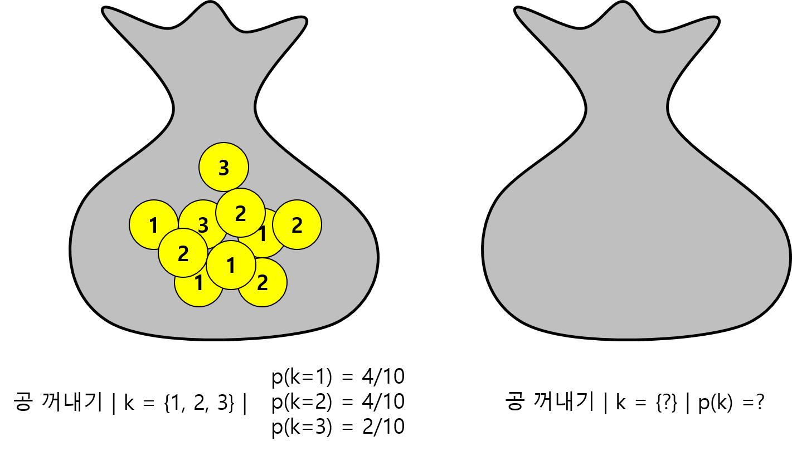

## Sampling distribution

**통계량(a statistic)**은 랜덤 표본을 요약하는 하나의 값입니다.  표본평균이 그 예이며 $\bar{X} = (X_1 + X_2 + ... + X_n)/n$ 으로 나타낼 수 있습니다. 그런데 통계량이 랜덤 표본에 의존한다면 해당 통계량 또한 확률 변수가 되며 이 통계량의 분포를 **표본분포라고 (sample distribution)** 합니다. 표본 분포는 복잡한 것으로 알려져 있으나 일반적으로 사용하는 평균이나 분산 등의 통계량에 대해서는 연구가 많이 되어 잘 알려져 있는 편이며 대부분 그들의 모집단과 관련된 값을 가지고 있읍니다. 예를 들어 표본평균의 기댓값과 표준편차는 다음과 같은 값을 가집니다. 

$$
E(\bar{X}) = \mu_{\bar{X}} = \mu \\ 
SD(\bar{X}) = \sigma_\bar{X} = \frac{\sigma}{\sqrt{n}}
$$
즉, 표본평균의 기댓값은 모평균과 같고 표본평균의 표준편차는 모평균의 표준편차와 관계가 있으나 더 작습니다. 이러한 특성 때문에 $\bar{X}$를 모평균의 추정에 사용할 수 있습니다. 


**[EXERCISE]** 1, 2, 3 세 개의 숫자가 각각 적힌 공이 주머니에 있다. 여기서 하나의 공을 뽑을 때 나오는 숫자를 확률변수 $X$라 할 때 $X$의 기댓값과 분산을 구하시오 (공식 이용, 코드 작성).


```{r, eval=F}

x <- 1:3
xp <- rep(1/3, 3)
ex <- sum(x*xp)
vx <- sum(x^2*xp) - (sum(x*xp))^2
c(ex, vx)


```


**[EXERCISE]** 위 예제에서 임의 복원 추출 방법으로 두 개의 표본을 추출하는 경우를 생각해보자. 이 경우 확률변수  $X$를 두 수의 합을 나타낸다고 가정할 경우 기댓값과 분산을 구하는 코드를 작성하시오. 

```{r, eval=F}

x <- data.frame(x1=rep(1:3, times=3), x2=rep(1:3, each=3))
px <- table(rowSums(x))/length(rowSums(x))
k <- as.numeric(names(px))
ex <- sum(k*px)
xp <- sum(k^2*px) - ex^2
c(ex, vx)

barplot(px)
```


위 예제의 경우는 모집단을 알고 있는 경우입니다. 만약 주머니 안에 몇개의 공이 있는지 어떤 수가 써 있는지 모르는 경우를 생각하면 주머니에서 임의 복원 추출을 통해 모수 (모평균)를 추정해야 합니다.  




모평균을 추정할 때에는 앞서 공식에 의해 표본평균의 기댓값을 구해야 하므로 임의 복원추출 시행과 그 표본들의 평균을 구하는 여러번의 반복 작업으로 모평균과 모분산을 추정할 수 있습니다. 


그런데 일반적인 경우 위 그림처럼 사건들의 확률이 단순하지 않습니다. 만약 모든 확률을 (분포를) 알고 있다면 각 확률에 경우의 수를 곱해서 모두 더한 값이 기대값입니다. 그러나 모든 확률을 알아내는 것은 불가능에 가깝습니다. 따라서 모수를 추정하기 위해서 우리가 취할 수 있는 방법은 두 가지 입니다. 하나는 충분히 많은 표본을 추출해서 평균을 구하거나 알고있는 확률들(분포)를 사용하는 것 입니다. 요즘처럼 컴퓨터가 발달하지 않은 시대에는 후자의 방법을 사용하기 위해서 많은 통계학자들의 분포를 연구해 두었습니다. 즉, 특정한 상황에 대한 PDF나 PMF를 계산해 둔 것입니다.  

## Probability distributions 

통계에는 다양한 분포들이 존재할 수 있으나 그 중 많이 사용되거나 유사한 특성을 갖는 분포들을 분류해 (families of distribution) 두었고  (https://en.wikipedia.org/wiki/List_of_probability_distributions) 이들 중 잘 알려진 몇 가지 분포를 살펴보도록 하겠습니다. 먼저 각 분포는 수학적인 함수(PDF, PMF)로 표현될 수 있고 각 함수에는 분포의 중심과 모양 등을 결정하는 모수(parameter)가 있습니다. 이는 이미 배운 모평균, 모분산 등의 모수 입니다. 

$$
f_X(x; \mu, \sigma) = 
\frac{1}{\sigma \sqrt{2\pi}} e^{-\frac{(x-\mu)^2}{2 \sigma^2}}  \\
$$


* Discrete random variable 
  * Bernoulli distribution
  * Binomial distribution
  * Poisson distribution

* Continuous random variable
  * Uniform distribution
  * Normal distribution
  * Exponential distribution
  * Lognormal distribution
  * t-distribution
  * chi-squared distribution
  

R에서는 4가지 타입의 분포 정보를 활용할 수 있는 함수를 제공하고 있습니다. 

* "d" 함수는 분포의 PDF/PMF 값 반환
* "p" 함수는 분포의 CDF/CMF 값 반환
* "q" 함수는 분포의 사분위값 반환
* "r" 함수는 분포에서 임의 표본 추출 


### Bernoulli random variables

* 확률 변수 X 가 (0, 1) 두 값만을 가질 경우의 확률 분포 (success=1, failure=0)
* 확률 변수 X의 pmf는 $P(X=1) = p$ 로 나타내며 이 분포는 $ Bernoulli(p) $ 로 타나냄 (파라메터: $p$)
* 베르누이 확률 변수의 iid 샘플을 가리켜 (베르누이 시행) Bernoulli trial 이라함

$$
\mu = p \\
\sigma^2 = p(1-p)
$$


### Binomial random variables

* 확률변수 X는 $n$번의 베르누이 시행에서 성공의 개수를 나타냄 
* 이항분포를 나타내는 파라메터는 $n$ 과 성공확률 $p$ 이며 $ Binomial(n, p) $ 로 나타냄
* 가능한 경우의 수 $k=0, 1, 2, .., n$ 이므로 $X$의 분포는 

$$
P(X=k) = {n \choose k} p^k (1-p)^{n-k} \\
\mu = np \\
\sigma^2 = npq
$$


**[EXERCISE]** 동전을 10번 던질 경우 X를 앞면이 나오는 경우의 수라 하면 $X=5$ 일 경우의 확률 $P(X=5)$와 $P(X<6)$의 값을 구하시오


**[EXERCISE]** 하나의 동전을 10번 던질 때 $X$를 앞면이 나오는 경우의 개수라 하자. 만약 동전이 공평하다면 Binomial(10, 1/2) 분포를 따르게 된다. P(X=5) 값을 구하시오. 
```{r, eval=F}
# from the pdf of binomial r.v.
choose(10, 5) * (1/2)^5 * (1/2)^(10-5)

# using dbinom function
dbinom(5, size=10, prob=1/2)

dbinom(0, size=10, prob=1/2) +
dbinom(1, size=10, prob=1/2) +
dbinom(2, size=10, prob=1/2) +
dbinom(3, size=10, prob=1/2) +
dbinom(4, size=10, prob=1/2) +
dbinom(5, size=10, prob=1/2)


sum(dbinom(0:5, size=10, prob=1/2))

```

```{r, eval=F}
## pdf 
x<-0:10
x_dist <- choose(10, x) * (1/2)^x * (1/2)^(10-x)
x_dist_df <- data.frame(x, x_dist)
ggplot(x_dist_df, aes(x=x, y=x_dist)) + geom_bar(stat="identity") 

```


ggplot을 이용해서 이항분포를 그려봅니다. 히스토그램의 y축은 빈도 수를 나타내지만 이를 확률로 나타낼수도 있고 이 경우 y값은 dbinom의 값과 같습니다.  

```{r, eval=F}
library(ggplot2)
library(reshape2)


## pdf 
x<-0:10
x_dist <- choose(10, x) * (1/2)^x * (1/2)^(10-x)
x_dist_df <- data.frame(x, x_dist)
ggplot(x_dist_df, aes(x=x, y=x_dist)) + geom_bar(stat="identity") 

x_trials <- rbinom(1000, size=10, prob=1/2)
hist(x_trials, br=100)
## distribution
ggplot(data.frame(x_trials), aes(x=x_trials)) + geom_bar()

x_tab <- table(x_trials)
x_df <- data.frame(x_dist, x_tab/sum(x_tab))
x_df2 <- melt(x_df, id.vars="x_trials")

ggplot(x_df2, aes(x=x_trials, y=value, fill=variable)) + 
  geom_bar(stat="identity", position = "dodge") 

```

위 그래프에서 Freq는 bar로 x_dist는 line으로 나타내 보겠습니다. 

```{r, eval=F}
x_df
ggplot(x_df, aes(x=x_trials, y=x_dist)) + 
  geom_bar(stat="identity", position = "dodge") +
  geom_line(aes(x=as.numeric(x_trials), y=Freq), color="red", size=2) +
  geom_point(aes(x=x_trials, y=Freq), size=3) + 
  scale_y_continuous(sec.axis = sec_axis(~., "Freq"))

```


위 예제에서 앞면이 6번 이하로 나올 확률을 구하면 $ P(X \le 6) = \sum_{k \le 6} P(X=k) $ 이므로 다음과 같습니다. 따라서 $ P(X \ge 7) = 1- P(X \le 6)$ 입니다. 

```{r, eval=F}
sum(dbinom(0:6, size=10, prob=1/2))
pbinom(6, size=10, p=1/2)
```

즉, pbinom을 이용해서 누적함수 분포를 쉽게 그릴 수 있습니다.  

```{r, eval=F}

x <- 0:10
y <- pbinom(x, size=10, p=1/2)
dat <- data.frame(x, y)
ggplot(dat, aes(x, y)) +
  geom_point() +
  geom_line() +
  geom_bar(stat="identity")

```


### Normal random variables

* 정규확률변수 $X$의 분포는 연속적인 종모양 (Bell-shaped) 형태를 가진 분포로 pdf상의 y값은 밀도로 해석 
* 정규분포를 나타내는 파라메터는 종모양의 중심인 $\mu$와 분산 $\sigma^2$ 두 개임이며 $ Normal(\mu, \sigma) $ 또는 $N(\mu, \sigma)$ 로 나타냄

$$
f(x|\mu,\sigma) = \frac{1}{\sqrt{2\pi\sigma^2}} e^{-\frac{1}{2\sigma^2} (x-\mu)^2} 
$$
다음은 ```rnorm```과 ```dnorm```을 활용한 예제 입니다. 

```{r, eval=F}
library(ggplot2)

n <- 1000
x <- rnorm(n, mean=175, sd=2)
xbar <- mean(x)
s <- sd(x)
xbarsd <- xbar + c(-1, 1)*s
hist(x, br=30, probability = T);lines(density(x), col="red", lwd=3);abline(v=xbarsd, col="red", lwd=3, lty=2)
```

다음 두 개의 normal desities를 가정해서 그래프를 그려봅시다. 하나는 $f(x|\mu=0, \sigma=1)$이고 다른 하나는 $f(x|\mu=4, \sigma=1/2)$ 입니다. 

```{r, eval=F}
x1 <- seq(-4, 4, by=0.1)
y1 <- dnorm(x1, mean=0, sd=1)
plot(x,y)

x2 <- seq(0, 8, by=0.1)
y2 <- dnorm(x2, mean=4, sd=0.5)
plot(x2, y2)
```

ggplot을 이용해서 두 그래프를 하나의 화면에 그려봅니다. 

```{r, eval=F}
dat <- data.frame(x1, x2, y1, y2)
dat

ggplot(dat) +
  geom_line(aes(x1, y1)) +
  geom_line(aes(x2, y2)) +
  geom_hline(yintercept = 0)
```

연속형 확률분포에서 y 값은 특정 x 값에 대한 density라 했고 x의 범위에 대한 면적의 넓이가 확률 입니다. N(0, 1) 분포에서 누적확률 0.5인 곳은 x=0 이며 pnorm 함수로 다음과 같이 확인이 가능합니다. 즉 정규분포에서도 앞서 이항분포에서와 같이 pnorm 함수를 이용해서 누적확률을 구할 수 있습니다.   

```{r, eval=F, echo=T}
pnorm(0, 0, 1)

```

qnorm은 pnorm의 역함수로 생각하면 되겠습니다. 즉, 정규분포 N(0, 1)에서 확률이 0.5가 되는 곳의 x값을 구하기 위해서는 다음과 같이 코드를 작성하면 되겠습니다. 

```{r, eval=F}
qnorm(0.5, 0, 1)
```


**[EXERCISE]** N(0, 1) 분포에서 (누적) 확률이 0.95가 되는 곳의 x값을 구하고 그래프를 그린 후 geom_polygon 함수를 이용하여 해당 영역을 색칠 하시오. 

다음은 수업시간에 진행했던 노트 입니다. 

```{bash, eval=F}
표준정규분포 N(0, 1)

1. x값 -4부터 4까지 0.1 간격으로 생성 (seq 함수)
2. y 값은 dnorm 으로 x값에 대한 y값 저장

3. x1에 저장 <- 확률 0.95인 x값? qnorm
4. y1 은 x1에 해당하는 density 값 (dnorm)

5. 색칠할 구간의 (테두리) 좌표 x2와 y2 
x2는 -4부터 x1까지 0.1간격으로 생성 seq()
y2는 x2의 density 값 dnorm으로 

6. 마지막 점 추가 
x2 <- c(x2, x1)
y2 <- c(y2, 0)
 
7. data.frame 만들기 
dat1 <- data.frame(x, y)
dat2 <- data.frame(x2, y2)


8. ggplot 분포 그리기
ggplot(dat1, aes(x=x, y=y)) +
   geom_line() +
   geom_polygon(data=dat2, aes(x=x2, y=y2)) 

```


```{r, eval=T, echo=T}
library(ggplot2, quietly = T)
library(reshape2, quietly = T, warn.conflicts = F)

x1 <- seq(-4, 4, by=0.1)
y1 <- dnorm(x1, mean=0, sd=1)
dat <- data.frame(x1, y1)

x.val <- qnorm(0.95, 0, 1)
x2 <- seq(-4, x.val, length.out=100)
y2 <- dnorm(x2, 0, 1)
x2 <- c(x2, x.val)
y2 <- c(y2, 0)
dat2 <- data.frame(x2, y2)

p <- ggplot(dat) +
  geom_line(aes(x1, y1)) +
  geom_hline(yintercept = 0) +
  geom_polygon(data=dat2, aes(x=x2, y=y2)) +
  geom_vline(xintercept = 0, color="white", linetype = "dashed")
p

```

몇 가지 옵션을 추가한 그래프 입니다. 

```{r, eval=T, echo=T}
onesd_x <- 1
onesd_y <- dnorm(onesd_x, 0, 1)
onesd_dat <- data.frame(x=c(0, onesd_x, onesd_x), y=c(onesd_y, onesd_y, 0))

## dashed line 
p <- p + geom_line(data=onesd_dat, aes(x=x, y=y), color="white", linetype="dashed")

## text label
p <- p +  annotate("text", label = "sd=1", x = 0.5, y = onesd_y+0.02, size = 5, colour = "red")

## arrow with text 
p + labs(title="Normal distribution with mean 0 and sd 1", x="X", y="Density") +
  theme(plot.title = element_text(size=15, face="bold.italic", color="blue", hjust=0.5),
        axis.title.x = element_text(size=15, color="blue"),
        axis.title.y = element_text(size=15, color="blue")) +
  geom_segment(aes(x = 2, y = 0.2, xend = x.val, yend = dnorm(x.val, 0, 1)), 
          arrow = arrow(),
          color='orange',size=2) +
  annotate("text", label = paste("x=", round(x.val, 3), sep=""), x = 2, y = 0.22, size = 5, colour = "red")

```


다음은 간단히 표준정규분포에서 표본을 추출 한 후 히스토그램과 적합 곡선 (pdf 추정 곡선)을 표현한 그래프 입니다. 


```{r, eval=T}
nsample <- 100
x <- rnorm(nsample)
xx <- seq(min(x), max(x), length.out=100)
y <- dnorm(xx, mean(x), sd(x))
plot(xx, y)


df <- data.frame(x)
ggplot(df, aes(x=x)) + 
  geom_histogram(aes(y=..density..)) +
  geom_density(color="#FF6666")

```


주머니에서 공 꺼내기 (G+R=N), R을 빨강공의 갯수, G를 녹색 공의 갯수라 하고 N을 총 공의 갯수라 하자. 반복을 허용해서 두 번의 공을 뽑을 때 빨간 공의 갯수를 확률변수 $X$라 하자. $X$의 분포는? 확률 변수 $X$를 반복을 허용해서 3번의 공을 뽑는 경우에 기댓값과 분산을 구하시오


<a rel="license" href="http://creativecommons.org/licenses/by-nc-nd/4.0/"></a><br />이 저작물은 <a rel="license" href="http://creativecommons.org/licenses/by-nc-nd/4.0/">크리에이티브 커먼즈 저작자표시-비영리-변경금지 4.0 국제 라이선스</a>에 따라 이용할 수 있습니다.


