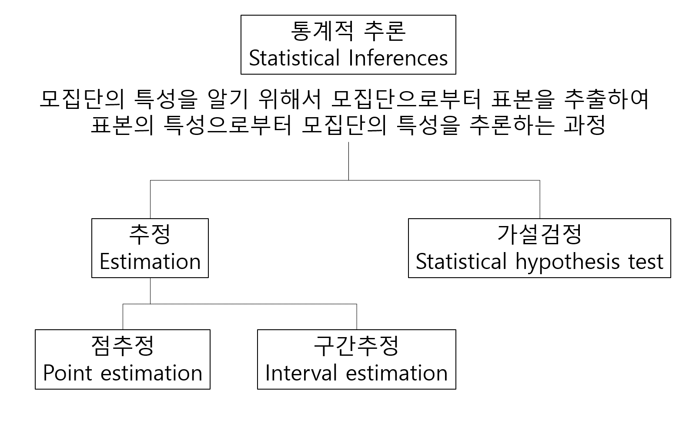

# Confidence intervals



점추정의 경우 이항분포에서 모비율을 추정하는 추정량인 (estimator) $np$나 정규분포의 표본평균의 추정량인 $\bar{X} = \sum_{i=1}^n X_i/n$ 등이 점추정량이고 이들은 모두 추정량의 특징인 불편성을 만족하는 불편추정량 (unbiased estimator)입니다. 불편추정량이란 점추정량 $\hat{\theta}$의 기대치 $E(\hat{\theta})$이 모집단의 모수 $\theta$와 같은 추정량을 말하며 앞서 중심극한 정리에 의해서 표본평균의 기대값이 모평균과 같음을 배웠으므로 $\bar{X}$가 불편추정량이 되는 것 입니다. 

그런데 점추정량은 표본에 따라서 다르고 오차에 대한 정보도 제공하지 못하므로 점추정량에 오차한계를 빼고 더해서 추정량의 하한치와 상한치를 구하여 모수를 포함하는 구간을 나타내는 신뢰구간을 사용합니다. 신뢰구간은 모수를 포함할 범위를 말하며 다음과 같이 정의할 수 있습니다. 


$p( \hat{\theta_L} \le \theta \le \hat{\theta_U} ) = 1-\alpha$


여기서 1-$\alpha$를 백분률로 치환한 값 $(1-\alpha)\cdot 100%$를 신뢰수준이라고 합니다. 여기서 $\alpha$는 유의수준 (significance level)이며 신뢰구간 $[\hat{\theta_L}, \hat{\theta_U}]$에 모수 $\theta$가 포함되지 않을 확률이라고 할 수 있습니다. 일반적으로 신뢰수준 90%, 95%, 99%에 상응하는 유의수준 $\alpha$=0.1, 0.05, 0.01 이 사용됩니다. 95% 신뢰구간을 해석할 때 해당 구간에 모수를 포함할 확률이 95% 이다라고 해석할 수 있습니다. 틀린 해석이라고 할 수는 없지만 더 정확한 해석은 표본 추출을 100번 반복해서 100개의 신뢰구간을 구했을 때 그 중 95개의 신뢰구간이 모평균을 포함하는 구간이다 라고 해석하는 것입니다. 


## CI for population proportion, $p$

앞서 장에서는 시뮬레이션에 기반한 신뢰구간을 알아보았습니다. 아래는 분포 가정에 기반한 모비율 $p$에 대한 신뢰구간을 구하는 방법입니다. $X$를 이항분포를 따르는 성공의 갯수라고 정의하면 $X$~B(n, p) 입니다. 여기서 $n$은 시행횟수이고 $p$는 성공 비율입니다. 그런데 $n$이 충분히 클 경우 $X \sim N(np, npq)$ 임이 알려져 있습니다. $\hat{p}$은 성공의 갯수를 나타내는 확률변수 $X$를 $n$으로 나누어 준 값으로 볼 수 있고 이는 다음과 같은 분포로 정의될 수 있습니다. 

$$
\frac{X}{n} \sim N(\frac{np}{n}, \frac{\sqrt{npq}}{n}) \\
\hat{p} \sim N(p, \sqrt{\frac{p(1-p)}{n}}) 
$$ 

$$
SD(\hat{p}) = \sqrt{\frac{p(1-p)}{n}}
$$


이라 하면 충분히 큰 $n$에 대해서 다음 값은 표준정규분포를 따릅니다. 

$$
Z = \frac{\hat{p} - p}{SD(\hat{p})}
$$

표준정규분포에서 0.95 확률에 해당하는 구간을 구하면 다음과 같습니다. 


$$
-1.96 < \frac{\hat{p} - p}{SD(\hat{p})} < 1.96 
$$

위 식을 모수 $p$를 기준으로 변형하면 다음과 같습니다. 

$$
\hat{p} - 1.96 \cdot SD(\hat{p}) <  p < \hat{p} + 1.96 \cdot SD(\hat{p})
$$

위 범위가 모수 $p$에 대한 신뢰구간입니다. 그러나 $SD(\hat{p}) = \sqrt{\frac{p(1-p)}{n}}$에서 $p$는 일반적으로 알 수 없으므로 샘플로부터 계산된 $\hat{p}$를 이용한 표준오차 (Standard error)를 사용합니다. 

$$
SE(\hat{p}) = \sqrt{\frac{\hat{p}(1-\hat{p})}{n}}
$$

$SE(\hat{p})$ 를 사용한 다음 통계량의 경우도 충분히 큰 $n$에 대해서 표준정규분포를 따르게 됩니다. 

$$
Z=\frac{\hat{p}-p}{SE(\hat{p})} = \frac{observed - expected}{SE} 
$$

따라서 모수 $p$의 95% 신뢰구간에 대해서 다음과 같은 식을 얻을 수 있습니다. 

$$
\hat{p}-1.96 \cdot SE(\hat{p}) < p < \hat{p}+1.96 \cdot SE(\hat{p}) 
$$


위 식의 1.96 값을 임계값 (critical value) 이라고 하며 $1.96 \cdot SE(\hat{p})$ 값을 오차한계 (margin of error)라고 합니다. 임계값은 신뢰구간에 따라서 달라지는 값으로 신뢰구간이 95%라면 $\alpha = 0.05 (1-0.95)$ 이고 임계값은 표준정규분포에서의 `qnorm` 함수를 이용해서 구할 수 있습니다. 

```{r, eval=F}

conf <- 95
myalpha <- (1-conf/100)
critical_value <- qnorm(1-myalpha, 0, 1)

x <- seq(-5, 5, by=0.01)
y <- dnorm(x, 0, 1)
dat <- data.frame(x, y)

ggplot(dat, aes(x=x, y=y)) +
  geom_line(size=1) +
  labs(y="Density") +
  theme_bw() +
  geom_area(data=filter(dat, x > critical_value), fill="#ff000055") +
  geom_area(data=filter(dat, x < (-1*critical_value)), fill="#ff000055") +
  geom_segment(aes(x=critical_value, 
                   xend=critical_value, 
                   y=0.32, 
                   yend=0), 
               arrow = arrow(length = unit(0.1, "inches")), 
               size=1) +
  annotate("text", 
           label=paste("Critical value\n", round(critical_value,3)), 
           x=critical_value, 
           y=0.35) +
  geom_segment(aes(x=3.5, 
                   xend=2, 
                   y=0.2, 
                   yend=0.02), 
               arrow = arrow(length = unit(0.1, "inches")), 
               size=1) +
  annotate("text", 
           label=paste("Alpha/2 ", myalpha/2), 
           x=3.5, 
           y=0.21)

```


**[EXERCISE]** 특정 찬성/반대 설문조사 인원이 1012명이고 그 중 찬성 비율이 0.46으로 나왔을 경우 95% 신뢰구간은 다음과 같이 구할 수 있습니다. 


```{r, eval=F}
phat <- 0.46
n <- 1012
SE <- sqrt(phat*(1-phat)/n)
lower <- phat + qnorm(0.025, 0, 1) * SE
upper <- phat + qnorm(0.975, 0, 1) * SE
c(lower, upper)
```

**[EXERCISE]** 위 예제에 대한 90% 신뢰구간을 구하시오

```{r, eval=F}
phat <- 0.46
n <- 1012
SE <- sqrt(phat*(1-phat)/n)
lower <- phat + qnorm(0.05, 0, 1) * SE
upper <- phat + qnorm(0.95, 0, 1) * SE
c(lower, upper)
```


**[EXERCISE]** ```prop.test``` 함수를 사용해서 95%, 90% 신뢰구간을 구하시오 

```{r, eval=F}
?prop.test
phat <- 0.46
n <- 1012
confint(prop.test(x=n*phat, n=n))
confint(prop.test(x=n*phat, n=n, conf.level = 0.7))

```


## CI for population mean

정규분포 모평균의 신뢰구간을 구할 때도 위 모비율과 유사한 방법을 사용합니다. 중심극한정리에서 표본평균의 $\bar{X}$의 분포는 $\bar{X} \sim N(\mu, \frac{\sigma}{\sqrt{n}})$ 입니다. 따라서 정규분포를 따르는 표본평균 $\bar{x}$의 표준화된 통계량 $Z$은 다음과 같습니다.  

$$
Z = \frac{\bar{x}-\mu}{\sigma / \sqrt{n}} = \frac{\bar{x}-\mu}{SD(\bar{x})} 
$$

그러나 앞서 언급한바와 같이 모표준편차 $\sigma$는 알 수 없으며 따라서 표본표준편차인 $s$를 대신 사용한 표준오차를 사용하게 됩니다. 이 때 $Z$ 값은 표준정규분포가 아닌 T분포를 따르게 되며 이는 다음과 같은 통계량을 가집니다. 

$$
T = \frac{\bar{x}-\mu}{s / \sqrt{n}} = \frac{\bar{x}-\mu}{SE(\bar{x})} = \frac{observed - expected}{SE}
$$

유의수준 (significance level)을 $\alpha$라 하면 신뢰구간은 다음과 같이 표현이 가능합니다. 이는 데이터가 모여있는 구간이라는 신뢰구간의 해석과 상통합니다. 

$$
\begin{split}
P(-t^* < \frac{\bar{x}-\mu}{s / \sqrt{n}} < t^*) = 1 - \alpha \\
P(\bar{x}-t^* \cdot SE < \mu < \bar{x} + t^* \cdot SE ) = 1 - \alpha 
\end{split}
$$

여기서 임계값 $t^*$는 t분포의 `q` 함수인 `qt()`를 사용해서 구할 수 있습니다. 

**[EXERCISE]** 한 반에 30명 학생들의 평균 키가 66인치이고 표준편차는 4인치인 경우 전체 학교 학생의 평균 키에 대한 80% 신뢰구간을 구하면 다음과 같습니다. 

```{r, eval=F}
xbar <- 66 
s <- 4
n <- 30
alpha <- 1 - 0.8
tstar <- qt(1-alpha/2, df=n-1)
SE <- s/sqrt(n)
MOE <- tstar * SE
xbar + c(-1, 1) * MOE
```


**[EXERCISE]** 어떤 커피전문점의 바리스타가 25초 기계를 돌리면 에스프레소 2온스가 나온다고 훈련을 받았다. 8번 시험을 해 본 결과 다음과 같은 무게의 에스프레소가 나왔다. 1.95, 1.8, 2.10, 1.82, 1.75, 2.01, 1.83, 1.9. 평균 샷 사이즈의 90% 신뢰구간을 구하고 이 구간에 2.0 온스가 들어가는지 검사하시오

```{r, eval=F}
x <- c(1.95, 1.8, 2.10, 1.82, 1.75, 2.01, 1.83, 1.9)
t.test(x, conf.level = 0.9)
```


