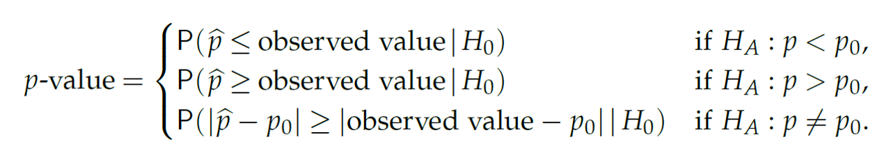

# Significance test


https://youtu.be/Xv7RZncGDwE

https://youtu.be/spJcs6iiXek

신뢰구간은 (구간추정) 통계적 추론의 방법 중 하나이며 유의성검정은 가설을 검정하는 또 다른 추론의 방법입니다. 유의성 검정은 분포를 가정한 상태에서 모수에 대한 특정 값을 추정한 후 (점추정) 해당 값이 가정된 분포로부터 관측될 확률을 계산하여 가설에 대한 판단을 수행합니다. 

유의성검정을 재판 과정의 검사와 배심원 입장으로 생각하면 이해가 쉬울 수 있습니다. 검사는 피의자가 유죄임을 주장하며 배심원들을 설득합니다. 배심원들은 피의자가 유죄라는 확정적 증거가 없는 한 무고하다는 가정을 하고 있으며 증거가 많아질수록 자신들이 가정한 무죄가 아닐 확률은 점점 적어집니다. 즉, 확률이 충분히 작으면 무죄라는 가정을 버리고 검사의 주장을 받아들이게 됩니다. 


## Errors in significance tests

다른 예를 들어봅시다. 어떤 영업사원이 A 회사에서 판매하는 기계의 영점이 평균 0으로 맞춰저 있다고 주장을 하며 해당 기계를 팔고 있습니다. 실제로 판매하는 기계의 영점이 0으로 맞춰져 있을 때 (0이 참) 우리 입장에서는 영업사원의 말은 당장 증명할 수 없는 가설일 뿐입니다. 그래도 그 가설을 믿고 (채택하고) 기계를 구입할 경우 오류 없는 정상적인 거래가 됩니다. 그런데 우리가 영점이 2라고 의심을 하며 영업사원의 말을 믿지 않고 (가설을 기각하고) 기계를 구입하지 않는다면 오류가 발생한 것입니다. 이 상황을 그래프로 알아봅니다 (편의상 기계 영점의 분산은 1이라고 가정). 


```{r, eval=F}

x1 <- seq(-6, 6, by=0.01)
y1 <- dnorm(x1, 0, 1)
z <- data.frame(x1, y1)
pval <- round(1-pnorm(2,0,1), 4)
ggplot(z) +
  geom_line(aes(x1, y1), color="purple") +
  geom_vline(xintercept = 2) +
  geom_hline(yintercept = 0) +
  geom_area(data=filter(z, x1 > 2), 
            aes(x1, y1), 
            fill="#80008055") +
  annotate("text", x=3, y=0.1, label=pval) +
  geom_segment(aes(x=3, xend=2.3, y=0.09, yend=0.01), 
               arrow=arrow(length=unit(0.1,'inch')),
               color='black',
               size=1)
  


```

위 그래프에서 실제 기계들의 평균 영점이 0임인 분포만을 생각하면 면적의 넓이 0.0228은 2보다 큰 영점을 가지는 기계가 생산될 확률입니다. 이 실제 사실에 더하여 "영점이 0이다"라는 가설의 분포를 생각하면 (가설과 사실의 분포가 겹쳐있음) 면적의 넓이 0.0228 부분은 2를 기준으로 가설을 받아들이지 않는 (기각하는) 경우로 볼 수 있으며 결국 실제 사실도 받아들이지 않는 오류를 범할 확률을 나타냅니다. 이 오류를 우리는 "제1종오류 ($\alpha$)" 라고 합니다. 

이제 영업사원의 가설이 거짓일 경우를 생각해 봅니다. 즉, 어떤 이유로 A회사 기계의 영점이 평균 3일 경우 영업사원의 "영점이 0이다"라는 주장은 거짓이 됩니다. 이 상황에서도 우리는 두 가지 경우를 생각할 수 있습니다. 영업사원의 가설을 믿고 (채택하고) 기계를 구입할 경우는 오류가 발생하는 상황과 영점이 2라는 의심으로 영업사원의 가설을 믿지않고 (기각하고) 기계를 구입하지 않는 올바른 판단을 한 상황 입니다. 


```{r, eval=F}

x1 <- seq(-6, 6, by=0.01)
y1 <- dnorm(x1, 0, 1)
x2 <- seq(-1, 11, by=0.01)
y2 <- dnorm(x2, 3, 1)
z <- data.frame(x1, y1, x2, y2)
#pval <- round(1-pnorm(2,0,1), 4)
ggplot(z) +
  geom_line(aes(x1, y1), color="blue") +
  geom_line(aes(x2, y2), color="red") +
  geom_vline(xintercept = 2) +
  geom_hline(yintercept = 0) +
  geom_area(data=filter(z, x1 > 2), 
            aes(x1, y1), 
            fill="#0000ff55") +
  geom_area(data=filter(z, x2 < 2), 
            aes(x2, y2), 
            fill="#ff000055") +
  annotate("text", x=3, y=0.1, label=pval) +
  geom_segment(aes(x=3, xend=2.3, y=0.09, yend=0.01), 
               arrow=arrow(length=unit(0.1,'inch')),
               color='black',
               size=1)
  

```

이 때는 실제 사실의 분포와(red) 가설의 분포가(blue) 다릅니다. 실제 사실의 분포 입장에서 2를 기준으로 가설을 기각하는 상황은 올바른 판단을 하는 상황입니다. 그러나 2를 기준으로 가설을 받아들이는 경우, 실제 사실은 받아들이지 않게 되는 오류가 발생합니다. 이 오류를 "제2종오류 ($\beta$)"라고 합니다. 

일반적으로 실제 사실은 모집단의 모수와 같이 알 수 없는 값입니다. 따라서 우리는 가설의 분포를 가지고 판단을 하게되며 이 때 $\alpha$와 $\beta$ 오류는 위 그림이 보여주는 것처럼 서로 trade off 관계에 있게 됩니다. 즉, 임의의 가설을 기반으로 특정 관측값의 유의성을 판단할 때 제1종오류를 최소화 하려하면 제2종오류는 최대화 되고 그 반대로 제2종오류를 최소화 하면 제1종오류는 오히려 커지게 되는 것 입니다. 


유의성검정에서 $H_0$는 귀무가설(Null hypothesis)이고 $H_1$을 대립가설(alternative hypothesis)이라 합니다. 일반적으로 $H_1$이 사람들이 관심있는 주장이고 유의성검정을 위해서 사람들의 주장의 반대인 $H_0$를 가정합니다. 만약 $H_0$ 가정 하에서 만들어진 통계량의 관측될 확률이 작으면 가정이 틀린 것으로 $H_0$를 기각하고 사람들이 주장하는 $H_1$을 채택합니다. 여기서 계산된 통계량이 관측될 확률을 유의확률(p-value) 이라 하며 유의성검정은 p-value를 계산하는 것과 같습니다. 위 그림에서 0.0228 값이 p-value 입니다. 

$$
\text{p-value} = P(\text{test statistic is the observed value or is more extreme}|H_0)
$$


p-value의 크고 작음을 판단하는 대략적인 범위는 다음과 같습니다.


유의성검정에서는 $H_0$가 참인지 거짓인지 판별하기 보다는 유의수준(significance level, $\alpha$)이라는 기준에 따라서 H0를 기각할지 안할지를 판단하게 됩니다. 위 영점 예제에서 제1종오류 $alpha$가 유의수준과 같은 의미 입니다. 일반적인 유의수준은 0.01, 0.05, 0.1 정도로 p-value가 이들 값보다 작게 나오면 $H_0$를 기각합니다. 앞서 기계 영점에 대한 예제에서와 같이 $\alpha$를 기준으로 $H_0$를 기각 할 경우 두 가지 오류, 제1종오류 (type-I error)와 제2종오류 (type-II error)가 발생할 수 있습니다. 


귀무가설 참 --> 채택 (o)   
귀무가설 참 --> 기각  (오류)   
귀무가설 거짓 --> 채택  (오류)   
귀무가설 거짓 --> 기각 (o)   


앞서 재판의 경우를 예로 들면 제1종오류는 죄가 없는 사람($H_0$가 참)을 죄가 있다고 판단 ($H_0$기각) 하는 경우로 가능하면 일어나서는 안되는 상황입니다. 따라서 $\alpha$는 보수적인 기준으로 정하게 되나 $\alpha$가 작아지면 자동적으로 $\beta$가 큰 값으로 결정되어 두 오류를 동시에 작게 만족시키는 유의수준은 정하기 어렵습니다. 따라서 가능한 제1종 오류를 작게 유지하면서 power ($1-\beta$)를 가능한 높게 되도록 검정을 디자인할 필요가 있습니다. 


**[Example]** 어떤 기계의 영점이 N(0,1)의 분포를 가지고, 영점이 맞지 않을 경우 N(1,1)의 분포를 가진다고 한다. 기계로 부터 측정한 값이 0.7일 경우 기계의 영점이 맞춰져 있는지 아닌지를 판단하시오

$$
H_0: \mu = 0 \text{ vs } H_1: \mu = 1
$$


만약 영점이 맞춰진 상태에서 관측된 값이라면 $Z = {0.7-\mu}/sd = 0.7$ 이므로 p-value는  ```1-pnorm(0.7, 0, 1)=0.2419``` 이므로 가설을 기각할만한 증거가 충분치 않습니다. 즉, $H_0: \mu=0$를 받아들이는 상황인 것인데 그렇지만 0.7은 분명히 0보다는 1에 가까운 ($H_1$) 값입니다. 이러한 경우에 1 sd 대신 1/sqrt(10) 값을 사용하면 훨씬더 명확한 판단을 내릴 수 있습니다. 

```{r, eval=F}

1-pnorm(0.7, 0, 1/sqrt(10))

```

즉, p-value가 충분히 작으므로 귀무가설 $H_0$를 기각하고 대립가설을 지지하게 됩니다. 1 standard deviation unit 대신 1/10 unit을 사용함므로써 더욱 명확한 판단을 내릴 수 있게 된 것입니다.   


위와 같은 p-value는 가설을 검정하는데 사용되는 핵심 기준이 되며 가설을 검정하기위한 p-value 계산법은 일반적으로 다음과 같습니다. 

 * 데이터에 맞는 분포를 정함 (모수 정의)
 * H0와 H1를 정함
 * 검정 통계량 정의
 * 데이터 수집
 * 검정 통계량 계산
 * p-value 계산 
 

유의성 검정의 목적은 추정한 모수가 얼마나 통계적으로 유의한지를 판단하기 위한 것 입니다. 모형에 (분포) 따라서 모수가 달라지므로 다음과 같이 몇 가지 경우에 대한 유의성 검정 방법들이 있습니다.  


## Significance test for a population proportion

실업률 고용률 오르는지, 빈곤율 떨어지는지 등 비율에 대한 값이 있고 이러한 모수를 갖는 분포는 이항분포가 대표적인 예 입니다. 해당 분포에 대한 모수가 관측한 값보다 더 높은지 낮은지를 비교하는 검정을 수행할 수 있습니다.  우리의 관심 확률 변수가 $p$ 이고 가설의 기준이 되는 값을 $p_0$라 합니다. 만약 $n$ 번 관찰 중 $x$번을 성공 횟수라 한다면 $\hat{p} = x/n$ 입니다. 보통은 표준화한 값을 통계량으로 사용하고 $Z$는 다음과 같습니다.  

$$
\begin{split}
H_0: p = p_0 \\
\\
H_1: p > p_0, H_1: p < p_0, H_1: p \neq p_0 \\
\\
Z = \frac{\hat{p} - E(\hat{p}|H_0)}{SD(\hat{p}|H_0)} = \frac{\hat{p} - p_0}{\sqrt{p_0(1-p_0)/n}} 
\end{split}
$$





**[Example]** 2000년 빈곤율은 11.7% 였고 2010년 빈곤율은 15.0% 였다. 2011년 빈곤율이 15.13%으로 관측 되었을 때 빈곤율이 증가하는 것인지 검정하시오. n = 150,000. 

* 분포 - 비율 비교 (이항분포)
* H0: 15.0과 같다, H1: 15.0보다 크다 
* 통계량: Z
* 통계량, pvalue계산


$$
\begin{split}
& H_0: p = 0.15 \\
\\
& H_1: p > 0.15 \\
\\
Z &= \frac{0.1513 - 0.15}{\sqrt{0.1513 \times 0.8487 / 150000}} = 1.405 \sim N(0,1)
\end{split}
$$

```{r, eval=F}
library(tidyverse)
n <- 150000
phat <- 22695/n
p0 <- 0.15
SD <- sqrt(p0*(1-p0)/n)
Z <- (phat - p0)/SD
pval <- 1-pnorm(Z)

## plot
x <- seq(-5, 5, length=100)
y <- dnorm(x)
dat <- data.frame(x, y)

#x1 <- seq(Z, 5, length=50)
#y1 <- dnorm(x1)
#dat2 <- data.frame(x=c(Z, x1, Z), y=c(0, y1, 0))

ggplot(dat, aes(x, y)) +
  geom_line() +
  geom_area(data=filter(dat, x > Z), fill="#ff000055") +
  #geom_polygon(dat=dat2, aes(x, y)) + 
  annotate("text", 
           label = round(pval,3), 
           x = 3, 
           y = 0.15, 
           size = 8, 
           colour = "red") +
  geom_segment(aes(x = 2.5, 
                   y = 0.12, 
                   xend = 1.8, 
                   yend = 0.05),  
               arrow = arrow(length = unit(0.1, "inches")), 
               color='red',
               size=1)


```

**[EXERCISE]** 앞서 예제를 ```prop.test``` 를 사용해서 구현하시오 

```{r, eval=F}
prop.test(x=22695, n=150000, p=0.15, alternative = "greater")
```


## Significance test for the mean (t-test)

이번에는 미지의 모평균에 대한 검정을 수행하는 방법을 알아봅니다. 검정 방법은 앞서 배운 검정 과정과 유사하며 통계량은 신뢰구간을 학습할 때 배웠던 t통계량과 같습니다.

$$
\begin{split}
H_0: \mu = \mu_0 \\
\\
H_1: \mu > \mu_0, H_1: \mu < \mu_0, H_1: \mu \neq \mu_0 \\
\\
T = \frac{\bar{x} - E(\bar{x}|H_0)}{SE(\bar{x}|H_0)} = \frac{\bar{x} - \mu_0}{s / \sqrt{n}} = \frac{\text{observed} - \text{expected}}{SE} 
\end{split}
$$

이제 데이터 $x_1, x_2, ..., x_n$을 얻고 이로부터 $t = (\bar{x}-\mu_0)/(s/\sqrt{n})$을 구할 경우 p-value는 다음과 같습니다. 


**[Example]** 새 SUV 자동차의 연비가 17miles / gallon 으로 알려져 있다. 소비자 그룹에서는 그러나 이보다 낮은 것으로 의심하고 있다. 다음 데이터들이 관측 되었을 때 해당 신차의 연비가 17mile 보다 작은지 검정하시오. 

```{r, eval=F}
mpg <- c(11.4, 13.1, 14.7, 14.7, 15, 15.5, 15.6, 15.9, 16, 16.8)
xbar <- mean(mpg)
s <- sd(mpg)
n <- length(mpg)
tstat <- (xbar-17)/(s/sqrt(n))
```


$$
\begin{split}
&H_0: \mu = 17 \\
\\
&H_1: \mu < 17 \\
\\
T &= \frac{14.87 - 17}{1.582 / 3.162} =  -4.284
\end{split}
$$


```{r, eval=F}
x <- seq(-5, 5, length=100)
y <- dt(x, df=n-1)
dat <- data.frame(x, y)
ggplot(dat, aes(x, y)) +
  geom_line() +
  geom_vline(xintercept = tstat)

pt(tstat, df=9, lower.tail=T)
```


```{r, eval=F}
pt(tstat, df=9, lower.tail=T)
```


**[EXERCISE]** 위 예제를 `t.test` 를 사용해서 구현하시오 

```{r, eval=F, echo=F}
t.test(mpg, mu=17, alternative="less")
```


## Problem 10
1) `babies(UsingR)` 데이터의 임신 중 흡현을 한 사람을 (smoke 변수의 1로 코딩된 샘플) 뽑으시오 (단, smoke 변수의 999값을 가진 샘플은 포함하지 마시오)


2) 위 문제 1)에서 "H0: 평균 임신기간이 40주 이다" 라는 가설을 검정하시오 (양측검정). 


