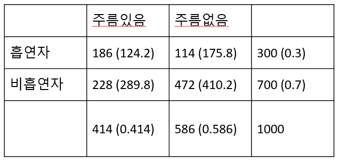

# Goodness of fit

앞서 chapter 4에서 범주형 데이터와 함께 The chi-squared statistics의 간략한 설명이 있었습니다. 범주형 데이터에서는 테이블로 데이터를 요약할 수 있고 각 테이블 숫자들의 분포가 얼마나 기대한 숫자들과 유사한지를 테스트할 수 있습니다. 이러한 검정을 적합도 검정이라고 합니다. 

## The chi-squared goodness-of-fit test

어떤 선거를 앞두고 100명의 사람들에게 공화당과 민주당 후보 중 어느 후보를 지지하는지 투표를 수행했다고 합시다. 공화당이 35명 민주당이 40명 그리고 결정하지 못 한 사람이 25명 이라고 할 때 공화당과 민주당 지지하는 사람들의 차이는 유의한 것인가? 라는 질문을 할 수 있습니다. 유의성 검정을 수행하기 위해서는 유의확률을 계산할 수 있는 확률 분포가 필요합니다. 그런데 위 설문조사는 두 개 이상의 옵션을 가지고 있습니다. 두 가지 경우의 수만을 가지는 경우를 이항분포라고 하였다면 두 가지 이상의 경우를 가지는 경우의 분포를 다항분포 (multinomical) 라고 합니다. 

$k$개의 범주를 갖는 $1$ 부터 $k$까지의 라벨이 적힌 카드가 있다고 할 경우 랜덤하게 카드를 하나 뽑을때 뽑힐 카드의 확률은 $p_1$, $p_2$, ..., $p_k$이고 $p_1 + p_2 + ... + p_k = 1$ 입니다. $n$번의 카드를 반복해서 뽑을 때 각 카드가 몇 개 뽑혔는지 테이블을 만들 수 있습니다. 이 테이블 각 cell의 숫자를 $y_1$, $y_2$, ..., $y_k$라 하고 이 숫자들을 모두 더하면 $n$이 됩니다. 각 cell의 숫자들을 나타내는 변수를 확률변수로 볼 수 있고 이 확률 변수들의 결합확률이 다항분포 입니다. 


앞서 선거 예제를 보면 우리가 기대하는 공화당, 민주당, 기권의 비율은 각각 35%, 35%, 30%라고 하면 100명의 설문조사인원 중 35명은 공화당, 40명은 민주당, 25명은 기권이 관측될 확률을 계산하는 경우로 볼 수 있고 이는 다음과 같습니다. 

$$
P(y_1=35, y_2=40, y_3=25) = {100\choose35} \cdot (0.35)^{35} \cdot {65\choose40} \cdot (0.35)^{40} \cdot {25\choose25} \cdot (0.30)^{25} 
$$

위 확률은 특정 값이 관측될 확률이며 검정에서 사용되는 p-value는 아닙니다. p-value는 관측값과 기대값의 차이를 이용해서 기존 분포에 맞는 통계량을 계산하는 방법으로 p-value를 구합니다. $y_i$ 는 얼마나 많은 수의 $i$ 범주의 카드가 $n$으로부터 뽑혔는지를 말해줍니다. 만약 $i$ 범주 하나만을 생각한다면 $y_i$의 기대값은 Binomial(n, $p_i$)를 따르게 되고 기대값은 $np_i$가 됩니다. 따라서 범주형 데이터 테이블에서 기대값과 관측값의 차이로 만든 통계량은 다음과 같으며 피어슨 카이스퀘어드 통계량 (Pearson's chi-squared statistic) 이라고 합니다. 

$$
\chi^2 = \sum_{i=1}^{k} \frac{(y_i-np_i)^2}{np_i} = \sum \frac{(observed-expected)^2}{expected} 
$$

테이블의 각 cell의 수가 ($y_i$) 5 이상일 경우 $y_i$는 근사적으로 $k-1$ 자유도를 갖는 카이제곱 분포를 따른다고 알려져 있습니다. 위 통계량을 사용하여 유의성 검정을 수행할 수 있습니다. 통계량 값이 클 경우 예측값과 관측값 차이가 커지게 됩니다. 


범주형 자료의 랜덤표본추출에 의해서 만들어진 테이블의 관측값이 $y_1$, $y_2$, ..., $y_k$라 하면 이들이 관측될 결합확률 분포는 다항분포 모형의 $p_1$, $p_2$, ..., $p_k$으로 표현할 수 있습니다. 이를 이용하여 다음 귀무가설과 대립가설을 수립하고 카이스퀘어 통계량을 사용하여 유의성 검정을 수행할 수 있습니다. 

$$
H_0: p_1 = \pi_1, ..., p_k = \pi_k \\
H_1: p_i \neq \pi_i \text{ for at least on } i
$$

귀무가설이 참인 가정 하에서 표본분포는 (sampling distribution) 자유도가 $k-1$인 $\chi^2$ 분포를 따르게 됩니다. 


```{r, eval=F}

## chisq plot

xs <- seq(0.1, 10, by = 0.1)
#y <- dchisq(x, 2)
dfs <- 1:7
#x2 <- rep(x, times=length(dfs))

y <- sapply(dfs, function(x){dchisq(seq(0.1, 10, by = 0.1), df=x)})
colnames(y) <- dfs
dat <- data.frame(x, y)
dat2 <- dat %>% 
  pivot_longer(!c("x")) %>% 
  mutate(df=gsub("X", "", name))

ggplot(dat2, aes(x=x, y=value, color=df)) +
  geom_line(size=1.5)


```


```{r, eval=F}

y <- c(35, 40, 25)
p <- c(35, 35, 30)
p <- p/sum(p)
n <- sum(y)
chi2 <- sum((y-n*p)^2 / (n*p))
pval <- pchisq(chi2, 2, lower.tail = F)

## plot
xs <- seq(0.1, 10, by = 0.001)
ys <- dchisq(xs, 2)
dat <- data.frame(xs, ys)

ggplot(dat, aes(x=xs, y=ys)) +
  geom_line() +
  geom_vline(xintercept = chi2) +
  geom_area(data=filter(dat, xs>0 & xs<chi2), fill="red") +
  annotate("text", 0.8, 0.1, label=round(pval,2), color="white") +
  annotate("text", 2, 0.3, label=round(chi2,2))


```

```{r, eval=F}

chisq.test(y, p=p)

```

## The chi-square test of independence

우리는 4장에서 two way-contingency table을 이용해서 두 범주형 변수의 상관성을 카이제곱 통계량으로 알아보았습니다. 즉, 테이블의 두 범주형 변수가 독립인지를 검사하기 위해서 주변분포와 조건부분포를 이용해서 기대값을 계산하고 관측값과의 차이로 카이제곱 통계량을 계산했습니다. 이 때 두 변수의 독립을 가정한 상태로 기대값을 계산했는데 이러한 가정이 바로 귀무가설과 같습니다. 정리하면 두 범주형 변수의 독립을 검정하기 위해서는 귀무가설과 대립가설, 검정통계량과 분포가 있으면 되겠습니다. 

$y_{ij}$, $i$=1,...,$n_r$, $j$=1,...,$n_c$ 를 two way contingency 테이블의 ($i$, $j$) 셀의 숫자라고 하고 $p_{ij}$를 해당하는 확률이라고 하겠습니다. 그리고 테이블에서 주변확률을  각각 $p_i^r = p_{i1} + p_{i2} + ... + p_{in_r}$ 과 $p_j^c = p_{1j} + p_{2j} + ... + p_{n_cj}$라 하면 두 변수가 독립일 경우 $p_{ij}=p_i^r p_j^c$ 입니다. 따라서 귀무가설과 대립가설은 다음과 같이 정의할 수 있습니다. 

$H_0$: 두 변수가 독립, $H_A$: 두 변수가 독립이 아님. 

이제 $H_0$를 참으로 가정한 상태에서 통계량은 다음과 같습니다. 

$$
\chi^2 = \sum_{i=1}^{n_r} \sum_{j=1}^{n_c} \frac{(y_{ij} - n \hat{p_{ij}})^2}{n\hat{p_{ij}}}
$$

앞서 Goodness of fit 검정과 다른 점은 앞에서는 $\hat{p_{ij}}$에 해당하는 기대 확률이 주어져 있었고 독립성 검정에서는 이 기대 확률을 테이블을 통해 계산한다는 점 입니다. 이 통계량은 귀무가설하에서 자유도 $(n_r-1)(n_c-1)$인 카이제곱 분포를 따르며 p-value는 다음과 같습니다. 

$$
P(\chi^2 \ge \text{observed value} | H_0)
$$

독립성 검정은 `chisq.test()`함수를 이용하여 수행할 수 있습니다. 아래 예제는 4장 두 변수의 연관성 학습할 때 나왔던 예제와 같습니다. 

**[Example]** 다음 seatbelt 데이터에서 만약 부모와 아이들의 안전벨트를 매는 두 사건 (변수)가 독립이라면 $p(C, P) == p(C)p(P)$ 즉, 결합확률이 각 확률을 곱한 것과 같고 기대값은 확률 x 전체 사건의 수($N$) 이므로 다시 적으면 $N p(C,P) == N p(C)p(P)$임. 여기서 $N p(C,P)$는 우리가 관측한 값으로 볼 수 있고 $N p(C) p(P)$는 독립을 가정한 상태에서 기대값이라고 볼 수 있음. 


```{r, eval=F}

fo <- matrix(c(56, 2, 8, 16), nrow=2)
rownames(fo) <- c("buckled","unbuckled")
colnames(fo) <- c("buckled","unbuckled")

## marginal probability
margin_rows <- rowSums(fo)/sum(fo)
margin_cols <- colSums(fo)/sum(fo)

## expected numbers
fe <- matrix(c(0,0,0,0), nrow=2)
fe[1,1] <- sum(fo)*margin_rows[1]*margin_cols[1]
fe[1,2] <- sum(fo)*margin_rows[1]*margin_cols[2]
fe[2,1] <- sum(fo)*margin_rows[2]*margin_cols[1]
fe[2,2] <- sum(fo)*margin_rows[2]*margin_cols[2]
#fe

## use chisq.test function
#(fo-fe)^2 / fe
chistat <- sum((fo-fe)^2 / fe)
df <- (nrow(fo)-1)*(ncol(fo)-1)
1-pchisq(chistat, df)


result <- chisq.test(fo)

```


**[Example]** 한 의학연구가에 의하면 흡연은 눈가에 주름이 지게 하는 요인이 된다고 한다. 이러한 주장이 타당한가를 알아보기 위해 30대 남자 1000명을 랜덤하게 추출하여 조사한 결과 다음과 같은 표를 얻었다. 30대 남자들을 대상으로 볼 때 연구가의 주장이 옳은지 판단하는 연관성을 나타내는 카이제곱 값을 구하라



chistat = 74.9652, pvalue<2.2E-16
```{r}
fo <- matrix(c(186, 228, 114, 472), nrow=2)
fo
chisq.test(fo, 1)
```


## Goodness-of-fit tests for continuous distribution

앞서 신뢰구간을 학습할 때 신뢰구간의 계산은 표본분포가 정규분포라고 가정하고 구할 수 있는 값이였습니다. 따라서 표본이 정규분포에서 추출되었는지 아닌지를 판단하는 것이 중요하며 이를 위해서 사분위 그래프 (quantile plot)이나 히스토그램을 그려서 정규분포인지를 판단했습니다. 이번에는 검정을 통해서 한 표본이 정규분포와 같은 연속형 분포를 따르는지를 판단하는 내용을 학습해 보겠습니다. Kolmogorov-Smirnov test는 표본이 정규분포와 같은지를 검정하는데 사용되는 방법입니다. 


