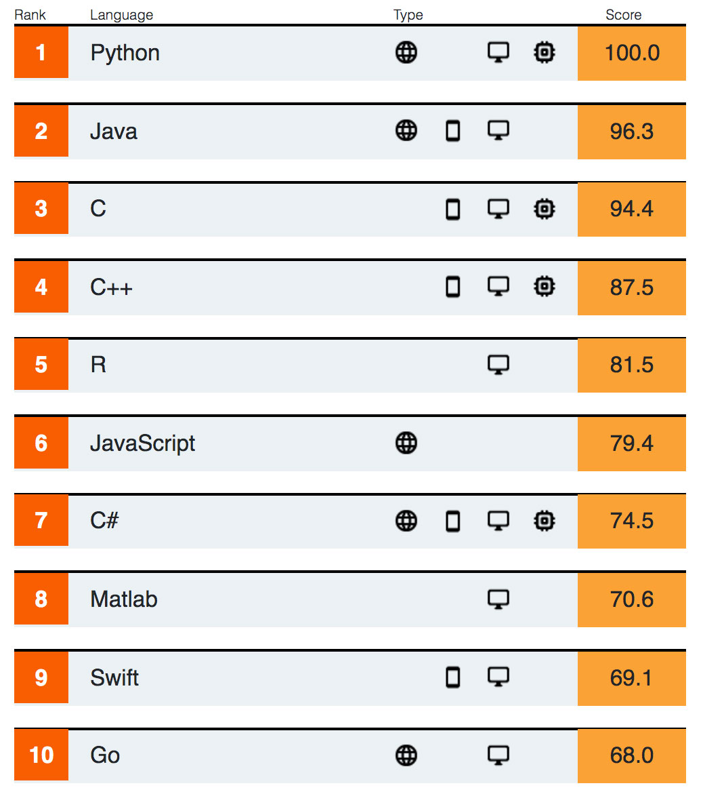
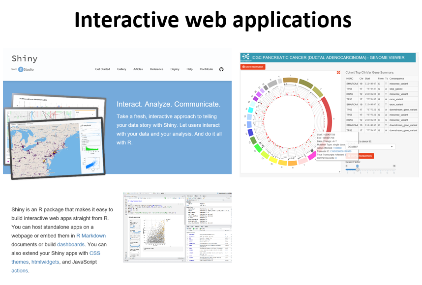
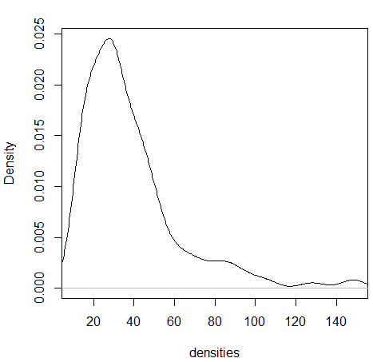
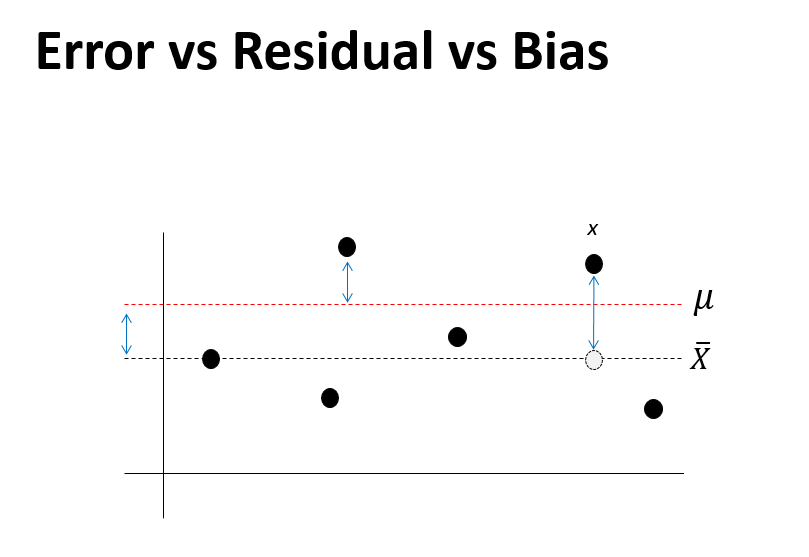

--- 
title: "R로 배우는 기초통계"
author: "한국생명공학연구원 김하성"
date: "`r Sys.Date()`"
site: bookdown::bookdown_site
mainfont: Nanum Myeongjo
documentclass: book
bibliography: [book.bib, packages.bib]
biblio-style: apalike
link-citations: yes
description: "UST lecture web site"
---


# Introduction 강의 개요 
- 매주 목요일 강의노트, 동영상 업데이트 
- 강사: 한국생명공학연구원 바이오합성연구센터 김하성
- 연락처: 042-860-4372, haseong [at] kribb.re.kr (생명연 연구동 1143)
- 강의조교: 박성군, tjdrns27 [at] kribb.re.kr
- 강의site: https://greendaygh.github.io/Rstat2020/ 

## Goal 강의 목표
- 이공계열 대학원생이 데이터 분석용 프로그래밍언어인 R을 기반으로 프로그래밍 기술과 함께 데이터를 분석하는 능력을 습득하고 이공계 연구에 필수인 통계적 사고의 기초를 배양함

## This course  
- 온라인 (강의자료, 동영상) 강의를 기본으로 함
- 기초 통계의 개념 설명과 R 실습 예시가 강의자료와 동영상 형식으로 제공됨
- 매 회 강의에는 해당 강의 내용과 관련된 과제가 주어지며 이메일을 통해 문제 풀이를 제출 받음
- 상황에 따라 강의 자료 및 동영상 업데이트 일정이 조정될 수 있음

## Tips
- 눈으로 이해하지 않고 스스로 실습 필수
- 각 명령줄이 어떻게/왜 작동하는지 이해하기
- 인터넷 검색을 통한 다른사람의 코드 이해/적용 필요 

## References books 참고 교제 
- Using R for Introductory Statistics by John Verzani
  - Free version of 1st Edition 
    - https://cran.r-project.org/doc/contrib/Verzani-SimpleR.pdf
  - Second edition
    - https://www.crcpress.com/Using-R-for-Introductory-Statistics-Second-Edition/Verzani/p/book/9781466590731
- R for Data Science (https://r4ds.had.co.nz, https://github.com/hadley)
- Bioinformatics Data Skills by Vince Buffalo (http://2.droppdf.com/files/5aTvl/bioinformatics-data-skills.pdf)
- First Course in Statistical Programming with R by Braun and
Murdoch (https://www.cambridge.org/core/books/first-course-in-statistical-programming-with-r/C9F088122AB40517B07FA77F2F0FDE2F)
- Introductory Statistics with R by Dalgaard (http://www.academia.dk/BiologiskAntropologi/Epidemiologi/PDF/Introductory_Statistics_with_R__2nd_ed.pdf)
- Modern Applied Statistics with S by Venables and Ripley (http://www.bagualu.net/wordpress/wp-content/uploads/2015/10/Modern_Applied_Statistics_With_S.pdf)
- 일반통계학 (영지문화사, 김우철 외)

## References 참고 자료
- https://resources.rstudio.com/
- http://shiny.rstudio.com/tutorial/
- R 홈페이지 https://www.r-project.org/
- Rstudio 홈페이지 https://www.rstudio.com/
- Packages for biologists https://www.bioconductor.org/
- R 기본 문서들 (소개, 사용, 설치, 운영) https://cran.r-project.org/manuals.html 
- R ebooks https://bookdown.org/
- Cheat Sheets https://www.rstudio.com/resources/cheatsheets/ 


## Evaluation 평가 세부 항목
- 과제 100%
- 성적부여기준: 최종 평균균 70점 이상 S, 70점 미만 U 부여
- 과제 채점: 각 과제당 총점 100점 만점 환산 점수 (답이 틀려도 코드가 있으면 가산점)
- 과제 제출일: 수업 자료 배포 후 1주일 오후 6시 (목요일 자료 배포 -> 다음주 목요일 오후 6시)
- 과제 솔루션 배포: 과제 제출일 마감 이 후 조교 배포

- 감점 기준
  - 솔루션 배포 이전 과제 제출: 감점 없음 
  - 솔루션 배포 이후 과제 제출: 40점 감점 
  - 과제 미제출: 100점 감점


## Schedule 강의 계획

- 1주차 - R basics / introduction of data
- 2주차 - Univariate data – Summary statistics
- 3주차 - Bivariate data – Correlation  / Independence  
- 4주차 - Multivariate data – R data structure
- 5주차 - Populations – Families of distributions
- 6주차 - Sampling – Distribution and CLT
- 7주차 - Statistical inference
- 8주차 - Confidence intervals 
- 9주차 - Significance test - parameteric
- 10주차 - Significance test – non parametric
- 11주차 - Goodness of fit - parametric
- 12주차 - Goodness of fit – non parametirc
- 13주차 - Linear regression – basics & simple LR 
- 14주차 - Multiple linear regression 
- 15주차 - Analysis of variance 
- 16주차 - Logistic / Non-linear regression  

## R Lecture Youtube Link  

### Lecture Chapter 1
* 1-1 https://youtu.be/8KNbdcUnko8
* 1-2 https://youtu.be/6YLWwv3fhEI
* 1-3 https://youtu.be/Rd8MfVNK3AQ
* 1-4 https://youtu.be/I3REftNvPxI


### Lecture 2
* 2-1 https://youtu.be/OzQZZKgJw1Q
* 2-2 https://youtu.be/svCRuAzo8Eg
* 2-3 https://youtu.be/3nk7nuVEYhw
* 2-4 https://youtu.be/XU5oODKWpUY
* 2-5 https://youtu.be/5RbWqIErLHA
* 2-6 https://youtu.be/rKn4NnaFx74

### Lecture 3
* 3-1 https://youtu.be/jsgN12MqGCc
* 3-2 https://youtu.be/RmnoquEPVPs
* 3-3 https://youtu.be/6fI2_680deE
* 3-4 https://youtu.be/hpplZyD-GKc
* 3-5 https://youtu.be/p1cnLDSatfM
* 3-6 https://youtu.be/0a8IseP7os8
* 3-7 https://youtu.be/G4ma21AqMis

### Lecture 4
* 4-1 https://youtu.be/BPPn4pRKOaE
* 4-2 https://youtu.be/Ptn5L1xuBJc
* 4-3 https://youtu.be/tukHveP3on0
* 4-4 https://youtu.be/6N8i9uQ-6F8
* 4-5 https://youtu.be/TbxHHHNWltE

### Lecture 5
* https://youtu.be/KhVJ1TtxPGA

### Lecture 6
* https://youtu.be/zEGrUncFg4I

### Lecture 7
* https://youtu.be/QIUM-diWzso
* https://youtu.be/bidwKqXReCE

<!--chapter:end:index.Rmd-->

# R basics  

## What is R / Rstudio 


R은 통계나 생물통계, 유전학을 연구하는 사람들 사이에서 널리 사용되는 오픈소스 프로그래밍 언어 입니다. Bell Lab에서 개발한 S 언어에서 유래했으며 엄청나게 많은 라이브러리 (다른 사람들이 만들어 놓은 코드)가 있어서 쉽게 가져다 사용할 수 있습니다. R은 복잡한 수식이나 통계 알고리즘을 간단히 구현하고 사용할 수 있으며 C, C++, Python 등 다른 언어들과의 병행 사용도 가능합니다. 2019년 top five language에 랭크 되었으며 이는 빅데이터 증가에 따라 인기가 높아진 것으로 볼 수 있습니다 (참고로 2018년에는 7위).

{width=450px}

Despite being a much more specialized language than the others, it’s maintained its popularity in recent years due to the world being awash in an ever-growing pile of big data.
https://spectrum.ieee.org/computing/software/the-top-programming-languages-2019


R은 통계분석에 널리 사용되는데 이는 데이터 가시화를 위한 그래픽 기능이나 벡터 연산 등의 편리함 때문에 점점 더 많은 사람들이 사용하고 있습니다. 기존에는 느린 속도나 부족한 확장성이 다른 언어들에 비해 단점으로 지적되었으나 R 언어의 계속적인 개발과 업데이트로 이러한 단점들이 빠르게 극복되고 있습니다. R 사용을 위해서는 R 언어의 코어 프로그램을 먼저 설치하고 그 다음 R 언어용 IDE인 RStudio 설치가 필요합니다.  

  

  

## R / Rstudio installation

### R 설치
- R 사이트에 접속 후 (https://www.r-project.org/) 좌측 메뉴 상단에 위치한 CRAN 클릭. 
- 미러 사이트 목록에서 Korea의 아무 사이트나 들어감
- Download R for Windows를 클릭 후 base 링크 들어가서 
- Download R x.x.x for Windows 링크 클릭으로 실행 프로그램 다운로드 - 로컬 컴퓨터에 Download 된 R-x.x.x-win.exe 를 실행
- 설치 가이드에 따라 R 언어 소프트웨어 설치 완료

 
### Rstudio 설치
Rstudio는 R 언어를 위한 오픈소스 기반 통합개발환경(IDE)으로 R 프로그래밍을 위한 편리한 기능들을 제공해 줍니다. 

- 사이트에 접속 (https://www.rstudio.com/), 상단의 Products > RStudio 클릭
- RStudio Desktop 선택
- Download RStudio Desktop 클릭
- RStudio Desktop Free 버전의 Download를 선택하고
- Download RStudio for Windows 클릭, 다운로드
- 로컬 컴퓨터에 다운로드된 RStudio-x.x.x.exe 실행
- 설치 가이드에 따라 설치 완료


## Rstudio interface
- 좌측 상단의 공간은 코드편집창, 좌측 하단은 콘솔창 이며 각 위치를 기호에 따라서 바꿀 수 있습니다. 


## Keyboard shortcuts

- 참고사이트 
  - https://support.rstudio.com/hc/en-us/articles/200711853-Keyboard-Shortcuts
  - Tools --> Keyboard shortcut Quick Reference (```Alt + Shift + K```)
- 코드편집창 이동 (```Ctrl+1```) 콘솔창 이동(```Ctrl+2```)
- 한 줄 실행 (```Ctrl+Enter```)
- 주석처리 (```Ctrl + Shift + C```) 
  - 또는 ```#```으로 시작하는 라인 

- 실습
  - 코드편집창에서 다음 입력 
  -   
  - 단축키 ```Ctrl + enter```로 코드 실행 
  - 단축키 ```Ctrl + 2```로 커서 콘솔창으로 이동
  - ```x```값 ```x+y```값 확인 
  - 단축키 ```Ctrl + 1```로 코드편집창 이동 
  - 단축키 ```Ctrl + Shift + C``` 사용

```{r, eval=F}
# x <- 10
# y <- 20

```


## R programming basics and terminology

- Console: 명령어 입력하는 창 
- Code: R 프로그래밍 변수/제어문 모음   
- Objects (개체, variable): 값이 (데이터) 저장되는 장소
- Data types: Integers, doubles/numerics, logicals, and characters.
- Object (Variable) types:
  - Vectors: 값들의 모임 combine function c() EX: c(6, 11, 13, 31, 90, 92)
  - Factors: 범주형 데이터 저장 장소
  - Data frames: 2D matrix 형태 데이터 저장 장소 
- Conditionals (조건, 제어):
  - if: ==, & (AND), | (OR) Ex: (2 + 1 == 3) & (2 + 1 == 4) 
  - for, while: 반복 수
- Functions (함수, commands): 특정 일 수행, 함수이름 - 입력값 (arguments) - 출력값 (output) 으로 구성 

## Set a working directory  

- 시작 전 항상 작업 디렉토리 설정 
- 예를 들어 c:\ 아래 새로운 디렉토리 rstat01 을 만들고 작업공간으로 설정  

```{r, eval=FALSE}
getwd()
dir()
setwd("C:\\rstat01")
getwd()
dir()
```

- RStudio > Session > Set Working Directory > Choose Directory


## R coding practice 

- 콘솔 계산기 
```{r, eval=FALSE}
2 + 2
((2 – 1)^2 + (1 – 3)^2 )^(1/2)
2 + 2; 2 - 2
```
- 이전 명령: 콘솔에서 위 아래 화살표  


## Variables and values 

- 프로그래밍 언에어서 변수, 값 개념 
- Assignment operator ( `<-` OR `=` )
  - Valid object name `<-` value 
  - 단축키: `Alt + -` (the minus sign)

```{r, eval=FALSE}
x <- 2
y <- x^2 – 2*x + 1
y
x <- "two"  
some_data <- 9.8
```

- 내장 변수 Built-in variables

```{r, eval=FALSE}
pi
```

- 변수이름 작명법 
  - 문자, 숫자, “_”,  “.” 등으로 구성
  - 대소문자 구분
  - 가독성, 의미있는 변수 이름 
  - 길이 제한 없음

```{r, eval=F}
i_use_snake_case <- 1
otherPeopleUseCamelCase <- 2
some.people.use.periods <- 3
And_aFew.People_RENOUNCEconvention <- 4
```

- 자동 완성 기능 (Tab completion) in RStudio
```{r, eval=F}
boxplot()
```


## Variable type of (storage) mode


## Variable - Vectors 

- Combine function `c()`: Concatenating elements end to end

```{r, eval=FALSE}
x <- c(10.4, 5.6, 3.1, 6.4, 21.7) 
y <- c("X1", "Y2",  "X3",  "Y4")
```

- 인덱싱: Subsets of the elements of a vector 

```{r, eval=F}
x[1]
x[1:3]
x[c(1,2,4)]
y[3]
```


## Functions

- Function 정의

```{r, eval=FALSE}
my_sine <- function(x){
	y <- sin(x)
	return(y)
}
```

- 사용법 

```{r, eval=F}
my_sine(pi)
```

- 용어 
  - function name: `my_sine`
  - parameter: `x`
  - argument: `pi`
  - return value: `y`

```{r, eval=F}
log(100)
?log
log(100, base=10)
log(100, 10)
```


- R code 스니핏 

```{r, eval=FALSE}
fun
```

- 내장 함수 (Built-in functions)
  - Tab completion

```{r, eval=F}
x <- pi
sin(x)
sqrt(x)
log(x)
log(x, 10)
x <- c(10, 20, 30)
x + x
mean(x)
sum(x)/length(x)
```


## Vectorized functions

```{r, eval=F}
x <- c(10, 20, 30)
x + x
sqrt(x)
sin(x)
log(x)
x-mean(x)
```


## Help

- R의 장점 중 하나 (예제 포함)

```{r, eval=F}
?
?mean
help("mean")
example("mean")
help.search("mean")
help(package="MASS")
```


## R packages

- R 패키지는 함수들의 모음으로 다른 사람들이 만들어 놓은 함수를 가져와서 사용할 수 있음
 + 예) sum() 은 “base” package에 있고 sd() 함수는 “stats” package에서 제공
- 패키지를 구할 수 있는 가장 대표적인 사이트 
 + The Comprehensive R Archive Network (CRAN) - http://cran.r-project.org/web/views/
 + Bioconductor - http://www.bioconductor.org/packages/release/bioc/
 


- UsingR package installation


```{r, eval=F}
install.packages("UsingR")
```


- UsingR package loading

```{r, eval=F}
library(UsingR)
help(package="UsingR")
```

- R 설치 디렉토리
- R 패키지 설치 디렉토리

```{r, eval=F}
.libPaths()
path.package()
```


## Data sets

- 일반적으로 패키지 안에 관련된 데이터도 같이 저장
- data() function를 이용해서 패키지 데이터를 사용자 작업공간에 복사해서 사용 가능

```{r, eval=F}
head(rivers)
length(rivers)
class(rivers)
data(rivers)
data(package="UsingR")
library(HistData)
head(Cavendish)
str(Cavendish)
head(Cavendish$density2)
```


## Cheatsheet

https://rstudio.com/resources/cheatsheets/


## Problems

과제는 새로운 R 파일을 생성 후 코드를 작성하고 `영문이름-학번-날짜.R` 이름으로 저장하여 조교에게 이메일로 제출 

- 1.1 다음 공식들을 계산하는 R 코드를 작성하시오 

$$
\sqrt{(4+3)(2+1)} \\
2^3 + 3^2 \\
\frac{0.25 - 0.2}{\sqrt{0.2 (1-0.2)/100}}
$$

- 1.2 변수 `x`에 1, 3, 5, 7, 9를 저장하는 코드를 작성하시오 

- 1.3 변수 `y`에 2, 4, 6, 8, 10을 저장하는 코드를 작성하시오

- 1.4 위 변수 `x`와 `y`를 더한 값을 `z`에 저장하는 코드를 작성하시오 (백터연산) 

- 1.5 `z`의 원소들의 합을 구하시오 (`sum()`함수 활용)

- 1.6 두 값을 입력받아 합을 출력하는 `mysum` 이름의 함수를 만들고 이 함수를 다음과 같이 이용해서 15와 20 두 값의 합을 구하는 코드를 작성하시오 (참고로 직접 만든 함수를 사용하기 위해서는 사용하기 전 해당 함수를 workspace에 등록하는 과정이 필요함)

```{r, eval=F}
z = mysum(15, 20)
cat(z)
```


<a rel="license" href="http://creativecommons.org/licenses/by-nc-nd/4.0/"></a><br />이 저작물은 <a rel="license" href="http://creativecommons.org/licenses/by-nc-nd/4.0/">크리에이티브 커먼즈 저작자표시-비영리-변경금지 4.0 국제 라이선스</a>에 따라 이용할 수 있습니다.


<!--chapter:end:01-intro.Rmd-->


# Univariat data

## Introduction 2
- Statistics: 데이터 분석을 통한 예측. 즉, 데이터를 수집, 정리하여 이로부터 미지의 사실에 대한 신빙성 있는 추론을 수행하는 과정


- Data - 사실을 나타내는 수치 
- 맥도너 정보경제학 (1963)
  + 지혜 (wisdom) : 패턴화된 지식
  + 지식 (knowledge) : 가치있는 정보
  + 정보 (information) : 의미있는 데이터
  + 데이터 (data) : 단순한 사실의 나열

- Univariate (단변량): Single variable 


$$ x_1, x_2, ..., x_n $$
```{r, eval=F}
library(UsingR)
exec.pay
?exec.pay
```


- 데이터의 속성에 따른 구분 
- 범주형 - 질적 데이터, 숫자로 나타낼 수 있으나 의미 없음
  + 명목형 (Nominal) - 사람 이름
  + 순서형 (Ordinal) – 달리기 도착 순서
- 수치형 - 숫자로 나타내며 데이터 속성을 그대로 지님님
  + 구간형 (Interval) – 선수1, 선수2 종점통과 시간
  + 비율형 (Ratio) – 출발시간 기준 종점 통과 시간


- Data type in R
  + Numeric data types (수치형)
    + Discrete (이산형) data - 카운트, 횟수 
    + Continuous (연속형) data - 키, 몸무게, Cannot be shared
  + Factors data - Categories to group the data (범주형)
  + Character data - Identifiers (범주형)
  + Date and time (수치형)

## Data vectors

- Using combine function 

```{r, eval=F}
#The number of whale beachings in Texas during the 1990s
whale <- c(74, 122, 235, 111, 292, 111, 211, 133, 156, 79)
#Object `whale` is a data vector == (univariate) data set

# The size 
length(whale)
sum(whale)
sum(whale)/length(whale)
mean(whale)
```


- Vectorization

```{r, eval=F}
whale - mean(whale)
whale^2 - mean(whale)
sqrt(whale)
```


- Adding values to a vector variable

```{r, eval=F}
x <- 1
x <- c(x, 2)
x
x <- c(x, 3, 3, 3, 4)
x
```


- Missing/NULL values
  + NA: Not available, The value is missing 
  + NULL: a reserved value
  + NaN: Not a number (0/0)
  + Inf: (1/0)

```{r, eval=F}
hip_cost <- c(10500, 45000, 74100, NA, 83500)
sum(hip_cost)
sum(hip_cost, na.rm=TRUE)
?sum
```

- Attributes: names in data vectors

```{r, eval=F}
head(precip)
class(precip)
length(precip)
names(precip)
order(names(precip))

test_scores <- c(100, 90, 80)
names(test_scores) <- c("Alice", "Bob", "Shirley")
```

- Indexing 

```{r, eval=F}
head(precip)
precip[1]
precip[2:10]
precip[c(1,3,5)]
precip[-1]
precip["Seattle Tacoma"]
precip[c("Seattle Tacoma", "Portland")]
precip[2] <- 10
```


- Functions for generating structured data

```{r, eval=F}
1:5
seq(1,5, by=1)
seq(0, 100, by=10)
seq(0, 100, length.out=11)
?seq
rep(5, times10)
rep(1:3, times=4)
```


## Data type 
 - Numeric data
```{r, eval=F}
class(1)
class(pi)
class(seq(1,5,by=1))
```
 
 - Character data
```{r, eval=F}
ch <- c("Lincoln", "said", "and")
class(ch)
```
 - Combining strings - paste function
```{r, eval=F}
paste("X", 1:10)
paste("X", 1:10, sep="")
paste("The", "quick", "brown", "fox")
paste(c("The", "quick", "brown", "fox"))
paste(c("The", "quick", "brown", "fox"), collapse=" ")
x <- 1:10
paste(x)
paste(x, collapse=":")
```

 - Factors 
```{r, eval=F}
x <- c("Red", "Blue", "Yellow", "Green", "Blue", "Green")
y <- factor(x)
y
```
 
- Adding a level 
```{r, eval=F}
levels(y)
y[1] <- "Gold"
y
```
```{r, eval=F}
levels(y) <- c(levels(y), "Gold")
levels(y)
y
y[1] <- "Gold"
y
```

 - Logical data
   + TRUE and FALSE
   + "is" functions
   + Comparison by `<`, `<=`, `==`, `!=`, `>=`, `>`
   + Combination by `!`, `&`, `|`

```{r, eval=F}
is.na(1)
is.numeric(1)
is.logical(TRUE)

pi < 3
precip < 30
which(precip < 30)
any(precip < 30)
all(precip < 30)
any(39 == precip)
which(39 == precip)
sum(precip < 30)
sum(c(TRUE, TRUE))

x <- 1:100
x < 10
x > 90
x < 10 | x >90
which(x < 10 | x >90)
i <- which(x < 10 | x >90)
x[i]
x[x < 10 | x >90]
```


- Date and time
  + Unixtime, POSIX time
  + 1970년 1월 1일 00:00:00 협정 세계시(UTC) 부터의 경과 시간을 초로 환산 
  + 32비트로 표현된 유닉스 시간은 1970년 1월 1일 00:00 (UTC)에서 2,147,483,647 (231 - 1) 지난 후인 2038년 1월 19일 03:14:08 UTC에 2038년 문제를 발생시킨다. 이는 산술 오버플로와 관련 있는 문제이다. –wiki- 


```{r, eval=F}
library(lubridate)
current_time <- now() # record since 1970
as.numeric(current_time)
as.numeric(now())
month(current_time)
```


## Functions 2

- Define a function

```{r, eval=F}

my_mean <- function(x){
	total <- sum(x)
	n <- length(x)
	return(total/n)
}

```

- Write a function named `get_dist` and use it for the `rivers` data

```{r, eval=F}

get_dist <- function(x){
	return()
}

```

## Miscellaneous 1

랜덤 문자열 만들기 

```{r, eval=F}
LETTERS
x <- sample(LETTERS, 10)
x_paste <- paste(x, collapse="")

random_string_generator <- function(n){
  x <- sample(LETTERS, n)
  x_paste <- paste(x, collapse="")
  return(x_paste)
}

random_string_generator(20)
random_strings <- replicate(10, random_string_generator(5))


```


특정 문자로 시작하는 데이터 뽑기

```{r, eval=F}

i <- grep("^D", random_strings)
random_strings[i]

i <- grep("D$", random_strings)
random_strings[i]
```


## Numeric summaries
<center>


<br>
<br>

</center>

- 대푯값 (요약값)
- Center – commonly known as “average” or “mean” but not the only one. 
  + median, mode, etc
  
- Spread – Variability of a data set. 
  + No variability – mean is everything 
  + Large variability – mean informs much less
  + confidence of interpretation from knowing center
  + Distance from center
  
- Shape – Degree of interpretation from knowing center and spread. 
  + eg. bell shape – two sides are equally likely, large values are rather unlikely and values tend to cluster near the center.


## Center for a univariat variable

<center>

</center>

### Sample mean
$$ \bar{x} = \frac{1}{n} (x_1 + x_2 + ... + x_n) = \frac{1}{n}\sum_i{x_i} $$ 

```{r, eval=F}
head(kid.weights)
str(kid.weights)
wts <- kid.weights$weight
length(wts)
plot(wts)
mean(wts)
devs <- wts – mean(wts) # deviation, centering
plot(wts)
mean(wts)
```
- Trimmed mean

```{r, eval=F}
mean(wts)
wts[wts<120]
mean(wts[wts<=120])
mean(wts, trim=0.8)
```

### Measure of Position

- _p_th Quantile - 특정 값으로 이 값보다 작은 데이터의 비율이 100∙p 퍼센트, 큰 데이터의 비율은 100∙(1- p) 퍼센트 
- Median - Splits the data in half _p_=0.5
- Percentiles - The same as quantile but its scale is 0 to 100

```{r, eval=F}
x <- 0:5
length(x)
quantile(x, 0.25)
median(x)
quantile(x, seq(0, 1, by=0.2))
quantile(x)
```

- Robustness 

```{r, eval=F}
mean(wts)
median(wts)
plot(wts)
abline(h=mean(wts), col="red")
abline(h=median(wts), col="blue")
wts2 <- wts[wts<120]
abline(h=mean(wts2), col="red", lty=2)
abline(h=median(wts2), col="blue", lty=2)
```

- Boxplot

```{r, eval=F}
x <- 0:5
quantile(x)
boxplot(x)
text(x=1.3, y=quantile(x, 0.25), labels = "1사분위수")
text(x=1.3, y=quantile(x, 0.5), labels = "2사분위수")
text(x=1.3, y=quantile(x, 0.75), labels = "3사분위수")
```


## Spread for a univariat variable

<center>

</center>

- Range - the distance between the smallest and largest values 
- Sample variance 
  + Distance - $$ d_i = x_i - \bar{x} $$

\begin{equation}
 s^2 = \frac{1}{n-1}\sum_i(x_i - \bar{x})^2
\end{equation}

- Sample standard deviation
  + 측정값들이 평균에서 떨어진 정도 
\begin{equation}
 \sqrt{s^2} = \sqrt{ \frac{1}{n-1}\sum_i(x_i - \bar{x})^2 }
\end{equation}

  
```{r, eval=F}
wts <- kid.weights$weight
var(wts)
sd(wts)

plot(wts)
boxplot(wts)
hist(wts)
hist(wts, breaks = 50)
hist(wts, 50)
abline(v=mean(wts), col="red")
```

- z-score 
  + How big (small) is the value relative to the others
  + $z=3$ 이 값은 평균에 비해 3 표준편차만큼 크다 

\begin{equation}
 z_i = \frac{x_i - \bar{x}}{s}
\end{equation}


- Example - z score
wts의 z 값을 구하는 함수를 만들고 histogram을 그리시오 

```{r, eval=F}
wts <- kid.weights$weight
```


- Interquartile range (IQR) 
  + Middle 50% of the data
  + Difference between Q3 and Q1

<center>

</center>


## Problems 02

1) `seq` 또는 `rep` 함수를 사용해서 다음 서열들을 만들고 `x` 변수에 저장하시오 

1-1) "a", "a", "a", "a", "a" 

1-2) 1, 3, 5, 7, ..., 99

1-3) 1, 1, 1, 2, 2, 2, 3, 3, 3

1-4) 1, 2, 3, 4, 5, 4, 3, 2, 1

<br>
<br>

2) Recording values  

다음은 신생아들의 키를 나타내는 data set 이다. 오류 값을 찾아내고 이들 값을 `NA`로 바꾼 후 평균 값을 구하시오 (`babies` 데이터셋은 `UsingR` 패키지에 있으며 오류값은 999 입니다)
```{r, eval=F}
x <- babies$dwt
x
```


<br>
<br>

3) `precip` 데이터는 미국 도시들의 연간 평균 강수량을 저장한 데이터이다. `precip`에서 "J"로 시작하는 도시이름을 찾고 해당 도시들의 평균 강수량을 구하시오 

<br>
<br>

4) 위 강수량 데이터 `precip`에서 연평균 강수량이 50 이상인 도시를 뽑고 해당 도시들의 강수량에 따라서 순서대로 나열하시오 

<br>
<br>

5) 특정 숫자가 짝수인지를 검사하는 방법은 해당 숫자를 2로 나누어 나머지가 0인지 확인하는 방법이다. `2 %% 2 == 0` 위와 같은 코드로 이를 구현할 수 있다. 다음 변수의 값들 중 짝수의 개수를 구하는 코드를 작성하시오 (1줄 코드임). 

```{r, eval=F}
x <- c(12, 3, 4, 2, 28, 11, 8, 9, 51, 89)
```

<br>
<br>

6) `bumpers` 데이터셋은 (`UsingR` 패키지) 자동차 범퍼를 교환하는데 필요한 비용을 나타낸다. 평균과 중간값, 표준편차를 구하고 교체 비용이 가장 비싼 차와 가장 싼 차가 어떤 차들인지 찾으시오. 


7) 다음 `wts` 변수 값들의 center를 나타내는 평균, 중간값과 spread를 나타내는 분산, 표준편차, IQR 을 구하시오 

```{r, eval=F}
wts <- kid.weights$weight
```


## Shape for a univariat variable

<center>

</center>
 
- Symmetry and skew

\begin{equation}
 \text{sample skewness} = \sqrt{n} \frac{\sum{(x_i - \bar{x})^2}}{(\sum{(x_i - \bar{x})^2)^{3/2}}} = \frac{1}{n}\sum{z_i^3}
\end{equation}


```{r, eval=F}
myskew <- function(x){
  n <- length(x)
  z <- (x-mean(x))/sd(x)
  return(sum(z^3)/n)
}

wts <- kid.weights$weight
hist(wts, 50)
myskew(wts)

z <- rnorm(length(wts))
hist(z, br=50)
myskew(z)
```

- Sample excess kurtosis 
  + Measure of tails
  
\begin{equation}
  \text{sample excess kurtosis} = n \frac{\sum{(x_i - \bar{x})^4}}{(\sum{(x_i - \bar{x})^2)^2}} -3 = \frac{1}{n}\sum{z_i^4} - 3
\end{equation}

```{r, eval=F}
mykurtosis <- function(x){
  n <- length(x)
  z <- (x-mean(x))/sd(x)
  return(sum(z^4)/n - 3)
}

wts <- kid.weights$weight
hist(wts, 50)
mykurtosis(wts)

z <- rnorm(length(wts))
hist(z, br=50)
mykurtosis(z)
```

## Viewing the shape

### Histogram 

도수분포표를 나타낸 그림으로 데이터를 특정 범위의 그룹으로 짝짓고 해당 범위와 그룹의 크기에 해당하는 막대를 그린 그래프입니다. 

```{r, eval=F}
x <- faithful$waiting
hist(x)
hist(x, breaks = 1000)
hist(x, breaks = 20, freq=FALSE)
hist(x, breaks = 20, freq=FALSE, main="Histogram")
hist(x, breaks = 20, freq=FALSE, main="Histogram", xlim=c(0, 100))
hist(x, breaks = 20, freq=FALSE, main="Histogram", xlim=c(0, 100), ylim=c(0, 0.1))
```

히스토그램은 center (mean, median), spread (Variance, IQR), shape (tail)을 모두 볼 수 있는 그래프입니다. 그리는 방법은 전체 범위의 데이터가 포함되도록 범위를 정하고 동일 같격으로 구분되는 계급의 개수를 정한 후 해당 계급에 속하는 데이터의 개수를 세어 도수를 구합니다. 다음은 도수 분포표를 만드는 코드 입니다.

```{r, eval=F}
x <- faithful$waiting
bins <- seq(40, 100, by=5)
out <- cut(x, breaks=bins)
table(out)
plot(table(out))
```


### Density plots 

히스토그램을 갖는 하나의 단변량 변수가 있을 때 특정 값이 선택될 확률은 히스토그램의 해당 계급의 도수값을 전체로 나눈 값이라고 할 수 있습니다. 그런나 연속적인 구간이나 시간의 경우에는 히스토그램보다는 density plot이 요약값을 보기에 더 적합합니다. 


```{r, eval=F}
wts <- kid.weights$weight
xrange <- range(wts)
den <- density(wts)
plot(den, xlim=xrange, xlab="densities", main="")
```



### Boxplots 
상자그림 또는 상자 수염 그림으로 불리는 boxplot은 다섯개의 주요 요약값을 (min, max, Q1, Q3, and median) 보여주며 대규모 데이터를 한 눈에 비교할 수 있는 좋은 방법 입니다. 

```{r, eval=F}
boxplot(kid.weights)
boxplot(kid.weights$weight)

#install.packages("vioplot")
library(vioplot)
vioplot(kid.weights)
vioplot(kid.weights, col=c("#3CAEA3", "#F6D55C", "#ED553B"), rectCol=c("gray"), main="Kids")
?vioplot

#console
par(mfrow=c(1,2))
plot(density(kid.weights$weight))
vioplot(kid.weights$weight)

```


## Quantile graph

quantile plot은 일반적으로 두 개의 변수의 분포를 비교하는데 사용됩니다. 본 단원의 단일 변수의 경우 해당 변수의 분포가 정규분포인지를 검사하는데 사용될 수 있습니다.  
```{r, eval=F}
x <- rep(Macdonell$finger, Macdonell$frequency)
qqnorm(x)
hist(x, br=50)

hist(Galton$child, br=50)
x <- jitter(Galton$child, factor=5)
hist(x, br=50)
qqnorm(x)

y <- rnorm(10000, mean(x), sd(x))
hist(y, br=50)
qqnorm(y)

## overlay
plot(density(x))
lines(density(y), col="red")
```


## Categorical data

단일 변수에서 범주형 데이터는 테이블 형태로 요약값 정보를 볼 수 있습니다. 

```{r, eval=F}

x <- babies$smoke
x <- factor(x, labels=c("never", "now", "until current", "once, quit", "unknown"))
table(x)
out <- table(x)
prop <- 100*out/sum(out)
round(prop, digits=2)
barplot(out)
barplot(prop)
dotplot(out)
dotplot(prop)
pie(out)

```


<!--chapter:end:02-univar.Rmd-->


# Bivariate data

## Introduction 3

본 단원에서는 두 변수를 동시에 고려할 경우 각 변수가 가지고 있는 데이터를 비교하여 변수간의 유사성이나 관계 (상관, 독립)에 대한 설명하는 방법을 소개하며 짝데이터 (Paired data)나 범주형 데이터의 경우에 두 변수의 관계를 어떻게 설명하는지 알아봅니다. 또한 그래프를 이용하여 두 변수의 관계를 가시화 하는 방법에 대해 알아보겠습니다.  


### Independence samples


위 그림은 두 변수간 (x, y축) 관계를 산점도와 marginal histogram을 이용하여 비교한 그림 입니다. Marginal histogram은 두 그래프가 비슷한 모양을 하고 있지만 왼쪽 그림은 두 변수간 강한 양의 상관관계를 보여주고 있으며 오른쪽은 두 변수가 아무런 관계도 아닌 독립임을 보여줍니다.


두 변수간의 관계를 설명할 때 가장 일반적인 경우의 데이터 형태는 코흐트 데이터 입니다. 처리군과 대조군으로 이루어진 데이터를 말하며 플라시보 (Placebo effect) 효과를 방지하기 위해서 실제 효과는 없지만 대조군에 처리한 조건과 동일한 조건의 처리를 수행합니다. 

```{r, eval=F}
beets <- c(41, 40, 41, 42, 44, 35, 41, 36, 47, 45)
no_beets <- c(51, 51, 50, 42, 40, 31, 43, 45)
```

위 데이터는 비트의 효과를 검증하기 위해  각 실험자의 달리는 시간을 측정하고 비교한 데이터 입니다. 이 데이터를 보고 알 수 있는 사실은 무엇이 있을지 앞서 단원에서 배웠던 대푯값을 고려해서 생각해 봅니다. 

- 가장 오래 달린 세 명이 no beet 그룹에 있음
- 가장 적게 달린 한 사람이 beet 그룹에 있음
- center, spread 또는 shape가 유사한가? 


### plot

두 변수에 대한 관계를 가장 먼저 그리고 가장 직관적으로 설명하는 방법은 그래프 입니다. 줄기잎 차트나 `dot-plot` 등은 많이 쓰이지 않으나 `boxplot`과 산점도는 (`dot-plot`) 데이터 분석을 수행하기 전에 변수들간의 관계를 대략적으로 가늠해 볼 수 있기 때문에 많이 사용되고 있습니다. 


```{r, eval=F}
dotchart(c(beets, no_beets))
dotchart(c(beets, no_beets), groups=factor(c(rep("beets", length(beets)), rep("no_beets", length(no_beets)))))
```

`boxplot`에서는 앞에서 배운바와 같이 다섯 가지 요약값을 볼 수 있습니다. 1사분위수, 2사분위수(중간값), 3사분위수, 그리고 최대, 최소값입니다. 여기서 최대 최소는 3사분위수 또는 1사분위수에서 IQR 1.5배에 해당하는 하위 또는 상위 값으로 그 범위를 벗어나는 값들은 outlier로 취급합니다. 


```{r, eval=F}
boxplot(beets, no_beets)
boxplot(beets, no_beets, names=c("beets", "no_beets"))
```


`Density plot`은 histogram과 비슷하게 데이터의 center, spread, 그리고 shape를 모두 보여주는 높은 활용도 때문에 많이 사용되는 그래프 입니다. 지난 시간 `R`의 `density` 함수를 활용하여 그리는 방법을 간단히 알아본 바와 같이 density 함수는 밀도함수를 추정하고 주어진 범위의 x값과 그에 대한 y값을 반환해주며 plot 함수를 이용하여 x와 y위치에 점이나 선을 그려주어 그래프를 완성합니다. 


```{r, eval=F}
library(UsingR)
head(michelson)
?michelson
str(michelson)
speed <- michelson$Speed 
expt <- michelson$Expt
fourth <- speed[expt == 4]
fifth <- speed[expt == 5]
d4 <- density(fourth)
d5 <- density(fifth)
xrange <- range(c(d4$x, d5$x))
yrange <- range(c(d4$y, d5$y))
plot(d4, xlim=xrange, ylim=yrange, main="")
lines(d5, lty=2)
legend(650, 0.008, legend=c("Fourth", "Fifth"), lty=c(1,2))
```

```{r, eval=F}
plot(fourth, fifth)
```


두 변수가 갖는 데이터의 Quantile 값을 비교하는 그래프로 R의 `qqplot` 함수를 사용합니다

```{r, eval=F}
qqplot(fourth, fifth)
ps <- seq(0.05, 0.95, by=0.05)
x <- quantile(fourth, ps)
y <- quantile(fifth, ps)
plot(x, y)

o <- order(fourth)
fourth[o]
fourth
```


## Data manipulation

### List

R언어에서 두 변수를 담을 수 있는 데이터 타입은 `list`와 `data frame` 두 종류가 있습니다. `list` 변수 타입은 `vector` 형태의 여러개의 element를 가질 수 있으며 각 element의 데이터는 문자나 숫자 어떤 데이터 타입도 가능하며 각 element vector의 길이가 모두 달라도 됩니다. list의 인덱싱에서 `[` `]`는 리스트를 반환하고 `[[` `]]`는 vector element들을 반환합니다. 


```{r, eval=F}
b <- list(beets = beets, "no beets"=no_beets)
b$beets
b[1]
b[[1]]
class(b[1])
class(b[[1]])
boxplot(b)
```


### Data frame 

`data.frame` 타입 변수는 list와 같은 기능의 타입으로 볼 수 있지만 모든 element 들이 같은 길이를 갖는다는 것이 다릅니다. 따라서 2차원 메트릭스 형태로 표현될 수 있으며 matrix와 같이 `[가로, 세로]` 방식으로 인덱싱 할 수 있습니다. 각 row는 샘플을 나타내고 column은 하나의 변수를 타나냅니다. R 기반의 데이터 분석에서는 가장 선호되는 데이터 타입이라고 볼 수 있습니다. 


```{r, eval=F}
id <- 1:10
name <- paste("Name", id, sep="")
grade <- LETTERS[sample(1:5, size=length(id), replace=T)]
student <- data.frame(id, name, grade)
student
str(student)

student$id
student[,1]
class(student$name)

class(student)
class(student[,1])
class(student$id)
student <- data.frame(id, name, grade, stringsAsFactors = F)
str(student)
?data.frame
```


### Model formulas

R에서는 두 변수의 관계를 수학적으로 표현하기 위한 방법을 제공하며 다양한 모형에서 공통적으로 사용될 수 있습니다. 


$$ response(s) \sim predictor(s) $$


```{r, eval=F}
beets
no_beets
runtime <- c(beets, no_beets)
nitrate <- c(rep("beets", length(beets)), rep("nobeets", length(no_beets)))
food.sports <- data.frame(runtime, nitrate)
boxplot(runtime~nitrate, data=food.sports)

head(michelson)
boxplot(michelson$Speed ~ michelson$Expt)
boxplot(Speed ~ Expt, data=michelson)
```

R에서 `plot`함수는 `Generic function`으로서 입력 파라메터가 갖는 데이터 타입에 따라서 다른 기능을 수행할 수 있습니다. 예를 들어 `formula type`으로 $x \sim  f$ 가 들어갈 경우 그룹별로 boxplot을 나란히 그려주며 따라서 그룹별로 데이터가 얼마나 다른지 한 눈에 비교할 수 있습니다. 


```{r, eval=F}
plot(Speed ~ Expt, data=michelson)
out <- summary(Speed ~ Expt, data=michelson)
plot(out)
plot(michelson$Speed)
plot(michelson$Speed, main="Speed", ylab="Speed", bty="l", pch="*", cex=2, col="red")
?pch
```
  


`stack` 함수는 관측 값을 하나의 벡터로 만들고 각 벡터의 라벨을 또 하나의 벡터로 만들어서 합해주는 기능을 수행합니다. 이는 다음에 배울 `reshape2` 패키지의 `melt` 와 비슷한 기능을 하고 있습니다. 

```{r, eval=F}
b <- list("beets" = beets, "no beets" = no_beets)
stacked <- stack(b)
plot(values ~ ind, data=stacked)
```


`split` 함수의 경우 data를 정의된 그룹으로 나누고 list 타입으로 반환해줍니다. 그룹은 `factor` 형으로 정의된 변수에 저장되어 있어야 합니다. 


```{r, eval=F}
?split
speeds <- split(michelson$Speed, michelson$Expt)
names(speeds) <- paste("Expt", 1:5, sep="")
speeds

speed <- michelson$Speed
expt <- michelson$Expt
speed
expt
speeds <- list(speed[expt==1], speed[expt==2], speed[expt==3], speed[expt==4], speed[expt==5])
names(speeds) <- paste("Expt", 1:5, sep="")
speeds

```

## Paired data 

paired data는 두 종류의 변수에 대한 데이터를 하나의 샘플로 부터 얻을 때의 데이터를 말합니다. 본 단원에서 두 변수의 데이터형은 연속형과 연속형, 또는 연속형과 범주형의 경우로 다음 단원에서 범주형과 범주형에 대한 경우의 두 변수간 관계를 설명하겠습니다. 


예를 들어 한 학생으로부터 얻어진 키와 몸무게 데이터가 paired data가 될 수 있습니다. paired data는 보통 다음과 같은 형태를 취하고 있습니다. 

$$ (x_1, y_1), (x_2, y_2), ..., (x_{252}, y_{252})  $$ 


걸리버 여행기라는 (1726) 소설이 나올 무렵의 사람들은 손목과 목, 허리 둘래가 항상 일정 비율로 비례하는 것을 알고 있었는데 이를 Lilliputians’ hypothesis라고 합니다. 이를 fat 데이터를 통해 알아 봅니다. 


`UsingR` 패키지의 `fat` 데이터는 252명의 남성으로부터 얻어진 다른 신체 부위의 측정 값을 제공하고 있으며 fat index를 예측하기 위한 목적으로 사용될 수 있습니다. 본 강의에서는 neck과 wrist 두 변수간의 관계를 설명하기 위한 데이터로 사용됩니다. 


```{r, eval=F}
library(UsingR)
class(fat)
head(fat)
names(fat)

neck_pair <- fat$neck
wrist_pair <- fat$wrist
mean(neck_pair/wrist_pair)
mean(neck_pair)/mean(wrist_pair)
plot(neck_pair, wrist_pair)

```


손목과 목 둘레를 측정한 데이터의 대표값 (평군)을 이용하여 두 변수 사이의 비율을 계산해 보면 2.084로 거의 두 배의 비율을 보입니다. 짝 데이터가 아닌 경우의 비율은 어떻게 될지 계산해 보면 아래와 같이 2.08로 비슷한 값이 구해집니다. 그러나 plot을 사용해서 산점도를 그려보면 nopair 데이터의 경우 두 변수의 상관성이 사라지는 것을 알 수 있습니다. 이것이 의미하는 바는 같은 사람에게서 얻은 짝데이터로만 손목과 목둘래가 비례한다는 정보를 알 수 있다는 것 입니다. 즉, 아무리 평균으로 2배의 차이가 있다고 할지라도 짝데이터 없이는 손목 둘래가 큰 사람이 목 둘래도 크다라고 말할 수 없다는 것 입니다.  


```{r, eval=F}
neck_nopair <-sample(fat$neck)
wrist_nopair <- sample(fat$wrist)
mean(neck_nopair)/mean(wrist_nopair)
mean(neck_nopair/wrist_nopair)
plot(neck_nopair, wrist_nopair)
```


### Pearson Correlation

`상관` 또는 `상관계수`는 두 변수의 선형적 관계를 정량적으로 나타내는 척도입니다. 상관계수의 값이 `0`일 경우 두 변수는 `독립 (independence)`이라고 할 수 있고 선형 관계에 대해서만 사용됩니다. 


```{r, eval=F}
x <- fat$wrist
y <- fat$neck
plot(x, y)
abline(v = mean(x), lty=2)
abline(h = mean(y), lty=2)
points(mean(x), mean(y), pch=16, cex=4, col="#00000055")
abline(lm(y~x))

```


공분산 (covariance)와 상관 (correlation)은 데이터의 중앙을 기준으로 4개의 구역에 각 데이터가 흩어진 정도를 정량화 한 것이며 다음과 같이 정의됩니다. 


$$ cov(x, y) = \frac{1}{n-1} \sum{(x_i-\bar{x})(y_i-\bar{y})} $$

$$ cor(x, y) = \frac{1}{n-1} \sum{(\frac{x_i-\bar{x}}{s_x})(\frac{y_i-\bar{y}}{s_y})} = cov(x,y)/(s_x s_y)$$

```{r, eval=F}
cor(fat$wrist, fat$neck)
cor(fat$wrist, fat$height)
cor(fat$age, fat$ankle)
```

### Spearman correlation coefficient

피어슨 상관계수는 선형적 관계에 대한 정량화만 가능한 반면 spearman 상관계수는 선형관계 뿐만 아니라 비선형 적인 관계에 대해서도 단조 증가나 감소에 대한 정보를 측정할 수 있는 measure 입니다. 이는 데이터의 값 자체를 사용하기 보다는 데이터를 rank 값으로 변환한 후 상관성을 비교하기 때문에 가능한 기능입니다. 


```{r, eval=F}
x <- Animals$body
y <- Animals$brain
cor(x, y)
plot(x, y)
Animals
cor(rank(x), rank(y))
cor(x, y, method="spearman") 
```

Animals 데이터에서 correlation 값이 낮은 이유는 공룡과 같이 뇌 무게에 비해 비정상적으로 큰 몸무게 값을 갖는 개체들 때문입니다. 


- Example: 공룡을 제외한 correlation을 구하시오 


일반적으로 분석의 신뢰성을 높이기 위해 실험 반복을 통해 데이터를 수집합니다. 그런데 가끔은 전체 반복 데이터를 모두 사용해서 상관계수를 구하는 값보다 각 반복 데이터의 평균에 대한 상관 계수를 구랗 때 더 높은 상관 관계를 확인할 수 있습니다. 

```{r, eval=F}

ToothGrowth

plot(ToothGrowth$dose, ToothGrowth$len)
cor(ToothGrowth$dose, ToothGrowth$len)
l <- split(ToothGrowth$len, ToothGrowth$dose)
group_means <- c(mean(l[[1]]), mean(l[[2]]), mean(l[[3]]))

points(c(0.5, 1, 2), group_means, col="red", pch=17, cex=2)
cor(c(0.5, 1, 2), group_means)

```


### Correlation, causation and association

상관성 분석 중 유의할 점 중 하나는 상관성이 인과 관계를 의미하지 않는 다는 점 입니다. Smoking vs. cancer (1950) 연구의 경우 폐암 발병의 원인으로 담배에 대한 입장이 Industry 입장에서의 견해와 health care researchers 입장에서 견해가 다를 수 있습니다. `Lurking variables` 또는 `compounding effect`라고 불리우는 효과는 원인과 결과가 되는 두 요소에 모두 상관성을 갖는 변수로서 당시 담배가 폐암에 원인인지 아닌지에 대한 논란을 일으켰습니다. 

```{r, eval=F}
cor(SAT$salary, SAT$total)
plot(salary~total, data=SAT, cex=2)
points(salary~total, SAT, subset = perc < 10,  col="red", pch=15, cex=2)
points(salary~total, SAT, subset = perc > 40, col="blue", pch=16, cex=2)
abline(lm(SAT$salary~SAT$total))
abline(lm(salary~total, SAT, subset = perc < 10),  col="red")
abline(lm(salary~total, SAT, subset = perc > 40),  col="blue")

```

Simpson’s paradox 현상은 전체 데이터의 상관성이 하위 그룹별로 고려한 상관성과 반대가 되는 경우를 말합니다. 


반응변수 y와 설명변수 x의 관계는 다음 그림과 같은 경우의 수를 생각할 수 있습니다. 


직접적 원인에 의한 결과를 설명하는 인과관계로 설명이 어렬울 경우 좀 더 넓은 범위의 연관성(Association) 으로 두 변수가 관련이 있음을 표현하는 것도 하나의 방법입니다. 다음 1996년 오스트레일리아의 총기 소유자들에게 총기를 다시 사들이는 정부 정책과 자살율에 관한 연구 예제에서는 Common response를 설명합니다.  

```{r, eval=F}

buyback <- c(ACT=1500, NSW=2500, WA=2700, Qld=3700, Vic=4250, SA=4200, NT=5000, Tas=7500)
change <- -c(0.2, 1, 0.9, 2.5, 1.0, 1.6, 2.5, 3.4)
m <- data.frame(buyback, change)
cor(buyback, change)

```


### Trends

앞서 상관계수는 두 (연속형) 변수간의 관계를 나타내는 척도라고 설명을 했습니다. 하나의 변수는 연속형이고 다른 변수가 범주형 변수일 경우에도 각 범주형 변수의 그룹이 값는 평균값을 비교하여 관계를 유추할 수 있습니다. 즉, 각 그룹의 평균값들을 선으로 연결하였을 때 그 기울기가 일정하면 그룹의 변화에 따른 반응값이 선형적으로 일정한 관계에 있다고 해석할 수 있습니다. 

```{r, eval=F}
ToothGrowth
str(ToothGrowth)
l <- split(ToothGrowth$len, ToothGrowth$dose)
group_means <- lapply(l, mean)
plot(len ~ dose, data=ToothGrowth, pch=16, col=rgb(0, 0, 0, 0.25), cex=1.2)
points(c(0.5, 1, 2), group_means, cex=2, pch=18, col="red")
lines(c(0.5, 1, 2), group_means, col="red")
```


선형적 트렌드는 다음과 같은 모형으로 나타낼 수 있습니다. 

$$ \mu_{y|x} = \beta_0 + \beta_1 x $$ 

여기서 $\mu_{y|x}$ 는 설명변수 $x$ 가 주어진 상태에서 반응변수의 평균으로 볼 수 있습니다. 각 데이터포인트의 경우 $$y_i = \beta_0 + \beta_1 x_i + e_i$$ 이며 $e_i$는 에러를 나타냅니다. $\beta$ 값들은 계산을 해야 알 수 있지만 0일 경우 $y$ 값은 항상 일정하고 에러의 평균은 0이 됨을 가정하고 있습니다.  


이제 $\beta$가 0인지 아닌지를 계산하면 두 변수가 연관이 있는지에 대한 판단을 할 수 있습니다. $\beta$를 구하기 전에 우선 `error`, `residual`, 그리고 `bias` 에 대한 념을 정확히 알아두는 것이 좋습니다. 


### The method of least squares

정의에 의해서 잔차는 다음과 같습니다. 즉 잔차는 관측값에서 추정된값과의 차이입니다. 

$$ \hat{y}_i = b_0 + b_1 x_i $$
$$ residual = y_i - \hat{y}_i $$

$\beta$ 값은 최소제곱추정법이라는 방법으로 구할 수 있는데 이 방법은 각 점에서의 잔차를 최소화 하는 선분을 (회귀선) 구하는 과정이며 $\beta$는 해당 선분의 기울기로 볼 수 있습니다. 즉, 추정에 의해서 구해진 회귀선은 `squared residual`을 최소화 하는 선분이라고 해석할 수 있습니다. 

$$ \arg\min_b\sum_i{(y_i - (b_0 + b_1 x_i))^2} $$


 


선분 $\hat{y} = \hat{\beta}_0 + \hat{\beta}_1 x$의 최소 제곱법에 의한 $\beta_0$와 $\beta_1$의 추정값 $\hat{\beta}_0$와 $\hat{\beta}_1$은 다음과 같이 정의 됩니다. 


$$ \hat{\beta}_1 = \frac{\sum(x_i - \bar{x})(y_i-\bar{y})}{\sum(x_i - \bar{x})^2} = cor(x,y)\frac{s_y}{s_x}$$

$$ \hat{\beta}_0 = \hat{y} - \hat{\beta}_1 x $$


위 두 식에서 회귀선분의 기울기인 $\hat{\beta}_1$은 상관계수에 $s_y / s_x$를 곱한 수로 1만큼 x 축으로 변할 때 변화하는 y 값의 평균 변화량으로 해석하면 되겠습니다. 또한 상관계수와는 달리 설명변수와 반응변수인 $x$와 $y$가 바뀔경우 값이 달라지며 여전히 잔차의 합은 0가 됩니다. R에서는 다음과 같이 `lm` 함수를 사용하며 이 함수에 대한 더 자세한 내용은 11장에서 다시 배우게 되겠습니다. 


```{r eval=F}
library(UsingR)
?lm
out <- lm(maxrate ~ age, data=heartrate)
out

## visualize fitted line
names(out)
summary(out)
plot(maxrate ~ age, data=heartrate)
abline(out)

## residuals
sum(resid(out))
sum(out$residuals)
res <- heartrate$maxrate - out$fitted.values
sum(res)

## fitted values
age <- c(30, 40)
out$coefficients[1] + out$coefficients[2]*age
predict(out, data.frame(age))
head(heartrate)
predict(out, data.frame(age=30))
```

선형 추세선 외에 smoother를 이용한 곡선 추세선을 그릴 수 있습니다. 회귀 선분의 경우 전체 데이터에 대해서 $b$를 구한 후 추세선을 그리나 전체 데이터가 아닌 일부 데이터에 대해서 회귀 선분을 그리고 그 선분들을 연결하면 곡선 형태의 추세선을 그릴 수 있습니다. `loess` 함수를 이용하면 local polynomial regression을 수행 할 수 있습니다. 

```{r, eval=FALSE}
f <- child ~ parent
plot(f, data=Galton, col=rgb(0,0,0, alpha=0.25))
res.lm <- lm(f, data=Galton)
abline(res.lm, lty=1, lwd=2)

## loess
res.loess <- loess(f, data=Galton, degree=1)
x <- seq(64, 73, length=20)
newdata <- data.frame(parent=x)
predicted <- predict(res.loess, newdata)
lines(predicted~x, lty=2, lwd=2)
```

```{r, eval=FALSE}
parent2 <- jitter(Galton$parent)
child2 <- jitter(Galton$child)
dat <- data.frame(parent2, child2)
f <- child2 ~ parent2
plot(f, data=dat, col=rgb(0,0,0, alpha=0.25))
res.lm <- lm(f, data=dat)
abline(res.lm, lty=1, lwd=2)

## loess
res.loess <- loess(f, data=dat, degree=1)
x <- seq(64, 73, length=20)
newdata <- data.frame(parent2=x)
predicted <- predict(res.loess, newdata)
lines(predicted~x, lty=2, lwd=2, col="red")

```


- correlation vs. association vs. relation


## Problems 03 

1-1) 다음 데이터를 `age` 변수에 저장하고 mean, median, variance 를 구하시오

```{r, eval=F}
{7,   9,   2,  64,  41,  60,  82,  31,  38,  25,  52,  68,  67}
```

1-2) 위 age 데이터를 z-score로 변환 하고 zage 변수에 저장하시오

1-3) age와 zage  두 데이터셋에  대한 각각의 `boxplot`을 그리고 중간값을 출력하시오


```{r, eval=F, echo=F}
age <- c(7,   9,   2,  64,  41,  60,  82,  31,  38,  25,  52,  68,  67)
mean(age)
median(age)
var(age)

zage <- (age-mean(age))/sd(age)
zage
median(age)
median(zage)
boxplot(data.frame(age, zage))
text(1, 50, median(age))
text(2, 50, round(median(zage),3))

```

2-1) 다음 데이터를 list 타입의 변수, `record`에 저장하시오 

  - marsha: 25, 0, 45, 90, 0, 10, 60, 25
  - bill: 30, 30, 30, 30, 20, 10, 15, 20
  
2-2) 위 데이터를 `boxplot`을 이용해서 비교하시오 

3-1) `UsingR`의 `stud.recs` 데이터를 읽어들이고 `sat.v`와 `sat.m` 변수를 각각 `x`, `y`에 저장 후 각각의 density plot을 겹쳐서 그리고 center가 같은지 비교하시오

```{r, eval=F}
library(UsingR)
str(stud.recs)
x <- stud.recs$sat.v
y <- stud.recs$sat.m

```


3-2) 위 데이터에서 `x`와 `y`의 shape이 같은지 비교하기 위한 적당한 그래프를 그리시오


4-1) UsingR 패키지의 `fat`에는 체지방 데이터와 BMI 스코어가 `body.fat`과 `BMI`에 저장되어 있다. 두 변수의 관계를 나타내는 산포도를 그리고 상관계수를 구하시오. 


## Bivariate categorical data

두 종류의 짝데이터가 모두 범주형일 경우에 그 연관성을 정량화하는 방법에 대해서 알아보겠습니다. 

### Contingency tables

범주형 데이터에는 summarized 된 데이터와 unsummarized  된 데이터가 있을 수 있으며 두 경우에 분석하는 전략이 다를 수 있습니다. 일반적으로 범주형 데이터는 각 샘플의 그룹 정보를 표시하여 나타내며 분석을 위해서는 이러한 그룹 정보를 기준으로 각 그룹에 해당하는 샘플의 갯수를 카운팅하여 contingency table (분할표)로 변환하여 분석을 수행하게 됩니다. 두 범주형 변수의 경우는 two-way contingency table로 나타낼 수 있습니다. 


R에서는 다음과 같은 다양한 방법으로 테이블을 만듭니다. 


```{r, eval=F}
rbind(c(56,8), c(2,16))
cbind(c(56,2), c(8,16))

seatbelts <- matrix(c(56, 2, 8, 16), nrow=2)
rownames(seatbelts) <- c("buckled","unbuckled")
colnames(seatbelts) <- c("buckled","unbuckled")
seatbelts

rownames(seatbelts) <- c("pa_buckled","pa_unbuckled")
colnames(seatbelts) <- c("ch_buckled","ch_unbuckled")
seatbelts

dimnames(seatbelts) <- list(parent=c("buckled","unbuckled"),
child=c("buckled","unbuckled"))
seatbelts
```

Unsummarized 데이터의 경우는 다음과 같이 `table`함수를 사용하여 해당 범주에 속하는 데이터의 갯수를 카운팅하고 테이블을 만듭니다. 


```{r, eval=F}
head(grades)
str(grades)
mytbl <- table(grades$prev, grades$grade)
```

### Marginal distributions 

분할표를 이용한 두 범주형 변수의 연관성을 정량화 하기 전에 알아야할 두 가지 개념 중 하나는 주변분포 (marginal distribution)이고 다른 하나는 조건부분포 (conditional distributoin) 입니다. two-way 테이블은 두 개의 변수에 대한 요약 정보를 나타내며 각 변수들의 분표를 독립적으로 정량화 한 경우를 주변분포라고 합니다. R에서는 `colSums`, `rowSums` 또는 `margin.table`을 이용하여 계산 할 수 있습니다. 

```{r, eval=F}
mytbl
rowSums(mytbl)
x <- margin.table(mytbl, margin=1)
hist(x, br=10)

colSums(mytbl)
x <- margin.table(mytbl, margin=2)
hist(x, br=10)
```


### Conditional distributions

조건부 분포는 분할표의 하나의 row에 대해서 다른 row와 비교하는 경우를 생각하면 됩니다. 즉 위 안전벨트 데이터에서 부모가 벨트를 맬 경우와 매지 않을 경우 각각에 대한 아이들의 벨트 착용 비율을 말합니다. 

$$ p(C=b|P=b) = \frac{p(C=b, P=b)}{p(P=b)} $$


R에서는 Marginal 분포 값으로 각 해당하는  cell의 값을 나누어 비율을 계산할 수 있습니다. Seatbelt 데이터의 경우 부모가 벨트를 착용할 경우 아이들이 착용하는 비율이 0.875이고 부모가 착용하지 않을 때 아이들이 착용하는 비율은 0.11로 차이가 보임을 알 수 있습니다. 


```{r, eval=F}
prop.table(seatbelts)
seatbelts/sum(seatbelts)

prop.table(seatbelts, margin=1)
prop.table(seatbelts, margin=2)

```

R 이 제공하는 `xtabs` 함수를 사용하면 위와 같은 계산을 쉽게 할 수 있습니다. 다음 `Fingerprints` 데이터는 whorls 와 Loops의 갯수의 조합에 해당하는 사람들의 수를 세어놓은 데이터입니다. `NA`를 제외하고 테이블을 만들기 위해서는 각 카테고리별로 테이블을 나누고 해당 cell에 맞는 값을 할당하는 복잡한 과정이 필요하지만 `xtabs` 함수를 사용하면 위 과정을 쉽게 수행할 수 있습니다.  


```{r, eval=F}
head(Fingerprints)
tail(Fingerprints)

## without xtabs
idx <- !is.na(Fingerprints$count)
Fingerprints[idx,]
whorls <- rep(Fingerprints$Whorls[idx], Fingerprints$count[idx])
loops <- rep(Fingerprints$Loops[idx], Fingerprints$count[idx])
table(whorls, loops)

## with xtabs
xtabs(count ~ Whorls + Loops, Fingerprints)
xtabs(count ~ ., Fingerprints)
```

`xtabs`의 formula에 count 데이터가 없을 경우 공란으로 비워두면 자동으로 해당되는 범주의 갯수를 계산해서 분할표를 만들어줍니다. 

```{r, eval=F}
str(Cars93)
xtabs( ~ Origin + Type, Cars93)
```


### Graphical summaries of contingency tables

테이블 데이터를 가시화 하는 가장 쉬운 방법은 `barplot` 함수를 이용하는 것 입니다. 

```{r, eval=F}
barplot(seatbelts)
barplot(seatbelts, beside=T)
barplot(seatbelts, beside=T, legend=rownames(seatbelts))
barplot(seatbelts, beside=T, legend=rownames(seatbelts), col=c("red", "blue"))

```

`mosaic plot`은 `barplot`을 확장한 개념입니다. titanic 예제는 타이타닉호에 탑승했던 승객들의 객실 등급과 생존 유무 등을 정리해 놓은 데이터셋 입니다. mosaic plot을 통해서 Sex와 Survived 의 관계를 관측할 수 있으며 이를 확장하여 Class에 대한 분류를 더 하여 정보를 비교할 수 있습니다.  


```{r, eval=F}
titanic <- as.data.frame(Titanic)
head(titanic)
tbl <- xtabs(Freq ~ Survived + Class, data=titanic, subset=Sex=="Female")
mosaicplot(tbl)
tbl <- xtabs(Freq ~ Survived + Class, data=titanic)
mosaicplot(tbl)

xtabs(Freq ~ Sex, titanic)
tbl <- xtabs(Freq ~ Sex + Survived, titanic)
mosaicplot(tbl)
tbl <- xtabs(Freq ~ Sex + Survived + Class, titanic)
mosaicplot(tbl)
```


### Measures of association for categorical data

타이타닉 데이터에서 객실 등급과 생존율의 그룹별 사람수를 보면 다음과 같이 등급별로 생존 비율이 크게 다른 패턴을 가짐을 알 수 있습니다. 이는 두 변수가 서로 상관되어 있음을 의미하는데 비록 이 변수들이 숫자형 변수는 아니지만 자연스럽게 그룹별로 정렬될 수 있고 따라서 그룹별 비율을 비교하므로써 상관성에 대한 유무를 판단할 수 있습니다. 

```{r, eval=F}
mosaicplot(xtabs(Freq ~ Class + Survived, data=titanic))
```


Kendal tau correlation은 concordant/discordant pair를 이용한 정량적 연관성 측정값으로 다음과 같이 계산 할 수 있습니다. 특정 관측 데이터 pair (x1, y1)과 (x2, y2)가 있을 때 x1과 y1이 x2, y2에 비해서 둘 다 높은 (또는 낮은) rank에 위치할 경우 concordant 하다고 하며 반대로 x2 또는 y2 둘 중 하나는 높으나 다른 하나는 낮은 또는 그 반대인 경우 discordant 한 것으로 정의 됩니다. 피어슨 상관성과 같은 -1부터 1사이의 값을 가지며 0은 연관이 전혀 없는 경우를 말합니다.


$$ \tau = \frac{Number ~ of ~ concordant ~ pair - Number ~ of ~ discordant ~ pair}{n(n-1)/2} $$

```{r, eval=F}

y <- rep(titanic$Survived, titanic$Freq)
y <- ordered(y)
x <- rep(titanic$Class, titanic$Freq)
x <- ordered(x)
as.numeric(y)
as.numeric(x)
cor(as.numeric(y), as.numeric(x), method="kendall")

```


The chi-squared statistics 는 가장 널리 쓰이는 범주형 자료의 연관성 척도로 다음과 같이 정의됩니다. 수식의 "o"와 "e"는 각각 관측값과 예측값을 나타냅니다. 이 값이 클 경우 연관이 크다는 것이고 크고 작음에 대한 검증은 10장에서 다시 다루기로 합니다. 

$$ chi-squared ~ statistic = \sum \frac{(f_o - f_e)^2}{f_e} $$


```{r, eval=FALSE}
f <- Freq ~ Survived + Class
tbl <- xtabs(f, data=titanic, subset=c(Sex=="Female"))
summary(tbl)
```


`seatbelt` 데이터 부모와 아이들의 안전벨트를 매는 두 사건 (변수)가 독립이라면 $p(C, P) == p(C)p(P)$ 즉, 결합확률이 각 확률을 곱한 것과 같고 기대값은 확률 x 전체 사건의 수($N$) 이므로 다시 적으면 $N p(C,P) == N p(C)p(P)$ 입니다. 여기서 $N p(C,P)$는 우리가 관측한 값으로 볼 수 있고 $N p(C) p(P)$는 독립을 가정한 상태에서 기대값이라고 볼 수 있습니다.


```{r, eval=F}

seatbelts <- matrix(c(56, 2, 8, 16), nrow=2)
rownames(seatbelts) <- c("pa_buckled","pa_unbuckled")
colnames(seatbelts) <- c("ch_buckled","ch_unbuckled")
seatbelts

fo <- seatbelts
fo
## marginal probability
margin_rows <- rowSums(fo)/sum(fo)
margin_cols <- colSums(fo)/sum(fo)

fe <- matrix(0, 2, 2,) 
rownames(fe) <- rownames(fo)
colnames(fe) <- rownames(fo)
## expected numbers
fe[1,1] <- sum(fo)*margin_rows[1]*margin_cols[1]
fe[1,2] <- sum(fo)*margin_rows[1]*margin_cols[2]
fe[2,1] <- sum(fo)*margin_rows[2]*margin_cols[1]
fe[2,2] <- sum(fo)*margin_rows[2]*margin_cols[2]

sum((fo-fe)^2 / fe)

## use chisq.test function
chisq.test(fo, correct=F)
```


## Problems 04

01-1) `batting(UsingR)` 데이터는 2002년 메이저리그 통계자료이다. 스트라이크아웃 (SO)와 홈런 (HR)의 상관계수를 구하고 산점도를 그리시오.  

02-1) `fat(UsingR)` 데이터에서 복부둘레(abdomen)와 손목둘레(wrist)를 각각 반응변수(y)와 설명변수(x)로 놓고 선형 모형을 적합하시오. 손목 둘레가 17인 사람의 복부 둘레를 예측하시오. 

03-1) `UScereal` 데이터셋은 미국 식료품점의 선반에 진열된 시리얼 제품의 정보에 대한 데이터임. 시리얼 생산 브랜드와 (`UScereal$mfr`) 디스플레이되는 floor 층 수 (`UScereal$shelf`) 관계를 나타내는 테이블을 구해서 `tbl` 변수에 저장하고 출력하시오

```{r, eval=F}
library(MASS)
head(UScereal)
str(UScereal)
?UScereal
```

03-2) 브랜드와 진열 층 수와의 관계를 `barplot`으로 표현하시오

03-3) 테이블의 각 cell 별 기대값을 구하고 chisqure  값을 구하시오


```{r, eval=F}
tbl <- as.matrix(table(UScereal$mfr, UScereal$shelf))
```

```{r, eval=F, echo=F}
tbl <- as.matrix(table(UScereal$mfr, UScereal$shelf))
barplot(tbl, beside=T)
colvals <- colSums(tbl)/sum(tbl)
rowvals <- rowSums(tbl)/sum(tbl)
fl1_exp <- rowvals * colvals[1] * sum(tbl)
fl2_exp <- rowvals * colvals[2] * sum(tbl)
fl3_exp <- rowvals * colvals[3] * sum(tbl)
tbl_exp <- data.frame(fl1_exp, fl2_exp, fl3_exp)
chisq_val <- sum(((tbl-tbl_exp)^2)/tbl_exp)
chsq <- chisq.test(tbl)
c(computed=chisq_val, chsq$statistic)
```


<!--chapter:end:03-bivar.Rmd-->


# Data transformation basics 

* https://youtu.be/KhVJ1TtxPGA

일반적인 데이터 분석은 데이터 전처리(변환), 가시화, 모델링(통계분석)의  반복적인 수행으로 진행될 수 있습니다. 


https://r4ds.had.co.nz/


R에서는 `data.frame` 형식의 데이터 타입이 주로 사용되며 (최근 `tibble`형식도 많이 사용됨) 따라서 `data.frame` 기반의 데이터를 다루기 위한 다양한 함수를 익힐 필요가 있습니다. 앞서 설명한 `ggplot2` 패키지는 가시화에 사용되는 대표적인 패키지이고 본 장에서는 `data.frame` 데이터의 전처리나 변환을 위한 함수들을 배워보겠습니다. 먼저 builtin 함수들을 중심으로 설명을 진행하고 이 후에 6장에서 `dplyr` 패키지에 대한 내용을 다루겠습니다. 앞서 배웠던 데이터를 저장하는 object의 종류를 먼저 간략히 정리해 봅니다.  


## Data structures in R

### Vectors 

같은 타입의 데이터를 (Numeric, character, factor, ...) 저장한 오브젝트 타입으로 인덱스는 `[`, `]` 사용합니다. 


```{r, eval=F}
x <- c(10.4, 5.6, 3.1, 6.4, 21.7) 
class(x)
is.numeric(x)
y <- c("X1", "Y2",  "X3",  "Y4")
class(y)
is.numeric(y)
z <- c(T, F, F, T)
class(z)
is.logical(z)
```


### Lists 

`list` 변수 타입은 `vector` 형태의 여러개의 element를 가질 수 있으며 각 element의 데이터는 문자나 숫자 어떤 데이터 타입도 가능하며 각 element vector의 길이가 모두 달라도 됩니다. list의 인덱싱에서 `[` `]`는 리스트를 반환하고 `[[` `]]`는 vector element들을 반환합니다. 


```{r, eval=F}
## list
parent_names <- c("Fred", "Mary")
number_of_children <- 2
child_ages <- c(4, 7, 9)
data.frame(parent_names, number_of_children, child_ages)
lst <- list(parent_names, number_of_children, child_ages)
lst[1]
lst[[1]]
class(lst[1])
class(lst[[1]])
lst[[1]][1]
lst[[1]][c(1,2)]
```


### Matrices

같은 타입의 데이터로 채워진 2차원 행렬이며 인덱스는 `[i, j]` 형태로 i는 row, j는 column 을 가리킵니다. 메트릭스의 생성은 `matrix` 명령어를 사용하며 왼쪽부터 column 값을 모두 채우고 다음 컬럼 값을 채워 나가는 것이 기본 설정이며 `byrow=T` 를 통해 row를 먼저 채울수도 있습니다. row와 column 이름은 `rownames`와 `colnames`로 설정이 가능하며 `rbind`와 `cbind`로 두 행렬 또는 행렬과 백터를 연결할 수 있습니다 ( `rbind`와 `cbind`의 경우 행렬이 커지면 컴퓨터 리소스 많이 사용함).


```{r eval=F}
mymat <- matrix(0, nrow=100, ncol=3) # 1
mymat[,1] <- 1:100 # 2
mymat[,2] <- seq(1,200,2) # 3
mymat[,3] <- seq(2,200,2) # 4

m <- matrix(c(1,2,3,4), nrow=2)
m
m <- matrix(c(1,2,3,4), nrow=2, byrow = T)
m

```

```{r, eval=F}
m <- cbind(1:3, c(1.1, 1.2, 1.3), c(1, 1, 2)) # a 3 by 3 matrix
colnames(m) <- c("x", "y", "z") # or cbind(x=..., ...)
m
dim(m)
```

### data.frame

data frame은 변수들의 집합으로 ```list```형과 비슷하지만 각 변수 element들이 똑같은 길이를 가지고 matrix 형태로 표현되는 것이 다릅니다. 즉, 각 row는 샘플을 나타내고 각 column은 변수를 나타내며 각 변수들이 갖는 샘플의 개수 (row의 길이, vector 의 길이)는 같아야 합니다. 컬럼 한 줄이 하나의 변수 이므로 새로운 변수도 컬럼 형태로 붙여 넣을 수 있습니다. 변수들의 이름을 이용하여 ```$``` 기호로 각 변수들의 데이터에 접근 할 수 있고 matrix와 같이 ```[i,j]``` 형태의 인덱싱도 가능합니다. R 기반의 데이터 분석에서는 가장 선호되는 데이터 타입이라고 볼 수 있습니다.


```{r, eval=F}
ids <- 1:10
ids
idnames <- paste("Name", ids, sep="")
idnames
students <- data.frame(ids, idnames)
students
class(students$ids)
class(students$idnames)
students$idnames
str(students)

students <- data.frame(ids, idnames, stringsAsFactors = F)
class(students$idnames)
students$idnames
students[1,]
str(students)
```


## subset 

R에서 데이터 저장은 `data.frame`이나 `matrix` 타입을 일반적으로 사용합니다. 이 데이터의 일부 열 또는 행의 데이터만을 가져와서 별도로 저장하거나 분석이 필요할 경우가 있습니다. 이 때 인덱싱을 사용해서 일부 데이터를 선택하고 사용할 수 있으며 `subset`이 이러한 선별 기능을 제공합니다. 다음 `airquality` 데이터는 1973년 날짜별로 뉴욕의 공기질을 측정한 데이터 입니다. `NA`를 제외한 나머지 데이터만으로 새로운 데이터셋을 만들어 봅시다. `is.na`함수를 사용하면 해당 데이터가 `NA`일 경우 `TRUE`, `NA`가 아닐 경우 `FALSE` 를 반환해 줍니다. 


```{r, eval=F}
is.na(airquality$Ozone)
ozone_complete1 <- airquality[!is.na(airquality$Ozone),]
ozone_complete3 <- subset(airquality, !is.na(Ozone))
```

위 ozone_complete1와 ozone_complete2, ozone_complete3는 같은 결과를 보입니다. 그러나 ozone_complete1, 2보다는 ozone_complete3 코드가 훨씬 직관적이고 가독성이 높습니다. 특히 `airquality$ozone` 로 `$`를 사용하여 변수에 접근한 반면 subset 함수는 `Ozone`이라는 변수 이름을 사용해서 접근함으로써 코드의 간결성과 가독성을 유지할 수 있습니다. 또한 `subset`의 `select` 옵션을 이용해서 변수를 선택할 수도 있으며 `&`(AND)와 `|`(OR) 연산자를 사용해서 조건을 두 개 이상 설정할 수 있습니다. 아래 `select` 옵션에서 `-`는 해당 변수를 제외한다는 의미 입니다. 

```{r, eval=F}
ozone_complete4 <- subset(airquality, !is.na(ozone), select=c(ozone, temp, month, day))
ozone_complete5 <- subset(airquality, !is.na(ozone) & !is.na(solar.r), select=c(-month, -day))
```


## merging and split

`merge` 함수는 두 개 이상의 데이터셋을 통합하는 기능을 수행하는 함수입니다. 특히 `rbind`나 `cbind`와는 다르게,  결합하는 두 데이터에 공통적이거나 한 쪽의 데이터를 기준으로 결합을 수행 합니다. `?merge`를 참고하면 `by`, `by.x`, `by.y`, `all`, `all.x`, `all.y` 등의 옵션으로 이러한 설정을 수행할 수 있습니다. 간단한 예제를 통해서 이해해 보겠습니다.  

10명의 사람이 있고 이 사람들의 나이와 성별을 각각 나타낸 두 데이터셋이 있습니다. 그런데 df1은 나이만을 df2는 성별 정보만을 가지고 있으며 두 정보 모두 제공된 사람은 3명 (인덱스 4,5,6) 뿐입니다. 이제 merge를 이용해서 두 데이터셋을 결합해 보겠습니다. 


```{r, eval=F}
## merge
df1 <- data.frame(id=c(1,2,3,4,5,6), age=c(30, 41, 33, 56, 20, 17))
df2 <- data.frame(id=c(4,5,6,7,8,9), gender=c("f", "f", "m", "m", "f", "m"))

df_inner <- merge(df1, df2, by="id", all=F)
df_outer <- merge(df1, df2, by="id", all=T)
df_left_outer <- merge(df1, df2, by="id", all.x=T)
df_right_outer <- merge(df1, df2, by="id", all.y=T)
```

만약 두 데이터셋의 id가 다를 경우나 각각 다른 기준으로 결합해야 하는 경우는 `by`대신 `by.x`, `by.y` 옵션을 사용할 수 있습니다. 

`split` 함수는 데이터를 특정 기준으로 나누는 역할을 하며 해당 기준은 factor 형 벡터 형태로 주어질 수 있습니다.  예를 들어 `airquality` 데이터의 `month` 변수를 기준으로 데이터를 분리해 보겠습니다. 


```{r, eval=F}
str(airquality)
g <- factor(airquality$Month)
airq_split <- split(airquality, g)
class(airq_split)
str(airq_split)
```

위와 같이 `airq_split`은 길이가 5인 (5, 6, 7, 8, 9월) `list`타입이 되었고 각 요소는 서로 다른 size의 `data.frame`형으로 구성 된 것을 확인할 수 있습니다. 


## transforming data

R에서 기존 가지고 있는 데이터의 변경은 새로운 변수의 추가, 삭제, 변형과 샘플의 추가, 삭제, 변형을 생각해 볼 수 있습니다. 이러한 기능은 앞에서 배운 `merge`, `split`이나 `rbind`, `cbind`, 그리고 인덱싱을 활용한 값 변경 등의 방법을 이용할 수 있습니다. 또한 가장 직관적으로 필요한 변수들을 기존 데이터셋에서 추출한 후 `data.frame` 명령어를 사용해서 새로운 데이터셋으로 만들어주면 될 것 입니다. 

이러한 방법들 외에 `within`을 사용할 경우 특정 변수의 변형과 이를 반영한 새로운 데이터셋을 어렵지 않게 만들수 있습니다. `with` 함수의 사용 예와 함께 `within` 함수를 사용하여 데이터를 변형하는 예를 살펴봅니다. `with`나 `within` 함수는 R을 활용하는데 많이 사용되는 함수들은 아닙니다. 또한 이러한 기능들은 `dplyr` 등의 패키지에서 제공하는 경우가 많아서 필수적으로 익힐 부분은 아닙니다. 그러나 개념적인 이해를 돕기위한 좋은 도구들이며 여전히 고수준의 R 사용자들이 코드에 사용하고 있는 함수들이므로 알아두는 것이 좋습니다. 

```{r, eval=F}
## without with
ozone_complete <- airquality[!is.na(airquality$Ozone),"Ozone"]
temp_complete <- airquality[!is.na(airquality$Temp),"Temp"]
print(mean(ozone_complete))
print(mean(temp_complete))

## with
with(airquality, {
  print(mean(Ozone[!is.na(Ozone)]))
  print(mean(Temp[!is.na(Temp)]))
})

```

위 `with` 함수에서 보는바와 같이 `$`를 이용한 변수 접근 대신 `with`함수 내에서는 (`{`, `}` 안에서) 해당 `data.frame`에 있는 변수 이름을 직접 접근할 수 있으며 따라서 코드의 간결함과 가독성이 향상됩니다. 

`within` 함수는 `with`함수와 같이 `{`, `}` 안에서 변수의 이름만으로 해당 변수에 접근이 가능하나 입력된 데이터와 변경된 변수(들)을 반환한다는 점이 다릅니다. 아래 예는 `airquality` 데이터의 화씨 (Fahrenheit) 온도를 섭씨 (Celsius) 온도로 변환해서 새로운 데이터셋을 만드는 코드입니다. `data.frame`을 이용한 코드와 비교해 보시기 바랍니다. 데이터셋 내에서 참조할 변수들이 많아질 경우 `airquality$xxx` 식의 코드를 줄이는 것 만으로도 코드의 가독성과 간결성을 유지할 수 있습니다.  


```{r, eval=F}
newairquality <- within(airquality, {
  celsius = round((5*(Temp-32))/9, 2)
})
head(newairquality)

## data.frame
celsius <- round((5*(airquality$Temp-32))/9, 2)
newairquality <- data.frame(airquality, celsius)
head(newairquality)
```


## Analysis example (babies)

`UsingR` 패키지의 `babies` 데이터를 이용해서 산모의 흡연 여부와 신생아 몸무게의 관계를 알아보는 분석을 수행해 보겠습니다. 본 강의를 통해 배우지 않은 내용들이 있지만 코드를 따라 가면서 참고하시기 바랍니다.  우선 `UsingR` 패키지를 로딩합니다. 산모의 임신 기간이 (gestation) 999로 표기된 데이터는 명백히 에러이며 이들을 `NA`로 처리합니다.  

```{r, eval=F}
library(UsingR)
library(ggplot2)
head(babies)
## a simple way to checkout the data
plot(babies$gestation)  
## or using ggplot...
ggplot(babies, aes(x=1:length(gestation), y=gestation)) + 
  geom_point()
babies$gestation[babies$gestation>900] <- NA
str(babies)
```

아래와 같이 `within` 함수를 사용해서 `babies$` 를 반복해서 입력해주는 불편함을 줄이고 가독성을 높입니다. 똑같은 방법으로 `dwt` (아빠의 몸무게) 변수의 에러값들에 대해서도 `NA` 처리를 할 수 있습니다. 


```{r, eval=F}
new_babies <- within(babies, {
  gestation[gestation==999] <- NA
  dwt[dwt==999] <- NA
})
str(new_babies)
```

`smoke` 변수는 흡연 여부를 나타내는 범주형 변수로 0, 1, 2, 3 값은 의미가 없습니다. 사람이 읽을 수 있는 label을 붙인 `factor` 형 변수로 변환하는 코드도 함께 작성해 보겠습니다. 

```{r, eval=F}
str(babies$smoke)
new_babies <- within(babies, {
  gestation[gestation==999] <- NA
  dwt[dwt==999] <- NA
  smoke = factor(smoke)
  levels(smoke) = list(
    "never" = 0, 
    "smoke now" = 1, 
    "until current pregnancy" = 2,
    "once did, not now" = 3)
  })
str(new_babies$smoke)
```


## apply 

앞서까지는 데이터를 변형할 때 사용하는 다양한 함수들을 살펴 보았습니다. `apply`는 데이터를 변형하기 위한 함수라기 보다는 데이터를 다룰 때 각 원소별, 그룹별, row, 또는 column 별로 반복적으로 수행되는 작업을 효율적으로 수행할 수 있도록 해주는 함수입니다. `apply` 계열의 함수를 적절히 사용하면 효율성이나 편리성 뿐만 아니라 코드의 간결성 등 많은 장점이 있습니다. 쉬운 이해를 위해 `colMean` 함수를 예로 들면 `colMean`은 column 또는 row 단위로 해당하는 모든 값들에 대해 평균을 계산해주는 함수이고 `apply`를 사용할 경우 다음과 같이 `apply` 함수와 `mean` 함수를 이용해서 같은 기능을 수행할 수 있습니다. 아래는 `babies` 데이터의 clearning 된 (위에서 만들었던) `new_babies` 데이터에  이어서 수행되는 내용입니다. 


```{r, eval=F}
head(new_babies)
df <- subset(new_babies, select=c(gestation, wt, dwt))
colMeans(df, na.rm=T)
apply(df, 2, mean, na.rm=T)
```

위와 같이 `colMeans`와 `apply`가 똑같은 결과를 보여주고 있습니다. 두 번째 인자인 margin의 값으로 (`?apply`참고) 여기서는 `2`가 사용되었으며 margin 값이 1인지 2인지에 따라서 다음과 같이 작동을 합니다. 


`mean`외에도 다양한 함수들이 사용될 수 있으며 아래와 같이 임의의 함수를 만들어서 사용할 수 도 있습니다. 아래 코드에서는 `function(x)...`로 바로 함수의 정의를 넣어서 사용했으나 그 아래 `mysd` 함수와 같이 미리 함수 하나를 만들고 난 후 함수 이름을 이용해서 `apply`를 적용할 수 있습니다. 

```{r, eval=F}

apply(df, 2, sd, na.rm=T)
apply(df, 2, function(x){ 
  xmean <- mean(x, na.rm=T) 
  return(xmean)
  })

```

`apply` 함수는 특히 R에서 느리게 작동하는 loop (`for`, `while` 등) 문 대신 사용되어 큰 행렬에 대해서도 빠른 계산 속도를 보여줄 수 있습니다.  

```{r, eval=F}
n <- 40
m <- matrix(sample(1:100, n, replace=T), ncol=4)
mysd <- function(x){
  xmean <- sum(x)/length(x)
  tmpdif <- x-xmean
  xvar <- sum(tmpdif^2)/(length(x)-1)
  xsd <- sqrt(xvar)
  return(xsd)
}

## for 
results <- rep(0, nrow(m))
for(i in 1:nrow(m)){
  results[i] <- mysd(m[i,])
}
print(results)
apply(m, 1, mysd)
apply(m, 1, sd)
```

`apply` 함수 외에도 `sapply`, `lapply`, `mapply` 등의 다양한 `apply`계열 함수가 쓰일 수 있습니다. 먼저 `lapply`는 `matrix` 형태 데이터가 아닌 `list` 데이터에 사용되어 각 `list` 원소별로 주어진 기능을 반복해서 수행하며 `sapply`는 `lapply`와 유사하나 벡터, 리스트, 데이터프레임 등에 함수를 적용할 수 있고 그 결과를 벡터 또는 행렬로 반환합니다. 


```{r, eval=F}

x <- list(a=1:10, b=exp(-3:3), logic=c(T,T,F,T))
mean(x$a)
lapply(x, mean)
sapply(x, mean)

x <- data.frame(a=1:10, b=exp(-4:5))
sapply(x, mean)

x <- c(4, 9, 16)
sapply(x, sqrt)
sqrt(x)

y <- c(1:10)
sapply(y, function(x){2*x})
y*2
```

마지막 예제에서처럼 `sapply`나 `lapply`도 임의의 함수를 만들어 적용시킬 수도 있습니다. 자세히 살펴 보면 y는 10개의 값을 갖는 벡터이고 이 벡터의 각 원소 (값에) 함수를 반복해서 적용하는 것 입니다. 함수에서 `x`는 각 원소의 값을 차례차례 받는 역할을 하므로 1부터 10까지 값이 함수로 들어가 2를 곱한 수가 반환됩니다. 따라서 벡터연산을 하는 `y*2`와 결과가 같으나 원하는 함수를 정의해서 자유롭게 사용할 수 있다는 장점이 있습니다. 리스트의 경우는 다음과 같이 사용합니다. 

```{r, eval=F}
y <- list(a=1:10, b=exp(-3:3), logic=c(T,T,F,T))
myfunc <- function(x){
  return(mean(x, na.rm=T))
}
lapply(y, myfunc)
unlist(lapply(y, myfunc))
```

즉, `myfunc`의 `x`가 list y의 각 원소들, y[[1]], y[[2]], y[[3]]를 각각 받아서 `mean` 연산을 수행해 줍니다. 결과로 각 `list` 원소들의 평균 값이 반환되며 `unlist` 함수는 `list` 형태의 반환 값을 `vector` 형태로 전환해 줍니다. 


## Problems 05


1-1) airquality 데이터에서 `Temp`와 `Ozone` 변수로 이루어진 df라는 이름의 `data.frame`을 만드시오 (단 `NA`가 있는 샘플(열)은 모두 제외) 

```{r, eval=F, echo=F}
subset(airquality, !is.na(Temp) & !is.na(Ozone), select=c("Temp", "Ozone"))
```

2-1) 다음 df 의 hour, minute, second로 나누어진 값들을 초 단위로 변환하여 seconds라는 변수에 저장한 후 기존 df에 추가한 df2 데이터셋을 만드시오 (`within` 함수 이용)

```{r, eval=F}
df <- data.frame(hour=c(4, 7, 1, 5, 8),
                 minute=c(46, 56, 44, 37, 39),
                 second=c(19, 45, 57, 41, 27))
```

3-1) `airquality`의 월별 온도와 오존농도의 평균값을 구하는 코드를 작성하시오. 

 - Ozone, Temp, Month 변수를 선별 (`subset`사용)한 `df1` 만들기 
 
 - `df1`에서 Ozone과 Temp의 `NA`를 제외한 (`subset` 사용) 데이터셋 `df2` 만들기
 
  - `df2`의 Month 변수를 기준으로 데이터를 나누어 (`split` 사용) `df3` 만들기 
  
 - `lapply`, `colMeans` 함수를 사용하여 `df3`의 그룹별, Ozone, Temp의 평균 계산
 
 - `matrix` 형태로 변형

```{r, echo=F}
df1 <- subset(airquality, select=c(Ozone, Temp, Month))
df2 <- subset(df1, !is.na(Ozone) & !is.na(Temp))
df3 <- split(df2, factor(df2$Month))
df3 <- lapply(df3, colMeans)
```

```{r}
df3
```

```{r}
do.call(rbind, df3)
```

---


<a rel="license" href="http://creativecommons.org/licenses/by-nc-nd/4.0/"></a><br />이 저작물은 <a rel="license" href="http://creativecommons.org/licenses/by-nc-nd/4.0/">크리에이티브 커먼즈 저작자표시-비영리-변경금지 4.0 국제 라이선스</a>에 따라 이용할 수 있습니다.


<!--chapter:end:07-dplyr.Rmd-->


# Multivariate (tydiverse)

* https://youtu.be/zEGrUncFg4I

tidyverse (https://www.tidyverse.org)는 데이터 사이언티스트를 위한 R 기반의 독창적인 패키지들의 모음입니다. Rstudio의 핵심 전문가인 해들리위컴이 (Hadley Wickham) 중심이 되어 만들어 졌으며 기존의 툴보다 쉽고 효율적으로 데이터 분석을 수행할 수 있습니다. 


## Tidy data structure 

데이터의  변수와 값을 구분하는 일은 적절한 데이터 분석을 위해 필수적인 과정입니다. 특히 복잡하고 사이즈가 큰 데이터일 경우는 더욱 중요할 수 있으나 경험에 의존해서 구분을 하는 것이 대부분 입니다. Tidy data는 이러한 변수와 값의 명확한 구분과 활용을 위한 데이터 구조중 하나 입니다 (Hadley Wickham.
Tidy data. *The Journal of Statistical Software*, vol. 59, 2014). Long형 데이터로 알려져 있기도 합니다. 참고로 Wide형 데이터의 경우 샘플 데이터가 늘어날수록 row에 쌓이고 새로운 변수는 column에 쌓이는 방식으로 데이터가 확장되는 형태 입니다. 엑셀에서 볼 수 있는 일반적인 형식으로 다음 그림과 같습니다.


Long형 데이터의 경우 ID, variable, value 세가지 변수만 기억하면 되겠습니다. 위 wide형 데이터 경우를 보면 ID, variable, 그리고 value 이 세가지 요인이 주요 구성 요소임을 알 수 있습니다. Long형으로 변환할 경우 샘플을 참조할 수 있는 어떤 변수 (variable)도 ID가 될 수 있으며 2개 이상의 변수가 ID로 지정될 수 있습니다. 참고로 ID를 지정할 경우 해당 ID는 가능하면 중복되지 않는 값들을 갖는 변수를 사용해야 식별자로서 기능을 적절히 수행할 수 있습니다. Long형을 사용할 경우 데이터의 변수가 늘어나도 행의 수만 늘어나므로 코딩의 일관성과 변수들의 그룹을 만들어서  분석하는 등의 장점이 있습니다. 아래는 새로운 변수 F가 추가될 때 long 형 데이터에 데이터가 추가되는 경우를 나타낸 그림 입니다. 


일반적으로 얻어지는 데이터의 형태는 wide형이며 이를 Long형으로 변환하기 위해서는 `tidyverse` 패키지에 속한 `tidyr` 패키지의 `pivot_longer`와  `pivot_wider`를 사용합니다. 또한 `reshape2` 패키지의 `melt`함수와 그 반대의 경우 `dcast` 함수를 사용할 수도 있습니다. 본 강의에서는 `tidyr` 패키지를 사용합니다. wide형 데이터를 long형으로 변환하는 작업을 melting 이라고 합니다.


`airquality` 데이터는 전형적인 wide형 데이터로 특정 날짜에 네 개의 변수에 해당하는 값들을 측정했습니다. 이 데이터를 long형으로 바꿀 경우 ID를 날짜로 하면 데이터들을 식별 할 수 있습니다. 그런데 날짜는 변수가 Month와 Day두 개로 나누어져 있으므로 다음과 같이 두 변수를 식별 변수로 (ID로) 사용 합니다. 확인을 위해 상위 5개의 데이터만 가지고 형 변환을 진행해 보겠습니다.


```{r, eval=F}
library(tidyr)

myair <- airquality[1:5,]
myair_mlt <- pivot_longer(myair, c("Ozone", "Solar.R", "Wind", "Temp"))
myair_mlt 
myair_mlt2 <- pivot_longer(myair, c(Ozone, Solar.R, Wind, Temp))
myair_mlt2 
myair_mlt3 <- pivot_longer(myair, !c(Month, Day))
myair_mlt3

```

`ggplot`을 이용한 그래프 작성에는 위와 같은 long형 데이터가 주로 사용됩니다. R을 이용한 데이터 가시화는 `dplyr` 패키지로 wide형 데이터를 편집하고 `pivot_longer` 함수로 long형 데이터로 변환 후 `ggplot`을 이용하는 방식으로 수행합니다. 두 데이터 포멧에 대한 좀 더 구체적인 내용은 다음 링크를 참고하시기 바랍니다. https://www.theanalysisfactor.com/wide-and-long-data/


## Data manipulation with dplyr

`dplyr` (https://dplyr.tidyverse.org/) 은 `ggplot2`을 개발한 해들리위컴이 (Hadley Wickham) 중심이 되어 만들어 졌으며 `ggplot2`와 함께 `tidyverse`의 (https://www.tidyverse.org/) 핵심 패키지 입니다. `dplyr`은 데이터를 다루는 크기나 분석의 속도, 편의성을 향상시켜 새롭게 만들어놓은 패키지 입니다. 기존 `apply`와 같은 행렬 연산 기능과 `subset`, `split`, `group` 와 같은 행렬 편집 기능을 더하여 만들어진 도구라고 할 수 있습니다.

`dplyr`의 전신이라 할 수 있는 `plyr` 패키지는 다음과 같이 설명이 되어 있습니다. *A set of tools for a common set of problems: you need to split up a big data structure into homogeneous pieces, apply a function to each piece and then combine all the results back together.* 즉 split-apply-combine 세 가지 동작을 쉽게 할 수 있도록 만들어 놓은 툴 입니다. R이 다른 언어에 비해 데이터 분석에서 주목을 받는 이유로 `split`, `apply` 등의 행렬 연산 함수가 발달한 것을 내세우는데 `dplyr`은 이들을 보다 더 편리하게 사용할 수 있도록 만들어 놓은 것 입니다.

### dplyr - pipe operator

`dplyr`의 사용을 위해서는 여러 명령을 연속적으로 수행하도록 해주는 `%>%` 파이프 오퍼레이터의 이해가 필요합니다. 파이프 오퍼레이터의 작동법은 간단히 `%>%`의 왼쪽 코드의 결과를 출력으로 받아 오른쪽 코드의 입력 (첫번째 파라미터의 값)으로 받아들이는 작동을 합니다 (**단축키: Shift+Ctrl+m**). 다음 예에서 보면 `sin(pi)` 와 같은 함수의 일반적인 사용법 대신 `pi %>% sin` 처럼 사용해도 똑같은 결과를 보여줍니다. `cos(sin(pi))`와 같이 여러 합수를 중첩하여 사용할 경우와 비교해서 코드의 가독성이나 효율 측면에서 크게 향상된 방법을 제공해 줍니다.


```{r, eval=F}
library(dplyr)

pi %>% sin
sin(pi)
pi %>% sin %>% cos
cos(sin(pi))
```


특히 ` %>% `는 이후 설명할 `dplyr`의 `group_by`, `split`, `filter`, `summary` 등의 행렬 편집/연산 함수를 빈번히 다양한 조합으로 쓰게되는 상황에서 더 큰 효과를 발휘할 수 있습니다.


pipe operator의 왼쪽 구문의 결과가 오른쪽 구문의 첫 번째 파라미터의 입력 값으로 처리된다고 말씀 드렸습니다. 즉, 함수에서 사용되는 파라미터가 여러개일 경우가 있으므로 기본적으로 ` %>% ` 의 왼쪽 구문의 출력 값은 오른쪽 구문 (함수)의 첫 번째 인자의 입력값으로 들어가는 것 입니다. 이는 다음 예들을 통해서 명확히 알 수 있습니다. 먼저  `paste`함수는 그 파라미터로 `,`로 구분되는 여러개의 입력 값을 가질 수 있습니다. 따라서 다음 코드는 `x`가 `paste`의 첫 번째 파라미터로 들어가게 되어 `"1a", "2a", "3a", "4a", "5a"`로 a 앞에 x 값들이 붙어서 출력된 것을 알 수 있습니다.


```{r, eval=F}
x <- 1:5
x %>% paste("a", sep="")
```

특정 데이터셋의 컬럼별 평균을 구하고 각 평균의 합을 구할 경우를 생각해 봅시다. R에서는 `colMeans`라는 특별한 함수를 제공하여 컬럼별로 평균을 계산해 줍니다. 그 후 sum 함수를 사용하여 최종 원하는 값을 얻을 수 있습니다. 이러한 코드를 `%>%` 오퍼레이터를 사용한 경우의 코드와 비교해 볼 수 있습니다.

```{r, eval=F}
x <- data.frame(x=c(1:100), y=c(201:300))
sum(colMeans(x))

x <- data.frame(x=c(1:100), y=c(201:300))
x %>% colMeans %>% sum
```


그럼 만약 두 번째 파라미터에 입력으로 왼쪽 구문의 출력을 받아들이고 싶을 경우는 place holer `.` 을 사용하면 되겠습니다. `round` 함수는 두 개의 파라미터를 설정할 있 이으며 digits 라는 두 번째 파라미터에 값을 pipe operator로 넘겨주고 싶을 경우 아래와 같이 표현할 수 있습니다.

```{r, eval=F}
6 %>% round(pi, digits=.)
round(pi, digits=6)
```


### dplyr - Important functions

이제 본격적으로 `dplyr` 함수를 사용해 보겠습니다. `dplyr`을 구성하는 중요한 함수는 다음 6가지가 있습니다.

* `select()` -	select columns
* `filter()` -	filter rows
* `arrange()` -	re-order or arrange rows
* `mutate()` -	create new columns
* `summarise()` -	summarise values
* `group_by()` -	allows for group operations in the “split-apply-combine” concept
* `join()` - Merge two data.frames (`left_join()`, 'right_join()`, 'inner_join()`, 'full_join()`)

이 함수들은 ` %>% `와 함께 쓰이면서 강력한 성능을 발휘합니다. `summarise` 함수는 특정 값들의 통계 값을 계산해 주는 함수이며 그 외 5개 함수들은 행렬 편집을 위한 함수들로 보시면 되겠습니다. 간단한 예제를 수행하면서 각각의 기능을 살펴보고 왜 `dplyr`이 널리 사용되고 그 장점이 무엇인지 파악해 보도록 하겠습니다.

`iris` 데이터는 세 종류의 iris 품종에 대한 꽃잎과 꽃받침의 length와 with를 측정해 놓은 데이터 입니다. `head`와 `str` 명령어를 `%>%`를  이용해서 데이터를 살펴 봅니다. 

```{r, eval=F}
iris %>% head(10)
iris %>% str
```

#### filter 

먼저 아래와 같이 `filter` 함수를 사용해서 원하는 조건의 데이터 (샘플)을 골라낼 수 있습니다. 

```{r, eval=F}
library(dplyr)

head(iris)
iris %>% filter(Species=="setosa")
iris %>% filter(Species=="setosa" | Species=="versicolor")
iris %>% filter(Species=="setosa" & Species=="versicolor")
iris %>% 
  filter(Species=="setosa" | Species=="versicolor") %>% 
  dim

```


`filter`의 `,`로 구분되는 매개변수는 `and` 로직으로 묶인 조건입니다. 지난 강좌에서 보셨듯 R에서 `and`는 `&`,  `or`는 `|`, 그리고 not은 `!` 으로 사용하면 되며 `filter`에서 `,`로 구분된 조건은 `and`와 같다고 보시면 되겠습니다. 




Image from (https://r4ds.had.co.nz/)


#### arrange 

`arrange()`는 지정된 변수를 기준으로 값의 크기순서로 샘플들의 배열 순서 즉, row의 순서를 바꾸는 기능을 수행합니다. 기본으로 크기가 커지는 순서로 정렬이 진행되며 작아지는 순서를 원할 경우 `desc` 함수를 사용할 수 있습니다. 


```{r, eval=F}
iris %>% arrange(Sepal.Length)
iris %>% arrange(desc(Sepal.Length))
iris %>% arrange(Sepal.Length, Sepal.Width)
```

#### select

`select()` 는 주어진 데이터셋으로부터 관심있는 변수를 (column) 선택하여 보여줍니다. 다음 helper 함수들은 select 함수와 같이 유용하게 쓰일 수 있습니다. 

> starts_with("abc") -	"abc" 로 시작하는 문자열을 갖는 변수 이름 
> ends_with("xyz") -	"xyz"으로 끝나는 문자열을 갖는 변수 이름 
> contains("ijk") -	"ijk" 문자열을 포함하는 변수 이름 
> matches("(.)\\1") - 정규식, 반복되는 문자 


```{r, eval=F}
head(iris)
iris %>% dplyr::select(Species, everything()) %>% head(5)
iris %>% dplyr::select(Species, everything())
iris %>% dplyr::select(-Species)
iris %>% dplyr::select(starts_with('S'))
iris %>% dplyr::select(obs = starts_with('S'))

```

아래는 `matches` 함수를 사용한 방법 입니다. 좀 더 복잡한 패턴을 적용하여 변수들을 선택할 수 있으며 `grep` 함수를 사용할 경우도 정규식 패턴을 적용할 수 있습니다. 아래 `(.)\\1`은 하나의 문자 `.`가  (어떤 문자든) 한 번 더 `\\1` 사용된 변수 이름을 말하며 이는 `aavar` 의 `aa`밖에 없으므로 `aavar`가 선택됩니다. `grep`에서 `^` 표시는 맨 처음을 나타내므로 `^S`는 S로 시작하는 문자가 되겠습니다. 따라서 `grep("^S", colnames(iris))`의 경우 컬럼 이름 중 S로 시작하는 이름은 True로 그렇지 않으면 False 값을 리턴합니다. 


```{r, eval=F}
iris2 <- rename(iris, aavar = Petal.Length)
select(iris2, matches("(.)\\1"))
tmp <-iris[,3:5]
colnames(iris)[grep("^S", colnames(iris))]
iris[,grep("^S", colnames(iris))]
tmp
```

#### mutate

`mutate()` 함수는 새로운 변수를 추가할 수 있는 기능을 제공하며 앞에서 배웠던 `within()`과 비슷하다고 볼 수 있습니다. 아래와 같이 `mutate`함수는 sepal_ratio라는 변수를 새로 만들어서 기존 iris 데이터들과 함께 반환해 줍니다. 


```{r, eval=F}
iris2 <- iris %>% mutate(sepal_ratio = Sepal.Length/Sepal.Width)
head(iris2)
```


#### summarise

`summarise()`는 `data.frame`내 특정 변수의 값들로 하나의 요약값/대푯값을 만들어 줍니다. `summarise` 함수는 단독으로 쓰이기 보다는 `group_by()` 기능과 병행해서 쓰이는 경우에 유용하게 쓰입니다. `summarise_all()` 함수를 사용하면 모든 변수에 대해서 지정된 함수를 실행합니다. 


```{r, eval=F}
iris %>% summarise(mean(Sepal.Length), m=mean(Sepal.Width))
iris %>% group_by(Species) %>% summarise(mean(Sepal.Width))
iris %>% group_by(Species) %>% summarise_all(mean)
iris %>% group_by(Species) %>% summarise_all(sd)
```

#### join 

`join` 함수는 데이터를 합해주는 기능을 수행하는 `dplyr` 패키지에 속한 함수 입니다. 네 가지 종류의 함수가 있으며 (`left_join()`, 'right_join()`, 'inner_join()`, 'full_join()`) 기본적으로 공통되는 이름의 변수를 (key) 이용해서 공통되는 샘플끼리 자동으로 병합해 주는 기능을 수행합니다. `by`에서 지정해준 파라메터의 값을 기준으로 기능이 수행 됩니다. 

```{r, eval=F}
df1 <- data.frame(id=c(1,2,3,4,5,6), age=c(30, 41, 33, 56, 20, 17))
df2 <- data.frame(id=c(4,5,6,7,8,9), gender=c("f", "f", "m", "m", "f", "m"))

inner_join(df1, df2, by="id")
left_join(df1, df2, "id")
right_join(df1, df2, "id")
full_join(df1, df2, "id")

```


## code comparison

이제 `split`, `apply`, `combine`을 활용하여 평균을 구하는 코드와 `dplyr` 패키지를 사용하여 만든 코드를 비교해 보도록 하겠습니다. `split`은 `factor`형 변수인 Species를 기준으로 `iris` 데이터를 나누어 주는 역할을 하며 `lapply`는 `list` 형 데이터인 `iris_split`을 각 리스트의 각각의 원소들에 대해서 임의의 함수 `function(x)...` 를 수행하는 역할을 합니다. 마지막 `data.frame`으로 최종 경로를 combine 합니다.

```{r, eval=F}
iris_split <- split(iris, iris$Species)
iris_means <- lapply(iris_split, function(x){colMeans(x[,1:4])})
iris_means_df <- data.frame(iris_means)
iris_means_df
```

위 코드를 한 줄로 사용하여 최종 iris_means_df 데이터를 를 구한다면 다음과 같이 됩니다. 한눈에 코드가 들어오지 않고 이렇게 중첩해서 함수를 사용하는 습관은 어떤 프로그래밍 언어에서도 권장하지 않습니다.

```{r, eval=F}
iris_means_df <- data.frame(lapply(split(iris, iris$Species),
                                   function(x){colMeans(x[,1:4])}))
```


아래는 `dplyr` 패키지를 사용한 코드 입니다.

```{r, eval=F}
iris_means_df2 <- iris %>% 
  group_by(Species) %>% 
  summarise_all(mean)
```


위에서 보듯 `dplyr` 패키지를 사용할 경우 그 결과는 같으나 코드의 가독성과 효율성면에서 장점을 보여줍니다. `iris` 데이터를 받아서 Species에 명시된 그룹으로 나누고 `mean` 함수를 모든 컬럼에 대해서 사용하라는 의미 입니다. 


## dplyr example iris 

`dplyr`패키지를 이용해서 `iris` 품종별로 꽃과 꽃받침의 넓이와 길이의 평균을 비교하는 bar그래프를 (error bar 포함) 그려보겠습니다.


```{r, eval=F}
iris_mean <- iris %>% 
  group_by(Species) %>% 
  summarise_all(mean)
```

이제 이 값들을 이용해서 barplot으로 그려봅니다. 그래프의 x축은 species별 Length나 Width mean 값으로 하고 y축은 각 해당하는 값들로 `stat="identity"'로 넣어주면 될 듯 합니다.  ggplot을 이용해서 그래프를 그리기 위한 long형 데이터로 전환해보면 다음과 같습니다. 


```{r, eval=F}
iris_mean_mlt <- iris_mean %>% 
  pivot_longer(cols = -Species)

ggplot(iris_mean_mlt, aes(x=name, y=value, fill=Species)) +
  geom_bar(stat = "identity", position = "dodge") 

```


error bar 구현을 위해서는 각 그룹별 표준편차 `sd` 값이 필요합니다. 동일한 방법으로 sd 데이터를 구합니다. 

```{r, eval=F}
iris_sd_mlt <- iris %>% 
  group_by(Species) %>% 
  summarise_all(sd) %>% 
  pivot_longer(-Species)
```

이제 두 데이터를 병합 하겠습니다. 두 데이터를 병합할 때 key가 되는 변수가 필요하며 기본으로 동일한 이름을 가진 변수를 사용하지만 이 예제에서는 모든 변수가 동일한 이름을 가지고 있습니다. 따라서 by라는 옵션으로 key 변수를 지정해줄 수 있으며 다음과 같이 두 개 이상의 변수도 지정할 수 있습니다. 

```{r, eval=F}
iris_new <- left_join(iris_mean_mlt, iris_sd_mlt, by=c("Species", "name")) 
head(iris_new)
```

위와 같이 각 해당하는 샘플의 mean과 sd 값을 직접 비교해 보면 적절한 value 값들이 병합된 것을 알 수 있습니다. 단, `value`라는 변수 이름이 두 테이블에서 동일하게 사용되어 병합될 경우 value.x, value.y와 같이 자동으로 변수 이름이 다르게 할당 됩니다. 이제 위 데이터를 이용해서 barplot을 그려 보겠습니다. 

```{r, eval=F}
ggplot(iris_new, aes(x=name, y=value.x, fill=Species)) +
geom_bar(stat="identity", position="dodge") 

```


여기에 error bar를 추가하기 위해서는 다음과 같이 `geom_errorbar`라는 함수를 사용할 수 있습니다.  아래에서 `position_dodge(0.9)`는 error bar의 위치를 맞추기 위한 옵션으로 width를 사용할 경우는 일반적으로 `position_dodge(0.9)`를 사용한다고 외우는 것도 괜찮습니다. 


```{r, eval=F}

ggplot(iris_new, aes(x=name, y=value.x, fill=Species)) +
  geom_bar(stat="identity", position="dodge") +
  geom_errorbar(aes(ymin=value.x-value.y, ymax=value.x+value.y), 
              position=position_dodge(0.9),
              width = 0.4)

```

## Problems 06
6-1) `airquality` 데이터에서 `NA`가 포함된 샘플 (row)를 제거한 `myair` 라는 데이터셋을 생성하시오 

6-2) `myair` 데이터의 `Day` 변수를 제거한 후 새로운 데이터셋 `myair2` 데이터를 생성하시오    

6-3)  `myair2` 데이터에서 월별로 모든 변수에 (Ozone, Solar.R, Wind, Temp) 대한 평균을 구한 후 `myair3` 변수에 저장하시오    

6-4) `myair3` 데이터를 long 형으로 바꾸고 `myair4`에 저장하시오

6-5) `ggplot`으로 `myair4` 데이터의 월별 각 변수들의 평균 값들을 다음과 같은 bar 그래프로 그리시오  


6-5) 위 6-1)부터 6-5) 까지의 프로세스를 파이프로 묶어서 하나의 명령으로 수행하시오  


<!-- ```{r, eval=F} -->
<!-- ggplot(subdat.mlt, aes(x=device_name, y=value, fill=device_name)) + -->
<!--   geom_violin(trim=FALSE) + -->
<!--   geom_jitter(shape=16, position=position_jitter(0.1), color="#00000055") + -->
<!--   scale_fill_brewer(palette="Blues") + -->
<!--   geom_boxplot(width=0.1, fill="white")+ -->
<!--   theme_minimal() + -->
<!--   labs(y="OD600",  -->
<!--        x="DmpR mutant sensors", -->
<!--        fill=element_blank()) + -->
<!--   theme(legend.position = "none",  -->
<!--         axis.text = element_text(size=12), -->
<!--         axis.title=element_text(size=14)) -->

<!-- ``` -->


---


<a rel="license" href="http://creativecommons.org/licenses/by-nc-nd/4.0/"></a><br />이 저작물은 <a rel="license" href="http://creativecommons.org/licenses/by-nc-nd/4.0/">크리에이티브 커먼즈 저작자표시-비영리-변경금지 4.0 국제 라이선스</a>에 따라 이용할 수 있습니다.


<!--chapter:end:08-dplyr.Rmd-->


# Populations

* https://youtu.be/QIUM-diWzso

2장 통계의 개념을 설명하면서 다음과 같은 그림을 설명했습니다. 모집단은 우리가 관측할 수 없는 전체집합이고 그 중 샘플링을 통해 표본과 표본의 대표값을 구하고 이 대표값으로 모집단의 대표값이나 분포를 추정하는 것이 통계 입니다. 본 장에서 새로 등장하는 개념은 확률변수 (Random variable)  입니다. 이번 강의에서는 확률변수의 개념을 확실히 이해하고 이에 따른 확률과 분포의 개념도 정립하는 시간을 갖도록 합니다.  


## Random variable

확률변수는 변수와 같지만 데이터가 들어있지 않은 빈 공간으로 보면 되며 population의 데이터가 들어올 가능성만을 갖는 변수로 이해하면 되겠습니다. 즉, population의 어떤 데이터도 샘플링되어 들어갈 수 있지만 아직 들어가 있지 않은 상태이며 따라서 특정 값이 들어갈 수 있는 경우의 수, 즉 확률만이 존재하므로 확률 변수라고 합니다.

경우의 수는 임의 시행에서 어떤 사건이 일어날 수 있는 가짓수를 말하며 사건 E가 일어날 경우의 수는 $n(E)$ 로 나타냅니다. N을 모든 경우의 수가 일어날 수 있는 가짓수라 할 때 확률의 정의는 아래와 같습니다.

$$ P(E) = \frac{n(E)}{N} $$  
가짓수를 구할 때 두 사건 A, B가 동시에 일어나지 않는 경우, 즉 사건 A 또는 사건 B가 일어나는 경우의 수는 합의 법칙에 의해 두 경우의 수를 더해주고 두 사건이 동시에 일어날 때, 즉, 사건 A에 연이어 (동시에) 사건 B가 일어나는 경우의 수는 곱의 법칙에 의해 두 경우의 수를 곱해줍니다 .

만약 모든 사건이 동일 확률로 일어나고 총 사건이 한정적이라고 가정하면 다음과 같은 규칙이 적용 됩니다. 

$$ 
\begin{split}
P(E) & > 0 \\
\sum_{All} P(E) & = 1 \\
P(A \cup B) & = P(A) + P(B) - P(A ~ \cap ~ B) 
\end{split}
$$  

여기서 만약 사건 A와 B가 배반사건 일 경우 A 또는 B가 일어날 확률은 $P(A) + P(B)$ 이며 만약 두 사건이 독립일 경우 A와 B가 동시에 일어날 확률은 $P(A)P(B)$ 입니다. 독립이라는 것은 하나의 사건이 일어날 확률이 다른 사건이 일어날 확률에 영향을 주지 않는 경우를 말합니다. 


다음 예에서 한 사람을 선택할 경우 그 사람이 남자일 확률, 그 사람이 heavy smoker일 확률, 그리고 남자이거나 heavy smoker 일 확률을 각각 구하시오 

```{r, eval=F}
library(UsingR)
tbl <- xtabs(~Sex + Smoke, data=survey)
tbl
#
sum(tbl)
#P(Male)
margin.table(tbl, 1)/sum(tbl)
#P(Heavy)
margin.table(tbl, 2)/sum(tbl)

```


위 survey 데이터에서 Univariate 경우만을 생각해 보고 이 때 Random variable 의 개념을 알아봅니다. 


```{r, eval=F}
smoke <- survey$Smoke
smoke
```

survey의 smoke를 pupulation 데이터라고 가정하고 $X$를 해당 population에서 랜덤하게 sampling 한 변수라 하면 (확률 변수) $X$ 가 가질 수 있는 값은 4가지 입니다. 그러나 확률변수는 실제 값을 가지고 있지 않고 확률만을 가질 수 있으므로 $P()$를 사용하여 $P(X)$ 라고 표현합니다. R 코드를 이용하여 다음 확률들을 구해봅시다. 

$$ 
P(X=\text{"Never"}) =  \\
P(X=\text{"Heavy"}) = \\
P(X=\text{"Occas"}) = \\
P(X=\text{"Regul"}) = 
$$

```{r, eval=F}
smoke <- survey$Smoke
smoke
table(smoke)/length(smoke)
```


## Discrete random variable

$X$ 를 이산형 확률변수라 하면 $X$가 가질 수 있는 값은 ${0, 1, ..}$ 또는 ${"yes", "no"}$ 등의 이산형 값을 가질 수 있으며 이 값들을 $x$라 하면 $P(X=x)>0$ 이며 $X$의 분포는 이러한 확률들을 나열한 것으로 생각하면 됩니다. 즉, 이산형 확률변수 $X$의 분포는 먼저 가능한 $x$의 값들을 구한 후 $P(X=x)>0$이고 $\sum_x{P(X=x)}=1$인 확률 $P(X=x)$의 값들을 명시하면 됩니다. 

**[EXERCISE]** 동전 한 번 던지기, 가능한 경우의 수는? 확률 변수는? 분포는?

$$
P(X=0) = 1/2 \\
P(X=1) = 1/2
$$

**[EXERCISE]** 주머니에서 공 꺼내기 (G+R=N), 반복 허용해서 두 번 뽑을 때, $X$를 빨간 공의 갯수라 하면, 가능한 경우의 수는? 분포는?

$$
\begin{split}
P(X=0) & = G/N \times G/N \\
P(X=1) & = R/N \times G/N + G/N \times R/N\\
P(X=2) & = R/N \times R/N \\
\end{split}
$$


### Probability mass function

그러나 확률 변수의 분포를 언급할 때마다 일일이 확률을 명시할 수 없으므로 이러한 확률을 나타내는 함수를 정의하여 사용할 수 있고 이를 확률 질량 함수 (probability mass function, PMF)라 합니다. 


**[EXERCISE]** 앞서 동전 던지는 예제에서 PMF는? 

$$
f_X(x) =  \begin{cases} 
\frac{1}{2} ~~~~~ \text{where} ~ x \in \{0, 1\} \\
0   ~~~~~~ \text{where} ~ x \notin \{0, 1\}
\end{cases}
$$


### Mean and standard deviation of discrete R.V.

Dataset에서는 평균과 분산이 각각 center와 spread를 나타내는 대표값이였으나 확률 변수에서는 그 정의가 달라집니다. 모평균 (population mean)은 $\mu$로 나타내며 확률 변수 $X$에 기댓값 (expected value)과 같습니다. 기댓값은 평균과 같은 개념으로 사용되며 기호로는 다음과 같이 $E(X)$로 나타낼 수 있습니다. 

$$
\mu = E(X) = \sum x P(X=x) \\
$$
이는 가중평균으로 모든 $x$ 값들에 대해서 $P(X=x)$의 가중치를 비율로 곱한 후 더하면 됩니다. 참고로 기댓값은 다음과 같은 선형적 성질을 가지고 있습니다. 

* 가산성 $E(X+Y) = E(X) + E(Y)$
* 동차성 $E(cX) = cE(X)$

**[EXERCISE]** 주사위를 한 번 던질 때 나올 수 있는 주사위의 수의 기댓값? (확률변수 $X$?, 확률변수의 분포?, 확률변수의 기댓값?)

* 확률변수: 주사위를 한 번 던질 때 나올 수 있는 주사위의 수
* 가능한 경우의 수: {1, 2, 3, 4, 5, 6}
* 확률 변수의 분포: 

$$
\begin{split}
P(X=1) & = 1/6 \\
P(X=2) & = 1/6 \\
P(X=3) & = 1/6 \\
P(X=4) & = 1/6 \\
P(X=5) & = 1/6 \\
P(X=6) & = 1/6 \\
\end{split}
$$

* PMF: 

$$
f_X(x) = 
\begin{cases}
1/6 ~~ \text{where} ~~ x \in \{1,2,3,4,5,6\} \\
0 ~~ \text{where} ~~ x \notin \{1,2,3,4,5,6\}
\end{cases}
$$

* 기댓값:

모평균은 $\mu$로 표현하며 다음과 같이 정의할 수 있습니다.  
$$ 
\begin{split} 
\mu  & = E(X) \\
& = \sum_x{xP(X=x)} \\
\end{split}
$$


모표준편차는 $\sigma$로 표현하며 다음과 같이 정의할 수 있습니다 
$$ 
\begin{split} 
\sigma^2  & = VAR(X) \\
& = E[(X-\mu)^2] \\
& = E(X^2 - 2\mu X + \mu^2) \\
& = E(X^2) - 2\mu E(X) + \mu^2 \\
& = E(X^2) - E(X)^2 \\
& = \sum_x{x^2 P(X=x^2)} - (\sum_x{xP(X=x)})^2
\end{split}
$$
즉, 이 값은 $(X-\mu)^2$의 기댓값과 같습니다. 


**[EXERCISE]** 주머니에서 공 꺼내기 (G+R=N), R을 빨강공의 갯수, G를 녹색 공의 갯수라 하고 N을 총 공의 갯수라 하자. 반복을 허용해서 두 번의 공을 뽑을 때 빨간 공의 갯수를 확률변수 $X$라 하자. $X$의 분포는? 
$$
\begin{split}
P(X=0) &= \frac{G}{N} \times \frac{G}{N} \\
P(X=1) &= \frac{G}{N} \frac{R}{N} + \frac{R}{N} \frac{G}{N} = 2 \frac{GR}{N^2} \\
P(X=2) &= \frac{R}{N} \frac{R}{N} = \frac{R^2}{N^2}
\end{split}
$$

**[EXERCISE]** 기댓값과 분산을 구하시오
$$
\begin{split}
E(X) &= 0 \times P(X=0) + 1 \times P(X=1) + 2 \times P(X=2) \\
& = 2 \frac{G}{N}\frac{R}{N} + 2(\frac{R}{N})^2 \\
& = 2 \frac{(N-R)R}{N^2} + 2 \frac{R^2}{N^2} \\
& = 2 \frac{NR}{N^2} - 2 \frac{R^2}{N^2} + 2 \frac{R^2}{N^2} \\
& = 2 \frac{R}{N} \\
\end{split}
$$
$$
\begin{split}
VAR(X) &= E[(X-\mu)^2] \\
 & = E(X^2) - E(X)^2 \\
 & = 2 \frac{G}{N}\frac{R}{N} + 4(\frac{R}{N})^2 - (2\frac{R}{N})^2 \\
 & = 2 \frac{G}{N}\frac{R}{N}
\end{split}
$$


## Continuous random variable

연속 데이터의 경우에는 $P(X=x)$ 와 같은 개념이 불가능하므로 다른 방식의 확률에 대한 정의가 필요합니다. 이 경우에는 $P(a < X \le b)$ 와 같은 확률의 범위를 지정하는 방식이 쓰입니다. 이는 $F(b) = P(X<b)$ 함수나 $P(a < X \le b)$ 와 같은 크기에 해당하는 a, b, 그리고 $f(x)$로 둘러쌓이는 함수 $f(x)$로 구현될 수 있습니다. 위 함수 $f(x)$를 확률변수 $X$의 밀도라 하며 $F(x)$와의 관계는 다음 그림과 같습니다. 

```{r eval=F}
library(tidyverse)
fx <- function(x, mu, sigma){
  (1/(sigma*sqrt(2*pi)))*exp(-1*((x-mu)^2)/(2*sigma^2))
  }
x <- seq(-5, 5, 0.01)
y <- fx(x, 0, 1)
z <- data.frame(x, y)
plot(x=x, y=y, type="l"); 

## basic graphical function
myx <- seq(0,1,0.01)
myy <- fx(myx, 0, 1)
plot(x=x, y=y, type="l")
polygon(x=myx, y=myy, col="red")
##
myx <- seq(0,1,0.01)
myy <- fx(myx, 0, 1)
plot(x=x, y=y, type="l")
polygon(x=c(0,myx,1), y=c(0,myy,0), col="red")


## ggplot2
ggplot(z, aes(x=x, y=y)) +
  geom_line() +
  geom_area(data=filter(z, x > 0 & x < 1), fill="red")
  
  
p <- ggplot(z, aes(x=x, y=y)) +
  geom_line() +
  geom_area(data=filter(z, x > -0.5 & x < 1.5), fill="red") 
p
p + annotate("text", x = -2.5, y = 0.3, label = "f(x)")
p + annotate("text", x = -2.5, y = 0.3, label = "f(x)") +
  geom_segment(aes(x = -2.3, y = 0.29, xend = -1.2, yend = 0.2), arrow = arrow()) +
  annotate("text", x = 0.5, y = 0.1, label = "F(b)-F(a)")


ggplot(z, aes(x=x, y=y)) +
  geom_area(data=filter(z, x > -0.5 & x < 1.5), fill="blue") +
  geom_area(data=filter(z, x < -0.5), fill="green") +
  annotate("text", x = -2.5, y = 0.3, label = "f(x)") +
  geom_segment(aes(x = -2.3, y = 0.29, xend = -1.2, yend = 0.2), arrow = arrow()) +
  annotate("text", x = 0.5, y = 0.1, label = "F(b)-F(a)", color="white") +
  annotate("text", x = -1, y = 0.1, label = "F(a)") + 
  annotate("text", x = -0.5, y = -0.01, label = "a") +
  annotate("text", x = 1.5, y = -0.01, label = "b") +
  geom_line() +
  

```


### Probability density function

여기서 $f(x)$는 확률 변수의 분포를 나타내는 함수로써 확률 밀도 함수(probability density function, PDF)라 하고  확률 밀도 함수$f(x)$와 구간 [a, b]에 대해서 확률변수 X가 구간에 포함될 확률은 $P(a < X \le b)$은 $\int^a_b f(x) dx$ 입니다. 일반적으로 PDF는 다음 두 조건을 만족해야 합니다. 

* 모든 실수값 $x$에 대해서 $f(x) \ge 0$
* $\int^{\infty}_{-\infty} f(x) dx=1$

참고로 정규분포함수는 다음과 같은 pdf를 가집니다. 

$$
f_X(x; \mu, \sigma) = 
\frac{1}{\sigma \sqrt{2\pi}} e^{-\frac{(x-\mu)^2}{2 \sigma^2}}  \\
$$


또한 확률밀도함수와 누적분포함수 (cumulative density function, CDF) $F(x) = P(X \le x)$는 다음과 같은 수식이 성립합니다. 

$$
F(x) = \int^x_{-\infty} f(x) dx \\
f(x) = \frac{d}{dx} F(x) 
$$


### Mean and standard deviation of continuous R.V.

임의의 구간 [a, b]에서 연속형 확률변수 $X$의 기댓값과 분산은 앞서 이산형의 경우와 같이 가중치의 합이며 각각 다음과 같이 정의됩니다. 이 경우 $f(x)dx$ 부분이 확률로서 이산형의 경우 $P(X=x)$와 같은 가중치 역할을 합니다. 분산은 이산형의 경우와 같습니다. 

$$
\begin{split}
\mu = E(X) & = \int^{a}_{b} x f(x) dx \\
\sigma^2 = VAR(X) & = E((X-\mu)^2) \\
& = E(X^2) - E(X)^2 \\
& = \int^{a}_{b} x^2 f(x) dx - {\int^{a}_{b} x f(x) dx} ^2
\end{split}
$$


## Sampling from a population

통계는 어떤 실험으로부터 데이터를 확보한 후 그 분포가 모집단의  분포와 같을 것으로 기대하여 데이터의 기댓값과 분산을 계산하고 이를 가지고 모집단의 평균을 추정하는 것입니다. 따라서 모집단에서 표본을 추출 하는 방법이 중요하며 이 때 사용하는 방법이 **임의 복원추출 (Random sampling with replacement)** 입니다. $X_1, X_2, X_3, ..., X_n$을 모집단에서 뽑은 일련의 확률 변수라 한다면 이들의 분포가 같을 때 identically distributed 되었다고 하며 하나의 확률 변수의 값이 다른 변수들의 분포에 영향을 주지 않을 때 (즉 하나의 확률변수의 값을 알 때 다른 변수들의 분포가 변하지 않을 때) 그 변수는 다른 변수와 independent 하다고 합니다. 이 두 가지 특성을 갖는 표본들을 indepentent and identically distributed 라고 해서 i.i.d.라 부르고 이는 랜덤 샘플링을 할 때 기본이 되는 개념입니다. 이에 반해 임의 비복원추출의 (Random sampling with replacement) 경우 iid는 아니게 되나 모집단의 크기가 크고 표본의 크기가 작을 때에는 같은 요소를 뽑을 확률이 적어지기 때문에 복원추출법과 비복원추출법 간의 차이가 적어집니다. 

예로 하나의 동전을 $n$번 던질 때 $X_i$를 i번째 던지는 동전의 앞 또는 뒷면이라 하면 $X_1, X_2, ..., X_n$은 i.i.d. 입니다. 주머니 공 꺼내기 예제에서 공을 넣고 다시 꺼내는 복원 추출의 경우의 표본들도 마찬가지로 iid 입니다. 그런데 다시 넣지 않고 꺼내는 경우는 어떨까요? 

**[EXERCISE]** 3개의 빨간색 공과 2개의 녹색 공이 있는 주머니에서 반복을 허용해서 공을 뽑을 경우를 생각해 보자. 확률변수 $X_i$를 $i$번째 뽑은 공의 색이라 할 때 $X_1$ 의 확률 분포와 $X_2$의 확률 분포는? 반복을 허용하지 않는 경우의 확률 분포는?

$$
P(X_1=R) = \frac{3}{5} \\
P(X_1=G) = \frac{2}{5} \\
P(X_2=R) = \frac{3}{5} \times \frac{3}{5} + \frac{2}{5} \times \frac{3}{5} \\
P(X_2=G) = \frac{3}{5} \times \frac{2}{5} + \frac{2}{5} \times \frac{2}{5} 
$$

반복을 허용하지 않을 경우
$$
P(X_1=R) = \frac{3}{5} \\
P(X_1=G) = \frac{2}{5} \\
P(X_2=R) = \frac{3}{5} \times \frac{2}{4} + \frac{2}{5} \times \frac{3}{4} \\
P(X_2=G) = \frac{3}{5} \times \frac{2}{4} + \frac{2}{5} \times \frac{1}{4} 
$$


R에서는 `sample` 함수를 사용해서 복원/비복원추출 과정을 시뮬레이션 할 수 있습니다. 

```{r eval=F}
sample(0:1, size=10, replace = T)
sample(0:1, size=10, replace = F)
sample(0:1, size=1, replace = F)
```


## Problems 07

7-1) 하나의 주사위를 한 번 굴릴 경우 확률변수 $X$를 나오는 주사위 값이라 하면 $X$의 기댓값을 구하시오. 

$$
\begin{split}
P(X=1) = 1/6 \\
P(X=2) = 1/6 \\
... \\
E[X] = ?
\end{split}
$$

위에서 구한 기댓값이 실제 나오는지 주사위를 던져서 같은 값이 나오는지를 시뮬레이션하는 코드는 다음과 같습니다.  

```{r eval=F}
## simulation
n <- 1000
barx <- rep(0, n)
for(i in 1:n){
  x <- sample(1:6, size = i, replace=T)
  barx[i] <- mean(x)
}
plot(barx)

```

7-2) 위 `for` 문을 이용한 시뮬레이션을 `replicate` 또는 `sapply`를 이용한 코드로 구현하시오 
```{r, eval=F, echo=F}
## simulation 2nd
i <- 1:1000
barx2 <- sapply(i, function(x){mean(sample(1:6, size=x, replace=T))})
plot(barx2)

```


7-3) 주머니에 R개의 빨간공과 G개의 녹색공이 있다 (N=R+G). 반복을 허용해서 세 번의 공을 뽑을 때 빨간 공의 갯수를 확률변수 $X$라 하자. $X$의 분포와, 기댓값과 분산을 구하시오 (P(X=0) = (G/N)(G/N)(G/N) 이와같이 컴퓨터로 작성해도 되고, 종이에 적은 후 사진으로 보내도 됨)


## Sampling distribution


강의 링크: https://youtu.be/bidwKqXReCE


**통계량(a statistic)**은 랜덤 표본을 요약하는 하나의 값입니다.  표본평균이 그 예이며 $\bar{X} = (X_1 + X_2 + ... + X_n)/n$ 으로 나타낼 수 있습니다. 그런데 통계량이 랜덤 표본에 의존한다면 해당 통계량 또한 확률 변수가 되며 이 통계량의 분포를 **표본분포라고 (sampling distribution)** 합니다. 표본 분포는 복잡한 것으로 알려져 있으나 일반적으로 사용하는 평균이나 분산 등의 통계량에 대해서는 연구가 많이 되어 잘 알려져 있는 편이며 대부분 그들의 모집단과 관련된 값을 가지고 있읍니다. 예를 들어 표본평균의 기댓값과 표준편차는 다음과 같은 값을 가집니다. 

$$
E(\bar{X}) = \mu_{\bar{X}} = \mu \\ 
SD(\bar{X}) = \sigma_\bar{X} = \frac{\sigma}{\sqrt{n}}
$$
즉, 표본평균의 기댓값은 모평균과 같고 표본평균의 표준편차는 모평균의 표준편차와 관계가 있으나 더 작습니다. 이러한 특성 때문에 $\bar{X}$를 모평균의 추정에 사용할 수 있습니다. 


**[EXERCISE]** 1, 2, 3 세 개의 숫자가 각각 적힌 공이 주머니에 있다. 여기서 하나의 공을 뽑을 때 나오는 숫자를 확률변수 $X$라 할 때 $X$의 기댓값과 분산을 구하시오 (공식 이용, 코드 작성).


```{r, eval=F}

x <- 1:3
xp <- rep(1/3, 3)
ex <- sum(x*xp)
vx <- sum(x^2*xp) - (sum(x*xp))^2
c(ex, vx)


```


**[EXERCISE]** 위 예제에서 임의 복원 추출 방법으로 두 개의 표본을 추출하는 경우를 생각해보자. 이 경우 확률변수  $X$를 두 수의 합을 나타낸다고 가정할 경우 기댓값과 분산을 구하는 코드를 작성하시오. 

```{r, eval=F}

x <- data.frame(x1=rep(1:3, times=3), x2=rep(1:3, each=3))
px <- table(rowSums(x))/length(rowSums(x))
k <- as.numeric(names(px))
#k <- unique(rowSums(x))
ex <- sum(k*px)
vx <- sum(k^2*px) - ex^2
c(ex, vx)

barplot(px)
```


위 예제의 경우는 모집단을 알고 있는 경우입니다. 만약 주머니 안에 몇개의 공이 있는지 어떤 수가 써 있는지 모르는 경우를 생각하면 주머니에서 임의 복원 추출을 통해 모수 (모평균)를 추정해야 합니다.  


모평균을 추정할 때에는 앞서 공식에 의해 표본평균의 기댓값을 구해야 하므로 임의 복원추출 시행과 그 표본들의 평균을 구하는 여러번의 반복 작업으로 모평균과 모분산을 추정할 수 있습니다. 


그런데 일반적인 경우 위 그림처럼 사건들의 확률이 단순하지 않습니다. 만약 모든 확률을 (분포를) 알고 있다면 각 확률에 경우의 수를 곱해서 모두 더한 값이 기대값입니다. 그러나 모든 확률을 알아내는 것은 불가능에 가깝습니다. 따라서 모수를 추정하기 위해서 우리가 취할 수 있는 방법은 두 가지 입니다. 하나는 충분히 많은 표본을 추출해서 평균을 구하거나 알고있는 확률들(분포)를 사용하는 것 입니다. 요즘처럼 컴퓨터가 발달하지 않은 시대에는 후자의 방법을 사용하기 위해서 많은 통계학자들의 분포를 연구해 두었습니다. 즉, 특정한 상황에 대한 PDF나 PMF를 계산해 둔 것입니다.  

## Probability distributions 

통계에는 다양한 분포들이 존재할 수 있으나 그 중 많이 사용되거나 유사한 특성을 갖는 분포들을 분류해 (families of distribution) 두었고  (https://en.wikipedia.org/wiki/List_of_probability_distributions) 이들 중 잘 알려진 몇 가지 분포를 살펴보도록 하겠습니다. 먼저 각 분포는 수학적인 함수(PDF, PMF)로 표현될 수 있고 각 함수에는 분포의 중심과 모양 등을 결정하는 모수(parameter)가 있습니다. 이는 이미 배운 모평균, 모분산 등의 모수 입니다. 

$$
f_X(x | \mu, \sigma) = 
\frac{1}{\sigma \sqrt{2\pi}} e^{-\frac{(x-\mu)^2}{2 \sigma^2}}  \\
$$

** 주요 확률 분포의 종류 **

* Discrete random variable 
  * Bernoulli distribution
  * Binomial distribution
  * Poisson distribution

* Continuous random variable
  * Uniform distribution
  * Normal distribution
  * Exponential distribution
  * Lognormal distribution
  * t-distribution
  * chi-squared distribution
  

R에서는 4가지 타입의 분포 정보를 활용할 수 있는 함수를 제공하고 있습니다. 

* "d" 함수는 분포의 PDF/PMF 값 반환 `dnorm()`
* "p" 함수는 분포의 CDF/CMF 값 반환 `pnorm()`
* "q" 함수는 분포의 사분위값 반환 `qnorm()`
* "r" 함수는 분포에서 임의 표본 추출 `rnorm()`


### Bernoulli random variables

* 확률 변수 X 가 (0, 1) 두 값만을 가질 경우의 확률 분포 (success=1, failure=0)
* 확률 변수 X의 pmf는 $P(X=1) = p$ 로 나타내며 이 분포는 Bernoulli(p) 로 타나냄 (파라메터: $p$)
* 베르누이 확률 변수의 iid 샘플을 가리켜 (베르누이 시행) Bernoulli trial 이라함

$$
\mu = p \\
\sigma^2 = p(1-p)
$$

```{r, eval=F}
n <- 10
p <- 1/4
sample(0, 1, size=n, replace=TRUE, prob=c(1-p, p))
```


### Binomial random variables

* 확률변수 X는 $n$번의 베르누이 시행에서 성공의 개수를 나타냄 
* 이항분포를 나타내는 파라메터는 $n$ 과 성공확률 $p$ 이며 Binomial(n, p) 로 나타냄
* 가능한 경우의 수 $k=0, 1, 2, .., n$ 이므로 $X$의 분포는 

$$
P(X=k) = {n \choose k} p^k (1-p)^{n-k} \\
\mu = np \\
\sigma^2 = npq
$$


**[EXERCISE]** 하나의 동전을 10번 던질 때 $X$를 앞면이 나오는 경우의 개수라 하자. 만약 동전이 공평하다면 Binomial(10, 1/2) 분포를 따르게 된다. P(X=5) 값을 구하시오. 
```{r, eval=F}
# from the pdf of binomial r.v.
choose(10, 5) * (1/2)^5 * (1/2)^(10-5)

# using dbinom function
dbinom(5, size=10, prob=1/2)
```

ggplot을 이용해서 이항분포를 그려봅니다. 히스토그램의 y축은 빈도 수를 나타내지만 이를 확률로 나타낼수도 있고 이 경우 y값은 dbinom의 값과 같습니다.  

```{r, eval=F}
## pdf 
x<-0:10
x_dist <- choose(10, x) * (1/2)^x * (1/2)^(10-x)
x_dist_df <- data.frame(x, x_dist)
ggplot(x_dist_df, aes(x=x, y=x_dist)) + 
  geom_bar(stat="identity") 

## sampling
x_trials <- rbinom(1000, size=10, prob=1/2)
hist(x_trials, br=100)
## distribution
ggplot(data.frame(x_trials), aes(x=x_trials)) + 
  geom_bar()

```

위 예제에서 앞면이 6번 이하로 나올 확률을 구하면 $P(X \le 6) = \sum_{k \le 6} P(X=k)$ 이므로 다음과 같습니다. 따라서 $P(X \ge 7) = 1- P(X \le 6)$ 입니다. 

```{r, eval=F}

dbinom(0, size=10, prob=1/2) +
dbinom(1, size=10, prob=1/2) +
dbinom(2, size=10, prob=1/2) +
dbinom(3, size=10, prob=1/2) +
dbinom(4, size=10, prob=1/2) +
dbinom(5, size=10, prob=1/2)

x <- 0:5
sum(dbinom(x, size=10, prob=1/2))


sum(dbinom(0:5, size=10, prob=1/2))
pbinom(5, size=10, p=1/2)
```

즉, pbinom을 이용해서 누적함수 분포를 쉽게 그릴 수 있습니다.  
```{r, eval=F}

x <- 0:10
y <- pbinom(x, size=10, p=1/2)
dat <- data.frame(x, y)
ggplot(dat, aes(x, y)) +
  geom_point() +
  geom_line() +
  geom_bar(stat="identity")

```


### Normal random variables

정규확률변수 $X$의 분포는 연속적인 종모양 (Bell-shaped) 형태를 가진 분포로 pdf상의 y값은 밀도로 해석합니다. 정규분포를 나타내는 파라미터는 종모양의 중심인 $\mu$와 분산 $\sigma^2$ 두 개이며 $Normal(\mu, \sigma)$ 또는 $N(\mu, \sigma)$ 로 나타냅니다. 

$$
f(x|\mu,\sigma) = \frac{1}{\sqrt{2\pi\sigma^2}} e^{-\frac{(x-\mu)^2}{2\sigma^2} } 
$$

다음은 `rnorm`과 `dnorm`을 활용한 그래프 그리기 예제 입니다. 

```{r, eval=F}
n <- 1000
x <- rnorm(n, mean=175, sd=2)
xbar <- mean(x)
s <- sd(x)
xbarsd <- xbar + c(-1, 1)*s

hist(x, br=30, probability = T)
lines(density(x), col="red", lwd=3)
abline(v=xbarsd, col="red", lwd=3, lty=2)
```


```{r, eval=F}
xbarsd
ggplot(data.frame(x), aes(x=x)) +
  geom_histogram(aes(y=..density..), fill="gray", color="black")+
  geom_line(stat="density") +
  geom_vline(xintercept = xbarsd, linetype="dashed", color="red", size=1)


```


두 개의 normal desity를 가정해서 그래프를 그려봅시다. 하나는 $f(x|\mu=0, \sigma=1)$이고 다른 하나는 $f(x|\mu=4, \sigma=1/2)$ 입니다. 

```{r, eval=F}
x1 <- seq(-4, 4, by=0.1)
y1 <- dnorm(x1, mean=0, sd=1)
plot(x1,y1)

x2 <- seq(0, 8, by=0.1)
y2 <- dnorm(x2, mean=4, sd=0.5)
plot(x2, y2)
```

ggplot을 이용해서 두 그래프를 하나의 화면에 그려봅니다. 

```{r, eval=F}
dat <- data.frame(x1, x2, y1, y2)
dat

ggplot(dat) +
  geom_line(aes(x=x1, x=y1)) +
  geom_line(aes(x=x2, x=y2)) +
  geom_hline(yintercept = 0)
```

연속형 확률분포에서 y 값은 특정 x 값에 대한 density라 했고 x의 범위에 대한 면적의 넓이가 확률 입니다. N(0, 1) 분포에서 누적확률 0.5인 곳은 x=0 이며 pnorm 함수로 다음과 같이 확인이 가능합니다. 즉 정규분포에서도 앞서 이항분포에서와 같이 pnorm 함수를 이용해서 누적확률을 구할 수 있습니다.   

```{r, eval=F, echo=T}
pnorm(0, 0, 1)

```

qnorm은 pnorm의 역함수로 생각하면 되겠습니다. 즉, 정규분포 N(0, 1)에서 확률이 0.5가 되는 곳의 x값을 구하기 위해서는 다음과 같이 코드를 작성하면 되겠습니다. 

```{r, eval=F}
qnorm(0.5, 0, 1)
```


만약 IQR 구간을 구한다면 다음과 같이 0.25와 0.75확률이 되는 x 값들을 (quantile을) 구하면 되겠습니다. 

```{r, eval=F}
qnorm(c(0.25, 0.75))
```

표준정규분포의 중심으로부터 1 표준편차만큼 떨어진 구간의 넓이 (확률)을 구하면 다음과 같습니다. 

```{r, eval=F}
pnorm(1)-pnorm(-1)
```


**[EXERCISE]** N(0, 1) 분포에서 (누적) 확률이 0.95가 되는 곳의 x값을 구하고 그래프를 그린 후 geom_area 함수를 이용하여 해당 영역을 색칠 하시오. 

```{r, eval=F, echo=T}
mu <- 0
sigma <- 1
x1 <- seq(-5, 5, by=0.1)
y1 <- dnorm(x1, mean=mu, sd=sigma)
dat <- data.frame(x1, y1)

x.val <- qnorm(0.95, mu, sigma)

p <- ggplot(dat, aes(x1, y1)) +
  geom_line() +
  geom_hline(yintercept = 0) +
  geom_area(data=filter(dat, x1 > -5 & x1 < x.val)) +
  geom_vline(xintercept = 0, color="white", linetype = "dashed") +
  labs(x=element_blank(), y="Density")
p
```

몇 가지 옵션을 추가한 그래프 입니다. 

```{r, eval=F}
onesd_x <- 1
onesd_y <- dnorm(onesd_x, mu, sigma)
onesd_dat <- data.frame(x=c(0, onesd_x, onesd_x), 
                        y=c(onesd_y, onesd_y, 0))

## dashed line 
p <- p + geom_line(data=onesd_dat, 
                   aes(x=x, y=y), 
                   color="white", 
                   linetype="dashed")

## text label
p <- p +  annotate("text", 
                   label = paste("(", onesd_x, ", ", round(onesd_y, 2), ")", sep=""), 
                   x = onesd_x, 
                   y = onesd_y+0.02, 
                   size = 5, 
                   colour = "red")

## arrow with text 
p + labs(title="Normal distribution with mean 0 and sd 1", x="X", y="Density") +
  theme(plot.title = element_text(size=15, face="bold.italic", color="blue", hjust=0.5),
        axis.title.x = element_text(size=15, color="blue"),
        axis.title.y = element_text(size=15, color="blue")) +
  geom_segment(aes(x = 3, y = 0.2, xend = x.val, yend = 0), 
          arrow = arrow(),
          color='orange',size=1) +
  annotate("text", label = paste("x=", round(x.val, 3), sep=""), x = 3, y = 0.22, size = 5, colour = "red")

```


**[EXERCISE]** 대한민국 성인 남성의 평균 키는 175cm이고 표준편차는 3.5라고 하면 180cm보다 큰 사람의 비율은 얼마인가? 

```{r, eval=F}

mu <- 175
sigma <- 10

1-pnorm(180, mean=mu, sd=sigma)

```

```{r, eval=F}
n <- 10000
x <- rnorm(n, mu, sigma)
sum(x>180)/n
```


### Uniform distribution
균등분포는 임의의 확률변수가 구간 [a, b]에서 모두 일정한 확률을 갖습니다. 이산형과 연속형 모두에서 사용될 수 있으며 $f(x)(b-a)=1$ 이므로 pdf는 $f(x)=\frac{1}{(b-a)}$ 입니다. 균등분포의 모수는 구간을 나타내는 $a$, $b$ 두 개이며 평균과 분산은 각각 $\mu=(a+b)/2$, $(b-a)^2/12$ 입니다. 

```{r, eval=F}
x = runif(50, min=0, max=10)
ggplot(data.frame(x), aes(x=x)) +
  geom_bar(stat="bin")
```


### Poisson distribution
포아송분포는 이산확률 분포이며 단위 시간동안 임의의 사건이 몇 번 발생할 것인지를 표현하는 분포 입니다. 이항분포의 n이 무한대로, p가 0로 가까이 가면 포아송분포와 가까워지며 n 과 p는 모르지만 np, 즉 평균을 알고 있을 때 사용하는 분포 입니다. 포아송분포의 파라미터는 np 값인 $\lambda$ 이며 $\lambda$의 해석은 단위 시간동안 어떤 사건이 일어날 횟수에 대한 기댓값으로 한 페이지를 읽을 동안 발견한 오타의 갯수나 1시간동안 (단위시간동안) 도착한 고객의 수 등이 되겠습니다. 포아송분포는  $\lambda$에 따라서 분포의 모양이 달라지며 확률질량함수 pmf는 다음과 같습니다. 

$$
f(n|\lambda) = \frac{\lambda^n e^{-\lambda}}{n!}
$$

이 함수가 의미하는 바는 단위 시간동안 평균 발생 횟수가 $\lambda$일 때 n번 발생할 확률을 말합니다. 포아송분포의 평균과 분산은 모두 $\lambda$ 입니다. 만약 1년 동안 돌연변이 바이러스 나타난 평균 횟수가 1종 이였다면 1년동안 3종의 바이러스가 나타날 확률은 다음과 같습니다. 

```{r, eval=F}
dpois(3, 1)
rpois(100, 1)
```

### Exponential distribution
만약 일정 시간동안 발생하는 사건의 횟수가 포아송분포를 따른다고 할 때 사건들 사이의 대기 시간의 분포가 지수분포입니다. 연속확률변수의 분포이며 지수분포의 pdf는 다음과 같습니다. 

$$
f(x|\lambda) = \lambda e^{-\lambda x}, x \ge 0
$$

$\lambda$의 의미는 포아송분포에서와 같으며 지수분포의 평균은 $\mu = \frac{1}{\lambda}$이며 표준편차는 $\sigma = \frac{1}{\lambda}$ 입니다. 앞서 예에서 1개월 안에 바러스 변이가 나타날 확률을 알고자 할 때 지수분포를 사용합니다. 단위시간을 1년으로 하면 평균 횟수가 $\lambda=1$이고 구하는 확률은 다음과 같습니다.

$$
P(0 \le t \le 1/12) = \int_0^{1/12} 1 \cdot e^{-1 \cdot t} dt
$$ 

```{r, eval=F}
pexp(1/12, 1)
```

지수함수는 다음과 같은 조건을 만족하는 Memoryless 특성을 가지고 있다. 

$$
P(X \gt s+t | X \gt t) = P(X > s)
$$

### Sampling distributions
대표적인 샘플링 분포는 t분포, F분포, 그리고 chi-squared 분포가 있으며 이들은 다음 장 강의를 참고하시기 바랍니다. 


## Problems 07-2 

7-4) `ggplot`을 이용해서 표준정규분포 그래프를 그리고 IQR 구간을 검은 색으로 칠하시오 


7-5) 12시간 동안 A라는 음식점에 방문한 손님이 평균 10명 이라고 한다. 이 식당에 12시간 동안 20명의 손님이 방문할 확률을 코드를 작성하여 구하시오

7-6) 위 A 식당에서 1시간 안에 손님이 방문할 확률을 구하시오


## The central limit theorem

앞서 표본분포 (통계량의 분포) 설명에서 통계량 표본평균의 기대값은 $\mu$ 이고 표본평균의 분산은 $\sigma/\sqrt{n}$ 이라고 했습니다. 중심극한정리는 (The central limit theorem) 표본평균에 대한 분포가 $n$이 충분히 클 경우 정규분포에 수렴한다는 이론입니다. 참고로 $n$은 반복해서 표본평균을 계산한 횟수가 아닌 특정 표본평균을 구하기 위해 사용한 표본의 갯수 입니다. 이 이론의 중요한 포인트 중 하나는 모집단의 분포와 상관없이 항상 성립한다는 점 입니다. 

다음은 균등분포에서 표본평균의 기대값 $E(\bar{X})$가 모평균에 수렴하고 $n$이 커질수록 표본평균이 정규분포에 가까워짐을 나타내는 코드입니다. 참고로 `runif()` 함수는 [0,1] 구간에서 등확율을 갖는 분포이며 평균은 0.5 입니다. 


```{r, eval=F}
## uniform distribution
n <- 5
xs <- replicate(5000, mean(runif(n)))
xvar <- paste("Var: ", sprintf("%.6f", var(xs)), sep="")
xbar <- paste("Mean: ", sprintf("%.3f", mean(xs)), sep="")
ggplot(data.frame(xs), aes(x=xs))+
  geom_histogram(bins=50) +
  annotate("text", label=xvar, x=mean(xs), y=100, col="white") +
  annotate("text", label=xbar, x=mean(xs), y=120, col="white")


n <- 1000
xs <- replicate(5000, mean(runif(n)))
xvar <- paste("Var: ", sprintf("%.6f", var(xs)), sep="")
xbar <- paste("Mean: ", sprintf("%.3f", mean(xs)), sep="")
ggplot(data.frame(xs), aes(x=xs))+
  geom_histogram(bins=50) +
  annotate("text", label=xvar, x=mean(xs), y=100, col="white") +
  annotate("text", label=xbar, x=mean(xs), y=120, col="white")
```

지수분포에서는 $n$의 효과를 더 분명히 알 수 있습니다. $n$이 작을때는 지수분포 특성상 표본평균의 분포가 왼쪽으로 치우치는 모습을 보이는 반면 $n$이 클수록 정규분포에 가까워집니다.   

```{r, eval=F}
## exponential distribution

unifdistcomp <- function(n){
  xs <- replicate(5000, mean(rexp(n)))
  xbar <- paste("Mean: ", sprintf("%.3f", mean(xs)), sep="")
  xvar <- paste("Var: ", sprintf("%.6f", var(xs)), sep="")
  ggplot(data.frame(xs), aes(x=xs))+
    geom_histogram(bins=50) +
    annotate("text", label=xvar, x=mean(xs), y=100, col="white") +
  annotate("text", label=xbar, x=mean(xs), y=130, col="white")
}

unifdistcomp(5)
unifdistcomp(1000)

```

위에서 보듯 $n$이 커질수록 분산은 줄어들며 이는 표본평균의 평균, 즉 모평균의 추정값의 분산이 작아짐으로 추정한 값이 더 모평균에 가깝다는 것을 의미합니다. 


일반적으로 우리는 모집단의 평균을 추정하기 위해서 표본을 추출하며 추출된 표본의 평균을 가지고 모평균을 추정하게 됩니다. 앞서 표본평균의 기대값(평균)이 모평균이라는 것을 배웠고 추가로 중심극한정리에 의해서 표본평균의 분포가 정규분포라는 것을 알 수 있으므로 우리가 구한 표본평균을 정규분포에 비교해서 검증할 수 있게 되는 것 입니다. 이는 다음 장 통계적 추론에서 더 자세히 설명하겠습니다. 


<a rel="license" href="http://creativecommons.org/licenses/by-nc-nd/4.0/"></a><br />이 저작물은 <a rel="license" href="http://creativecommons.org/licenses/by-nc-nd/4.0/">크리에이티브 커먼즈 저작자표시-비영리-변경금지 4.0 국제 라이선스</a>에 따라 이용할 수 있습니다.


<!--chapter:end:09-population.Rmd-->


# Statistical inference

## Introduction

통계적 추정이란 모집단으로부터 임의 추출된 표본을 이용하여 모집단을 추정하는 과정을 의미합니다. 앞에서 배운들 중 다음 중요한 키워드들이 있습니다. 복습하는 의미에서 각 키워드들의 의미를 다시 한 번 익혀두시기 바랍니다. 

* 모집단 (population) - 전체 대상
* 모수 (Parameter) - 모집단의 분포를 설명하는 대푯값
* 표본 (sample) - 모집단으로부터 임의 추출된 관측값의 모음
* 통계량 (statistics) - 표본의 평균, 분산과 같은 대푯값으로 표본의 특징을 수치화한 값
* 확률변수 (random variable) - 확률적으로 따라 값이 결정되는 변수
* 확률분포 및 확률 질량/밀도 함수  
* 표본분포 (sampling distribution) - 통계량의 분포

다음은 표준정규분포 모집단에서 (모수: $\mu=0, \sigma=1$) 16개 표본을 임의 추출하여 평균을 (통계량) $\bar{x}$ 구하고 이 과정을 10번 반복한 상황을 표현한 그림으로 통계적 추론의 과정을 보여 줍니다. 즉, 표본을 뽑고 그 평균을 (표본평균) 구하는 과정을 반복할 경우 표본평균의 평균이 모평균에 수렴하고 표본평균의 분산이 표본들의 분산보다 더 작다는 것을 보여줍니다.   


* 어떤 임의 표본에 대해서 $\bar{x}$의 표본분포는 $\mu$ 근처에 위치
* 어떤 임의 표본에 대해서 $\bar{x}$의 표본분포의 표준편차는 $\sigma/\sqrt{n}$ 로 표현 ($\sigma$는 모분산, 표본들의 분산보다 작음)
* 모분포가 정규분포이면 $\bar{x}$도 정규분포임


## Simulation

이번 장에서는 시뮬레이션을 통해 추정의 개념을 이해하는 것을 목적으로 합니다. 확률과 공식의 유도를 통한 추정과정의 이해도 중요하지만 컴퓨팅 기반의 시뮬레이션도 통계적 추정의 개념을 이해하는데 큰 도움이 될 수 있습니다. R에서 분포관련한 시뮬레이션은 앞서 소개한 `d`, `r`, `p`, `q` 함수를 이용할 수 있습니다. 


**[EXERCISE]** $N(0, 1)$의 분포를 `dnorm()`을 이용해 그리시오 ($-4 \le x \le 4$)

```{r, eval=F, echo=T}
library(tidyverse)

x <- seq(-4, 4, by=0.01)
y <- dnorm(x, 0, 1)
dat <- data.frame(x, y)
ggplot(dat, aes(x, y)) +
  geom_line()

```

지수분포의 경우, 파라미터 ($\lambda$) 값에 따른 그래프 변화

```{r, eval=F}
x <- seq(0, 4, by=0.01)
y1 <- dexp(x, 1)
y2 <- dexp(x, 2)
y3 <- dexp(x, 3)
dat <- data.frame(x, y1, y2, y3)
datlong <- dat %>% pivot_longer(cols=c(y1, y2, y3))
ggplot(datlong, aes(x=x, y=value, col=name)) +
  geom_line(size=2)

```


아래 예제는 본 장의 처음 그림을 구현하는 코드 입니다. 각자 실행해 보시고 통계적 추론의 개념과 함께 그래프를 그리는 ggplot 코드도 익혀보시기 바랍니다. 


**[EXERCISE]** 표준정규분포로부터 16개의 표본을 뽑아 평균을 구하고 각 표본과 평균 값들을 $y=1$ 위치에 점으로 표현하시오 (`rnorm()`사용)

```{r, eval=F}
nsample <- 16
x <- rnorm(nsample, 0, 1)
y <- rep(1, nsample)
xbar <- mean(x)
dat <- data.frame(x, y)
ggplot(dat, aes(x, y)) +
  geom_point() +
  geom_point(aes(x=mean(x), y=1), colour="blue", size=5, shape=15)

```


**[EXERCISE]** 위 예제와 같이 표준정규분포로부터 16개의 표본을 뽑아 평균을 구하는 과정을 두 번 반복하되 두 번째 데이터는 $y=0.9$ 위치에 표현하시오

```{r, eval=F, echo=T}
nsample <- 16
x <- rnorm(nsample*2, 0, 1)
y <- c(rep(1, nsample), rep(0.9, nsample))
g <- factor(c(rep(1, nsample), rep(2, nsample)))
dat <- data.frame(x, y, g)

ggplot(dat, aes(x, y)) +
  geom_point() +
  geom_point(aes(x=mean(x[1:nsample]), y=1), colour="blue", size=5, shape=15) +
  geom_point(aes(x=mean(x[(nsample+1):length(x)]), y=0.9), colour="blue", size=5, shape=15) +
  scale_y_continuous(limits=c(0, 1.2))

```

**[EXERCISE]** 위 예제를 10번 반복하되 각 반복 데이터는 각각 $y=1, 0.9, 0.8, ..., 0.1$ 위치에 그리시오

```{r, eval=F, echo=T}
nsample <- 16
nrep <- 10

x <- rnorm(nsample*nrep, 0, 1)
tmpy <- seq(0.1, 1, length.out=nrep)
y <- rep(tmpy, each=nsample)
## ?rep
g <- factor(y)

dat <- data.frame(x, y, g)
head(dat)
## sample means
dat_mean <- dat %>% 
  group_by(g) %>% 
  summarise(mean=mean(x))
head(dat_mean)

ggplot() + 
  geom_point(data=dat, aes(x, y)) +
  geom_point(data=dat_mean, 
             aes(x=mean, y=as.numeric(as.character(g))), 
             colour="blue", 
             size=5, 
             shape=15) +
  theme_bw()
  
```

**[EXERCISE]** 위 예제에서 사용된 샘플들의 정규분포 곡선과 $\bar{x}$의 분포를 같이 그리시오 ($-4 \le x \le 4$, 앞서 예제의 `dat`와 `dat_mean` 사용)

```{r, eval=F}

head(dat)
head(dat_mean)

x <- seq(-4, 4, by=0.01)
# distribution of the samples 
y <- dnorm(x, mean(dat$x), sd(dat$x))
# distribution of the sample means
y2 <- dnorm(x, mean(dat_mean$mean), sd(dat_mean$mean))
dat2 <- data.frame(x, y, y2)
dat2_long <- dat2 %>% 
  pivot_longer(cols=c(y, y2))
head(dat2_long)

ggplot(dat2_long, aes(x=x, y=value, color=name)) +
  geom_line(size=1.2) +
  labs(y="Density") +
  theme_bw() +
  scale_color_manual(name="Type", 
                     labels=c("Samples", "Sample Means"),
                     values=c("red", "blue"))

```

위와 같이 표본들의 분포보다 표본평균들의 분포가 분포가 더 중심에 가깝다는 것을 볼 수 있습니다.


## z-statistics with simulation 

정규분포에서 추출된 표본들의 평균(표본평균)은 $n$의 수가 많지 않더라도 정규분포를 따릅니다 ($n$이 충분히 많은 경우, 중심극한정리에 의해서 모집단의 분포와 상관없이 표본평균의 분포는 정규분포 입니다). 통계적 유의성 판단의 기본 룰은 특정 확률변수 $X$의 분포를 가정한 후에 특정 사건의 관측한 값이 $X$의 확률분포 어디에 위치하는지 찾고 확률을 계산하여 해당 사건이 일어날만한 일이였으면 가정이 맞는 것으로 사건이 일어날 확률이 적게 나오면 가정이 틀린 것으로 판단하는 것입니다. 

유사한 방법으로 모집단이 정규분포로 알려진 표본들을 가지고 표본평균을 구했을때 이 표본평균이 정규분포에서 어디에 위치하는지와 그 확률을 계산하여 관측한 표본평균의 유의성을 판단할 수 있습니다. 이 과정에 사용하는 통계량이 z-score (z값) 입니다. 관측값을 z-score로 변환해줄 경우 표준정규분포 ($N(0, 1)$)로부터 확률을 쉽게 계산할 수 있습니다. 

$$ 
z= \frac{\bar{x} - \mu}{(\sigma/\sqrt{n})}
$$

앞서 Univariate, Bivariate 학습에서 배웠던 Z-score는 표본에 대한 통계량으로 표준편차로 나누어준것과 달리 아래 z-score는 표본평균에 대한 z-score로서 모평균을 빼주고 모분산/$\sqrt{n}$ 값을 사용한 점이 다릅니다. 

**[EXERCISE]** A 제과 업체에는 그들이 생산하는 사탕의 평균 무게가 평균 100g이고 표준편차가 16인 정규분포를 따른다고 주장한다. 그런데 소비자들은 이 사탕의 평균 무게가 100g보다 낮다고 의심을 하고 표본 10개를 추출하고 평균을 구했더니 90g이 관측되었다. z-score를 계산하고 표준정규분포에서 위치를 표시하시오. 

```{r, eval=F}
zstat <- function(x, mu, sigma){
  z <- (mean(x)-mu)/(sigma/sqrt(length(x)))
  return(z)
}

xobs <- c(90, 75, 89, 103, 95, 110, 73, 93, 92, 80)
z <- zstat(xobs, 100, 16)


x <- seq(-5, 5, length.out=100)
y <- dnorm(x, 0, 1)
# distribution of the sample means
dat <- data.frame(x, y)
p <- ggplot(dat, aes(x=x, y=y)) +
  geom_area(data=filter(dat, x < z), fill="red") +
  geom_line(size=1.2) +
  labs(y="Density") +
  theme_bw() +
  geom_segment(aes(x=-1, xend=z, y=0.05, yend=0), 
               arrow = arrow(length = unit(0.1, "inches")), 
               size=1) +
  annotate("text", label=round(z,2), x=-0.7, y=0.07) 
  
p

```

정규분포에서 관측값보다 더 작은 값이 관측될 확률 ($p(\bar{X} < 100)=p(Z<-1.98)$)은 `pnorm` 함수를 사용해서 구할 수 있으며 시뮬레이션을 이용할 수도 있습니다. 

```{r, eval=F}
p + geom_segment(aes(x=-2.2, xend=-2.2, y=0.1, yend=0.01), 
                 arrow = arrow(length = unit(0.1, "inches")),
                 size=1) + 
  annotate("text", label=round(pnorm(z, 0, 1),3), x=-2.2, y=0.12)


## simulation
n <- 1000
x <- rnorm(n, 0, 1)
sum(x < z)/n

```


이제 $p(X<100)=0.024$ 값의 의미를 생각해 봅니다. 이 확률은 회사측이 주장하는 $\mu$ = 100 이라는 가설을 전재로 합니다. 즉, $p(X<100|\mu=100)=0.024$ 입니다. 이는 X < 100 라는 사건이 굉장히 낮은 확률로 일어났다고도 볼 수 있으나 가설이 틀렸다고 보는 것이 합리적입니다. 따라서 회사측이 주장하는 사탕 평균 무게 100g의 주장을 기각하며 소비자측의 주장 $\mu < 100$ 즉 사탕이 100g 보다 작다는 주장을 강하게 지지하는 결과 입니다.


## t-statistics 

위와 같은 z-score를 계산하기 위해서는 모표준편차가 필요하지만 모분산은 일반적으로 알려져있지 않기 때문에 z-score를 사용한 검정의 활용은 한정적 입니다. 모표준편차 대신 표본의 표준편차를 사용하는 통계량이 t-statistic 입니다. t 통계량은 t분포를 가지며 t분포는 $n$ 이 무한에 가까워지면 표준정규분포와 같아집니다. 표본의 표준편차가 모표준편차보다 작은 경우 t 통계량 값이 z 값보다 커지게 되어 분포 양측 tail쪽 값이 많아지고 더 두꺼운 tail 분포 모양을 가지게 됩니다. 

$$ 
t = \frac{\bar{x} - \mu}{(s/\sqrt{n})}
$$

시뮬레이션을 통해 분포를 그려보겠습니다. $N(0,1)$ 분포에서 랜덤하게 $n$={4, 10, 20, 50, 100, 1000} 개의 표본을 뽑는 과정을 1000회 반복한 후 boxplot을 그려보겠습니다. 

```{r, eval=F}
tstat <- function(x, mu){
  (mean(x)-mu)/(sd(x)/sqrt(length(x)))
}

mu <- 0
sigma <- 1
M <- 1000
n <- c(4, 10, 20, 50, 100, 1000)

tstat_array <- replicate(M, 
                         sapply(n, function(x){
                           tstat(rnorm(x, mu, sigma), mu)
                           }))
dim(tstat_array)

## transposition
tstat_array <- t(tstat_array)
dim(tstat_array)
colnames(tstat_array) <- as.character(n)
boxplot(tstat_array)

tstat_df_long <- as.data.frame(tstat_array) %>% 
  pivot_longer(cols=everything())
ggplot(tstat_df_long, aes(x=name, y=value)) +
  geom_boxplot()

tstat_df_long <- as.data.frame(tstat_array) %>% 
  pivot_longer(cols=everything()) %>% 
  mutate(name=fct_relevel(name, "4", "10", "20", "50", "100", "1000"))
ggplot(tstat_df_long, aes(x=name, y=value)) +
  geom_boxplot()


```

## Two sample significance tests

두 그룹의 데이터 (표본)을 가지고 있을 때 두 그룹이 통계적으로 차이가 있는지를 검증하는 방법으로 (코흐트 데이터, Case-control 데이터) 시뮬레이션에 의한 방법을 먼저 소개하고 다음 장에서 확률 분포를 이용한 통계적 검증을 알아보겠습니다. 

카페인(커피)이 초초한 상태를 유발하는가? 라는 질문에 답하기 위해서 다음 데이터를 얻었습니다. 다음 값들은 커피를 제공한 그룹과 그렇지 않은 그룹의 손가락 탭핑 횟수를 비디오로 분석한 데이터 입니다. 이럴 경우 일반적으로 두 그룹의 평균의 차이를 비교합니다. 

```{r, eval=F}
coff <- c(245, 246, 246, 248, 248, 248, 250, 250, 250, 252)
nocoff <- c(242, 242, 242, 244, 244, 245, 246, 247, 248, 248)
obsdiff <- mean(coff) - mean(nocoff)
obsdiff
```

차이는 3.5가 나왔지만 이 차이가 얼마나 통계적으로 유의한지를 알아야 합니다. 시뮬레이션에 의한 방법은 위 두 그룹의 데이터들을 랜덤으로 섞은 후 다시 두 그룹으로 나누어 차이를 계산하고 이 과정을 반복해서 분포를 그린 후 유의성을 계산하는 과정입니다.  

**[EXERCISE]** 두 그룹 데이터에서 임으로 10명을 두 번 뽑아 그 평균의 차이를 계산하시오 

```{r, eval=F}

caf <- c(245, 246, 246, 248, 248, 248, 250, 250, 250, 252)
no_caf <- c(242, 242, 242, 244, 244, 245, 246, 247, 248, 248)
dat <- c(caf, no_caf) 
obs <- mean(caf) - mean(no_caf)

x <- sample(dat, 10, replace=T)
y <- sample(dat, 10, replace=T)

mean(x) - mean(y)
```


**[EXERCISE]** 위 예제의 과정을 1000번 반복하고 계산된 차이값들로 분포를 그리시오(for 문 이용)

```{r, eval=F}
diff_vals <- rep(0, 1000)
for(i in 1:1000){
  x <- sample(dat, 10, replace=T)
  y <- sample(dat, 10, replace=T)
  diff_vals[i] <- mean(x) - mean(y)
}

ggplot(data.frame(diff_vals), aes(x=diff_vals)) +
  geom_histogram()

```

 
 

**[EXERCISE]** 분포에서 실제 관측한 3.5 값의 위치를 표시하고 관측값보다 더 극단적인 경우가 나올 경우의 비율을 계산하시오 (위 예제 코드의 연속)

```{r, eval=F}
emp_pval <- sum(diff_vals > obs)/length(diff_vals)

textstring <- paste("p(X > ", obs, ") = ", emp_pval, sep="")
ggplot(data.frame(diff_vals), aes(x=diff_vals)) + 
  geom_histogram() +
  geom_segment(aes(x = obs, 
                   y = 30, 
                   xend = obs, 
                   yend = 5), 
               arrow = arrow(), 
               size=2) +
  annotate("text", 
           label = obs, 
           x = obs, 
           y = 35, 
           size = 5) +
  annotate("text", 
           label = textstring, 
           x = 2.5, 
           y = 100, 
           size = 5) +
  labs(x="X", y="Count")

```

관측된 차이 3.5는 가능한 차이값들을 모두 그려본 분포에서 가장자리에 위치합니다. 관측값이 중심에 가까울수록 흔하게 관측되는 것으로 두 그룹간 차이가 랜덤하게 나누어도 높은 확률로 관측 가능한 값이라는 의미입니다. 반면 가장자리에 위치할수록 그룹간의 차이가 랜덤이 아닌 특정 요인이 작용해서 발생한 사건으로 해석할 수 있습니다.


$p(X>3.5)$는 위 사건이 발생한 경우(3.5)보다 극단적으로 큰 값의 사건이 발생할 확률을 말하며 이는 $1-p(X \le 3.5)$ 이며 $p(X \le 3.5)$는 누적분포함수, `qnorm`으로 구할 수 있습니다. 예제에서는 이 값이 0.003으로 관측값 3.5는 랜덤으로는 거의 일어나기 힘든 확률의 사건임을 알 수 있습니다.

통계적 유의성 검정의 측면에서 생각해 보면 위 두 그룹의 데이터를 랜덤하게 섞은 후 그룹을 다시 나누는 것은  그룹간 차이가 없다는 것을 가정하는 것 입니다. 즉, $\mu_1 = \mu_2$ 이며 이 상태에서 $X=\mu_1 - \mu_2$ 인 확률변수라 할 때 $p(X > 3.5)$, 즉,  $p(\mu_1 - \mu_2 > 3.5 | \mu_1 = \mu_2)$를 계산 한 값입니다. 이 값이 0.001 이라는 것은 희박한 확률로 3.5가 관측되었다고 볼 수 있으나 가정이 틀렸다고 보는 것이 더욱 합리적 입니다. 따라서 $\mu_1 = \mu_2$를 받아들이지 않고 (기각하고) $\mu_1 \ne \mu_2$를 지지하는 확률이 높아지게 되는 것 입니다. 

   

## Estimation and confidence interval 

앞서 예제에서 두 그룹간 평균의 차이를 통계량 (statistic) 으로 볼 수 있습니다. 통계량은 표본의 특징을 모사하는 값으로 앞서 배운 대푯값들도 통계량으로 볼 수 있고 이들은 모수 (parameter)를 추정하기 위한 값입니다. 이 값이 얼마나 모수와 가까운지, 즉 차이가 0에 가까운지 판단하는 것은 통계적 추정에서 가장 중요한 부분 중 하나 입니다. 일반적으로 $\mu, \sigma$ 등 모수는 $\theta$로 표현하고 $\theta$를 추정하기위한 통계량은 $\hat{\theta}$로 표현합니다. 다음 식으로 우리가 계산한 통계량이 얼마나 모수에 가까운지는 다음 식으로 알 수 있습니다. 

$$
E((\hat{\theta} - \theta)^2) = VAR(\hat{\theta}) + (E(\hat{\theta}-\theta))^2 = \text{variance} + \text{bias}^2
$$
우리가 언급하는 통계량들은 대부분 unbiased 입니다. 불편추정량 (unbiased estimator)이라 부르며 다음과 같은 것들이 있습니다. 

* $E(\bar{x}) = \mu$
* $E(\bar{p}) = p$
* $E(s^2) = \sigma^2$

예를 들어 A poll asking a random sample of 1003 whether marriages between same-sex couples should be recognized by law as valid. 55% said yes, 이 경우 A randomly selected person would responding yes with $\hat{p}$  = 0.55 입니다. 

여기서 이러한 투표를 100번 반복 했을 때 계산되는 찬성 비율 값들이 대부분 (또는 95%는) 어디에 모여 있는가? 라는 질문을 할 수 있고 이는 모집단에서의 찬성 비율 (모수, 진짜) 값의 95% 신뢰구간은 무엇인가? 라는 질문과 같습니다. 


개념 설명을 위해 다음 t 통계량 시뮬레이션을 수행해 보겠습니다. 


```{r, eval=F}

tstat <- function(x, mu){
  SE <- sd(x)/sqrt(length(x))
  (mean(x)-mu)/SE
}

mu <- 0
sigma <- 1
M <- 1000
n <- 4 

tstats <- replicate(M, tstat(rnorm(x, mu, sigma), mu))
ggplot(data.frame(x=tstats), aes(x=x)) + 
  geom_histogram()

quantile(tstats, c(0.025, 0.975))

```

앞 뒤 0.025%를 제외한 구간은 위와 같으며 이는 아래와 같이 표현됩니다. 
$$
-1.97 < \frac{\bar{x}-\mu}{SE} < 2.033
$$
이를 다시 정리하면 다음과 같습니다.

$$
\bar{x} - 2.033 \cdot SE  < \mu < \bar{x}+1.97\cdot SE
$$
즉, 위 구간이 1000번 반복해서 표본평균을 구할 경우 위 구간이 95% 데이터들이 모여있는 구간이 되며 모평균 $\mu$의 95% 신뢰구간이라고 합니다. 보통 신뢰구간의 해석은 다음과 같습니다. 


## Bootstrap 

특정 확률변수의 분포를 모를 경우 분포를 생성하는 시뮬레이션 방법으로 적당한 수의 샘플이 있을 경우에 가능한 방법입니다. `UsingR` 패키지의 `Medicare` 데이터셋을 예로 들면, 병원비 청구 금액과 지불금액의 차이가 큰 범위의 분포를 가지고 있는 상황이며 이 데이터의 모평균에 대한 신뢰구간을 구하는 문제입니다. 


```{r, eval=F}
library(UsingR)
str(Medicare)
gapdata <- Medicare %>% 
  filter(DRG.Definition=="638 - DIABETES W CC") %>% 
  mutate(gap=Average.Covered.Charges-Average.Total.Payments) %>% 
  dplyr::select(Provider.Id, gap)
gapdata
str(gapdata)
ggplot(gapdata, aes(x=gap)) + geom_histogram(bins=30)
```

단순히 생각하면 위 데이터의 평균값 `mean(gapdata$gap)`을 계산하여 모평균을 유추할 수도 있습니다. 그러나 그렇게 분석할 경우 추정된 값이 얼마나 통계적으로 유의한지 알 수 없게 됩니다. 따라서 아래와 같이 boostrap 방법을 사용하여 분포를 생성할 수 있고 이를 이용하여 신뢰구간을 구하고 모평균에 대한 해석을 수행할 수 있습니다. 


```{r eval=F}
M <- 2000
xbar <- mean(gapdata$gap)
res <- replicate(M, {
  xstar <- sample(gapdata$gap, length(gapdata$gap), replace=T)
  mean(xstar) - xbar
})
conf95 <- quantile(res, c(0.025, 0.975))
ggplot(data.frame(res), aes(x=res)) + 
  geom_histogram(bins=30) +
  geom_vline(xintercept=conf95, linetype="dashed", color='blue', size=1.2) +
  geom_label(aes(x=conf95[1], y=400, label=round(conf95[1]))) +
  geom_label(aes(x=conf95[2], y=400, label=round(conf95[2])))


xbar + conf95
```

따라서 해석은 병원비 청구금액과 지불금액의 차이에 대한 모평균의 95% 신뢰구간은 (13097.79, 18068.15)이며 이는 반복해서 100번의 신뢰구간을 구했을 때 95개의 신뢰구간이 모평균을 포함할 수 있는 구간이다 라고 해석할 수 있습니다. 


## Problem 08-1

`datasets` 패키지의 `co2` 데이터셋은 1959년부터 1997년 사이 측정된 공기중 이산화탄소의 농도이다. 연구자들은 1997년이 1959년보다 더 많은 CO2가 방출되고 있다고 주장하고 있다. 이들의 주장을 통계적으로 검증하기 위해서 데이터를 두 그룹으로 나누고 두 그룹간의 차이가 유의한지 시뮬레이션에 의한 방법으로 알아보고자 한다. 통계적 검증은 1997년과 1959년 CO2 방출량이 같다라는 가정을 하고 평균의 차이값에 대한 분포에서의 확률을 구한 후 확률이 낮으면 같다라는 가정이 틀린 것으로 확률이 높으면 가정이 맞는 것으로 한다. 

1) 1959년 데이터들을 co2a 변수에 저장하고 1997년 데이터들을 co2b 변수에 저장하시오 

```{r, eval=F}
co2a <- co2[1:12]
co2b <- co2[457:468]
```


2) 두 그룹간 평균의 차이값을 obsdiff 변수에 저장하시오 (co2a - co2b)

3) 두 그룹을 하나의 데이터셋으로 만들고 이 데이터셋에서 임의로 12개씩 샘플을 두 번 뽑아 평균의 차이를 계산하시오 (복원추출)

4) 위 3)을 1000번 반복하고 각 계산된 값을 diff_vals 라는 변수에 저장하고 ggplot을 이용해서 히스토그램을 그리시오 

5) diff_vals 값들 중 obsdiff 보다 큰 값들의 비율 emp_pval을 구하시오 

```{r, eval=F, echo=F}
obsdiff <- mean(co2a) - mean(co2b)
dat <- c(co2a, co2b)

diff_vals <- rep(0, 2000)
for(i in 1:2000){
  x <- sample(dat, 12, replace=T)
  y <- sample(dat, 12, replace=T)
  diff_vals[i] <- mean(x) - mean(y)
}

ggplot(data.frame(diff_vals), aes(x=diff_vals)) +
  geom_histogram()

sum(obsdiff < diff_vals)
```

6) emp_pval 값의 의미를 해석하고 문제에서 설정한 가정의 맞고 틀림에 대한 결론을 내리시오 


<a rel="license" href="http://creativecommons.org/licenses/by-nc-nd/4.0/"></a><br />이 저작물은 <a rel="license" href="http://creativecommons.org/licenses/by-nc-nd/4.0/">크리에이티브 커먼즈 저작자표시-비영리-변경금지 4.0 국제 라이선스</a>에 따라 이용할 수 있습니다.


<!--chapter:end:10-statistical_inference.Rmd-->

